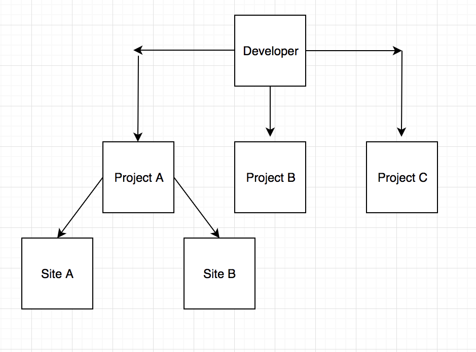

# Developer Onboarding

This page captures requirements of on boarding functionalities of developer, project, and site

## High-level Understanding

Developers and buyers will register with D-Rec platform by using register functionality.
Upon the successful registration, account will get developer account (Organisation Admin account) privileges.

Each developer will have multiple projects in same or different locations.

Each project will consist of multiple sites.
Site is completely dependent on location.
E.g. if a project is consisting of two sites with same infrastructure and different locale based, then that project is known to have two sites.

> [!NOTE]
> Projects will be with **CURRENT** statuses only.

Each site may have combination of different OEMs in multiple devices. E.g. one site may have 100 solar panels from Schindler OEM and another 100 solar panels from GE OEM.

Once the Developer got on-boarded in D-Rec platform, Developer will login to D-Rec platform and starts adding the projects.
Then, Developer will add site to his project on the completion of successfully adding project. In each site, Developer will select OEM of devices, add number of devices, type of devices, total capacity of energy generation of the site and so on.

High level illustration of Developer, Project and Site is as follows:

