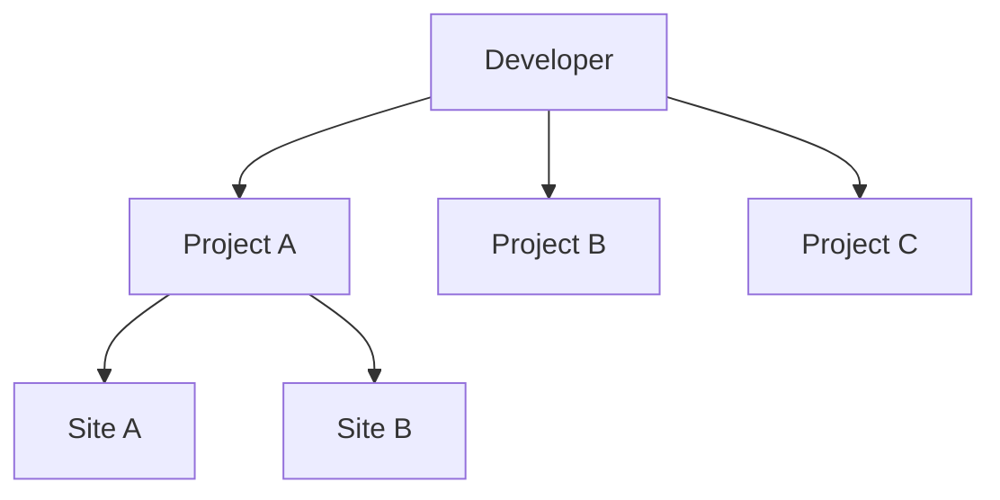
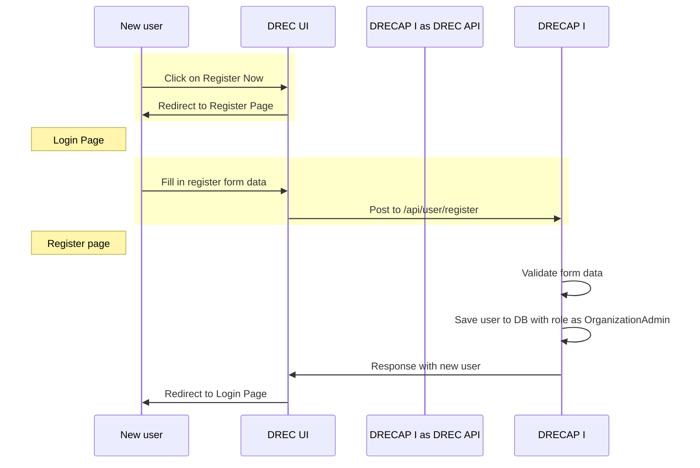
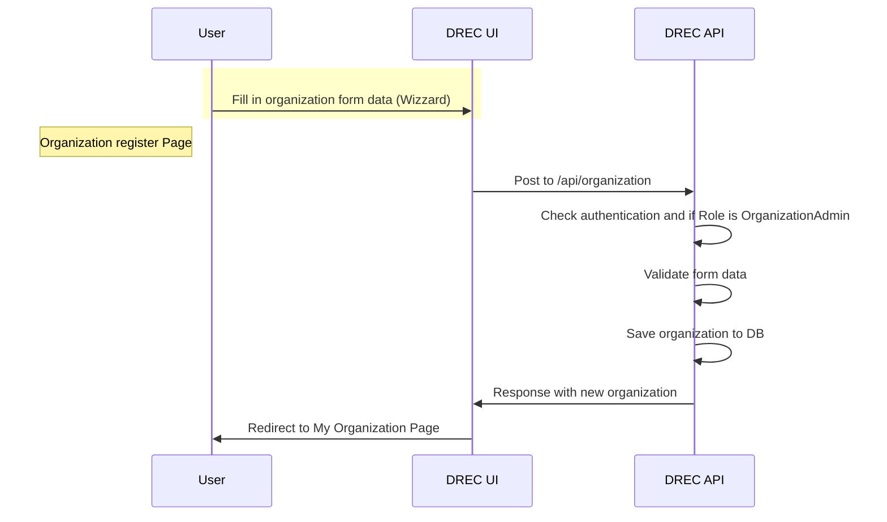
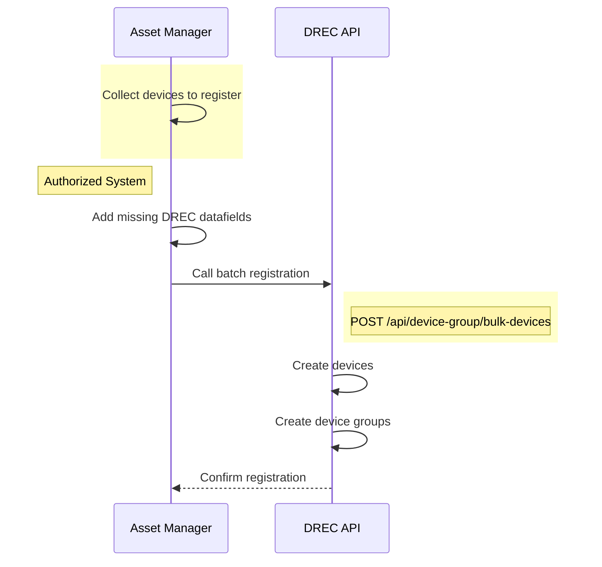
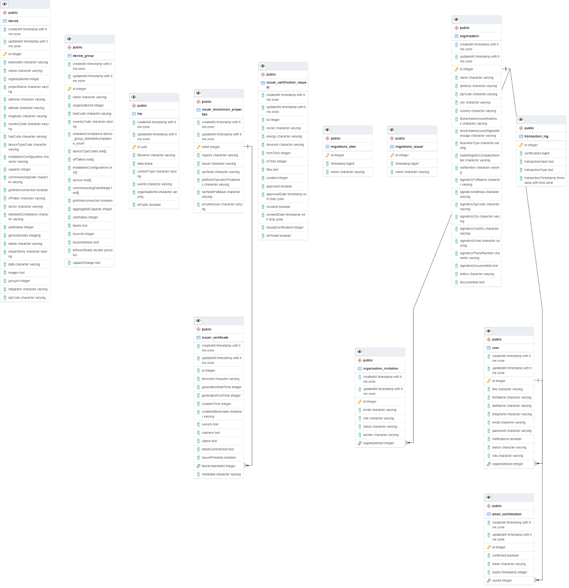

# Developer Onboarding

This page captures requirements of on boarding functionalities of developer, project, and site.

## High-Level Understanding

Developers and buyers will register with D-Rec platform by using register functionality. Upon the successful registration, account will get developer account (Organisation Admin account) privileges.

Each developer will have multiple projects in same or different locations.

Each project will consist of multiple sites. Site is completely dependent on location. E.g. if a project is consisting of two sites with same infrastructure and different locale based, then that project is known to have two sites. Projects will be with CURRENT statuses only.

Each site may have combination of different OEMs in multiple devices. E.g. one site may have 100 solar panels from Schindler OEM and another 100 solar panels from GE OEM.

Once the Developer got on-boarded in D-Rec platform, Developer will login to D-Rec platform and starts adding the projects. Then, Developer will add site to his project on the completion of successfully adding project. In each site, Developer will select OEM of devices, add number of devices, type of devices, total capacity of energy generation of the site and so on. High level illustration of Developer, Project and Site is as follows.

### Illustration of Developer, Project and Site

### Drec-PT-Arch

```mermaid
graph TD
    subgraph DREC_Section [D-REC Section]
        A[D-REC]
        A --> B[Aggregator Management]
        A --> C[Developer Onboarding]
        A --> D[Energy Management]
        A --> E[Buyer Reservation]
        A --> F[Certificate Management]
        A --> G[Profile]

        B --> H[Add New Aggregator]
        B --> I[View Aggregator]
        H --> J[Enable/Disable API Access]
        I --> K[View Buy Reservations]

        C --> L[Organization Management]
        C --> M[Manage Employees]
        C --> N[Manage Projects]
        C --> O[Manage Sites]
        C --> P[Manage Devices]

        D --> Q[View Energy Generations by Device/Device Groups]
        D --> R[Add Energy Generation Transactions]

        E --> S[Add Reservation]
        E --> T[View Reservations]

        F --> U[Certificate Management]
        F --> V[Gas Fee Requests]
        U --> Y[Generate Certificate]
        U --> Z[Transfer Certificate]

        G --> W[Wallet Management]
        G --> X[Employee Management]
    end

    subgraph Power_Trust_Section [Power Trust Section]
        AA[Power Trust]
        AA --> AB[Developer Onboarding]
        AA --> AC[Buyer Management]
        AA --> AD[Profile]
        AA --> AE[Order Management]
        AA --> AF[Certificates]

        AB --> AG[Organization Management]
        AB --> AH[Manage Employees]
        AB --> AI[Manage Projects]
        AB --> AJ[Manage Sites]
        AB --> AK[Manage Devices]
        AK --> AW[Inverter Integration Scripts]

        AC --> AL[Account Management]
        AC --> AM[Contract Management]
        AC --> AN[Demand Requests]
        AC --> AO[Dashboard]
        AN --> AX[Buyer Reservations]

        AD --> AP[Employee Management]
        AD --> AQ[Developer OSV]
        AD --> AR[Wallet]

        AE --> AS[Payables]
        AE --> AT[Receivables]

        AF --> AU[Gas Fee Payments]
        AF --> AV[DRECs]
    end

    BB[EWF Blockchain]
    AV --> BB
    AU --> BB
    AR --> BB
    W --> BB
    V --> BB
    Z --> BB
    Y --> BB

    AB --> C
    AX --> S
    AW --> R
    H --> AA
```

## User Registration

User clicks on registration button on D-Rec landing page and enters the following details while registering with D-Rec platform

- First Name
- Last Name
- Organisation Name
- Organisation Email Address
- Telephone
- User Name (for login) as we will use email address as username
- Password
- Confirm Password
- Organisation Type (radio buttons) - Developer, Buyer

### User Registration Expected Page

On the successful registration, this user account will be the admin account of organisation. User will be landed on Organisation Details Page

## Organisation Registration (Developer)

### Organisation Details Page

Organisation admin user will successfully login to D-Rec platform and see “No organisations registered” message and button to register organisation.

> [!NOTE]
> This message is subjective to change as per future requirements.

#### Mandatory fields -

- Name
- Address
- Zip Code
- City
- Country
- Business Type (dropdown) - PrivateIndividual, PublicSectorEntity, RegisteredIncorporatedBody
- Trade Registry Company Number
- Vat Number
- Organisation Logo (allowed file type - PNGs, JPEGs)

#### Optional fields -

- Signatory Full Name
- Signatory Address
- Signatory Zip Code
- Signatory City
- Signatory Country
- Signatory Email
- Signatory Phone Number

### Organization Registration Expected Page

On the successful registration of the organisation, organisation admin user will see registered organisation details.

“Add Project” button appears on Organisation Details page.

## Project Registration

This is new API development from D-Rec platform. User will enter the following details while registeringz projvect.

> [!NOTE]
> Client will confirm us on considering I-REC standards to be used while creating D-Rec certificate

- Country
- Status of the project (dropdown) - Current
- Technology Type (dropdown) - Solar Lanterns, Solar Home Systems, Community Mini Grids, Others
  On selection of Others, text field should appear
- Aggregate Nameplate Capacity for project (kW)
- Expected or Actual kWhs to be generated from the first year of operation
- Description of the project
- Electricity off-taker category (dropdown) - Agriculture, Manufacturing, Public Services etc…
- Sector
- Description of Social / Environmental Impact
- Project Image to browse (types accepted - PNGs, JPEGs)

Form with above fields and Submit, Reset and Back buttons should appear at the bottom of the page.

### Project Registrtaion Expected Page

Upon successful registration of project, project details should appear in tabular format along with search (filter) field on project details page. This filter should appear on tabular data.

Each row in table should consist of “Details” button and “Add Site” button. These details should appear on Organisation Details page.

## Device Onboarding (Site Registration)

User fills the following details on Site Registration Page. Site Registration is happening against to the project. Hence, Site Registration Page will auto populate Project Name, Off Taker, Sector and Impact Story details.

Site Registration (radio button) - Single, Multiple
Country for the Site
City for the Site
Address
Zip Code
Labels (e.g. Women owned business)
Latitude Value
Longitude Value
Fuel Code
Device Type Code
Number of Devices
Installation Configuration (dropdown) - StandAlone, Microgrid
Grid Interconnection (dropdown) - True , False
Commissioning / Commissioned Year (dropdown) - 2021, 2022 etc…
Quarter of the Year (dropdown) - Q1, Q2, Q3 and Q4
Nameplate Capacity for Site (kW)
Expected Year One kWhs
Site Image Upload (expected image formats - PNGs, JPEGs)

This registration page will consist of Submit (creating new entry), Reset (for resetting the page) and Back (to disappear form and go back to project details page).

> [!NOTE]
> If user selects Single Site entry option, then site registration form will appear. Otherwise, form with file browse field and submit button will appear.

### Device Onboarding Expected Page

User will be redirected to Project Details page on the successful submission of the site details form.

User will see tabular data of available sites against to the project upon the successful registering the site. Filter field will appear on top of tabular data.

Below tabular data, “Add Site” button also will be available to add new site in the same project.

## Device Onboarding with Bulk Upload (Site Registration)

Through file (needs to update the steps) and need to finalise the file type, fields in the file.

### JWT Issuance for Devices to send generated Data

This is proposed feature in new system where Project Developer can request authentication token (JWT) for each device which will help server uniquely identify device and verify the token and store the meter reads of that device. Device would need to send the token along with power generated data to the api.

JWT would be better with redis as lot of devices will hit meter reads api frequently storing jwt in redis especially of deivces would be efficient.

Including Meter Reads API in AWS Lambda: This is proposed architectural change where api of meter reads would be in AWS LAMbda which will help to scale up and scale down automatically.

#### User Login

User fills the below details to perform login action

- Username

- Password

- Login Type (radio button) - Developer, Buyer

### User Login Expected Page

For Developer login (OrganisationaAdmin account) - Organisation Details page

For Developer login (DeviceOwner account) - Organisation Details page with corresponding project details in tabular row.

For Buyer login - Buyer dashboard page

#### Buyer Dashboard

No requirement to implement buyer dashboard

#### Buyer Registration

Buyer will login to D-Rec and send request for purchasing D-Recs. This request form consists of below fields

- Country
- Fuel Type
- Sector (Off Taker)
- Capacity (kW)

As per request, buyer dashboard will reflect project high level details like countrywide and sector based projects whichever meeting requested energy units.

#### Add Device and Group Device

- first creates the json file of the device from this product json.
  `integrator-script=>index.js=>device-generator.js`
  (runGenerateIntegrators)function
- it adds all the devices to the device table, then a group is created in
  the group device table, then updates its id with all the devices that are grouped, with the help of this
  `integrator-script=>index.js=>post-devices.js`
  `using-API /device-group/bulk-devices`
  `drec-api=>src=>pods=>device-group`

1. BBOX-devices
2. Candi-devices
3. Distributed Energy-devices
4. Engie-devices
5. NSR-devices
6. Okra-devices

> [!NOTE]
> According api working process,For each device ID, add a groupId but make sure they all belong to the same owner

This means that both the device and the group add are associated with the same org.

Also used device group added on comparing the (countryCode,fuelcode, standard compliance )

Create Group based on the criteria

1. organizationId
2. countryCode
3. fuelCode
4. standardCompliance
5. installationConfiguration
6. offTaker

- In 3rd step, this will upload meter reads for each devices

`integrator-script=>index.js=>post-reads.js`
`(postOkraReads,postNSRReads,postEngieReads etc)function`
`using-API /meter-reads/id`
`drec-api=>src=>pods=>reads`

#### Working Of all api of group Devices

- Post-/device-group
  Add group device only these role- deviceowner or admin
- Get-/device-group/my
  Get all the data for these roles- deviceowner Or OrganizationAdmin Or Buyer
- Post-/device-group/reserve
  This api used for role Buyer, login user is buyer and reserved group so it used id, bolckchainaccountaddres, and group id then it update buyer_id and buyer_address in group device table
- Post-/device-group/unreserve
  This api used for role Buyer, login user is buyer and reserved group so it used login id, and group id then it update buyer_id and buyer_address is null in group device table.
- Get-/device-group/reserve Or /device-group/unreserve
  Get all list of reserve and unreserved for these role-admin or buyer
