# Functional Requirements

- D-REC Platform

  - Introduction

- BUSINESS REQUIREMENTS OVERVIEW

  - TECHNICAL SPECIFICATIONS

  - User registration flow

    1. For developers

    2. For buyers

  - User login

  - User pages for Developers:

    1. Organization

    2. Devices

       My devices:

       - here, the developers can see the devices that they have added in a tabular format the fields will contain:

       - The user can also use filter menu to view devices according to their preferences. The filter menu contains following fields according to which devices can be filtered

       Add devices:

       - In this page, developers can add devices by filling the following fields in the form:

       - Note- Mandatory field are marked with (\*).

       - After entering the mandatory fields, the developer can then submit the form by clicking the submit button, which will then submit the data into the DREC portal.

       - If, mandatory field are not submitted by the developer then the submit button will not be activated.

       - While the device external id should be unique for each device, different developers (of different organization) might enter same name in the external id field while filling the form for adding the devices. So, to differentiate the devices in the backend, each device will have unique id as well as unique organization id (unique for each organization).

       Bulk upload.

    3. Meter reads

       - Under this functionality, there are three fields:

    All reads:

          - After selecting all the fields, the users will have two buttons in UI.

    Add meter Read:

          - When the developer selects this option, they will be redirected to “Add read” page where they can add the meter reading of their added devices.

          - The meter readings will be validated based on the capacity of the devices and the time period for which the electricity is generated.

          - Formula = Device capacity [kW] * (Yield [kWh/kW] / 8760) * metered time period [h] * (1-degradation [%/year])^(device age [years] - 1)

  Certified meter reads:

  - User pages for Buyers

    1. My reservation

       - After selecting the fields, buyers can select ‘filter’ button to filter the list based on the selected preferences or can click ‘reset’ button to reset the preferences.

       - The filter form is not mandatory, buyers can directly see the list of devices from full list.

    2. Certificate

    3. Add reservation

       - Here, the buyer can make reservations of the devices to obtain certificates. Buyers will have to fill following details from the UI form:

       - After filling the reservation form, buyers will have the option to filter the list of devices by selecting following fields:

       - After clicking the ‘filter’ button, the list of devices will be displayed based on filter values. Filtering the devices is not mandatory, buyer can directly view list of unreserved devices from the UI. Buyers can select the devices they want to reserve and click submit button, which will then add the device to buyer’s reservation.

       - Important points regarding device registration.

## Introduction

### Technology Overview

The D-REC Initiative is a not-for-profit, multi-stakeholder, industry-led initiative. Our membership includes climate and impact oriented philanthropic organisations, climate investors, leading global corporations, international standards organisations, technology providers, international development organisations, environmental market agents, sustainability advisors, renewable energy industry associations and project developers in emerging markets.

A D-REC is a third party-certified, verifiable, trade able market instrument that can mobilize new sources of capital to support the deployment of newly distributed renewable energy.

The D-REC Platform was designed to facilitate the issuance of International RECs (I-RECs) from D-REC certificates through an automated approach. Current environmental markets require a largely manual exchange of data, such as generation reports, in order to receive renewable energy certificates. D-RECs utilize technology to overcome the challenges prohibiting small devices from accessing environmental markets. The primary value propositions for a technical solution include:

- Improved discoverability: Technology can make it easier for buyers and other stakeholders to discover projects that are closely aligned with their purchase criteria
  through a standardized data model that describes a variety of DRE assets.

- Lower transaction costs: Automating validation can shorten the time needed to issue certificates and thereby lower transaction costs.

- Scalability for smaller devices: Aggregation allows developers to achieve scale that is material to buyers, allows for quicker monetization cycles, and ensures issuance frequency through unreliable data connections.

- Clear traceability and provenance: Buyers can streamline their procurement reporting by utilizing the public ledger to document data origination and verification; the public ledger also reduces the risk of double-counting as all tokens (which represent I-REC issuance requests) are publicly discoverable.

The D-REC Platform supports account and device registration, data verification, token
minting, and I-REC issuances. The platform has two primary user categories: developers, and buyers.

### Purpose

D-REC is a not-for-profit platform to facilitate the secure and authentic transactions of RECs.

RECs can be reserved and monitored via this platform and Buyers can get the I-REC standard certified RECs.

#### Expected Users

The expected users of this platform are REC developers, REC Buyers and Intermediary organisations.

There will be multiple users under all the above mentioned categories for an instance, there will be multiple Device managers, site managers and administrators.

### DREC Project Developers

- Developers will use the D-REC platform to register devices and submit meter reads for verification. Simply doing so will not automatically lead to certification under I-REC; there

- must be a buyer that is present that has set a “reservation” (which is an issuance request done by “reserving” devices and seeking the certification of their meter reads over a certain period) in order for the data to then be tokenized and submitted to the I-REC Evident registry.

- Developers first create an account on the D-REC Platform - login credentials are through a username and a password. Once they are logged in, they can submit device registrations, which subsequently will allow them to submit meter reads for certification and enable prospective buyers to discover those projects.

### REC Buyers

- Buyers will have a different interface when interacting with the D-REC system. The primary objective will be to set and review “reservations.” These are ways for the buyer to identify specific devices from which they would like to secure RECs - this process “reserves” the device, therefore preventing additional buyers from also securing RECs (note: partial certification is something that will be addressed in a future release).

- The buyer first specifies certain parameters for the reservation, including the total volume of RECs they are seeking to purchase, the start and end period for which the data should be certified, and the issuance frequency (how frequent does the buyer want the issuance requests to occur). The buyer then selects specific devices to be associated with that reservation, which as noted earlier will remove that device from the list of available devices.

## Business Requirements Overview

The requirement or expectations from this development project of the D-REC tool can be described as:

- User Registration.

- Device Registration.

- Device Grouping and Ungrouping.

- I-REC Integration.

- Meter Readings.

- Buyer Reservation

### Scope Of Work

The target is to deliver the product in functional condition to fulfil the requirements.

The base requirement out of this tool is to allow developers to register their organizations, invite other users within same organization, register or onboard their projects, sites/devices and the users from developer organization should be able to monitor and analyze the flow of RECs, REC reservation, REC generation and consumption along with Meter Readings and certificate related Widgets can be included in application for ease of end users.

### Technical Specifications

| **Category**    | **Technology** |
| --------------- | -------------- |
| **Development** | .Net/Angular   |
| **Database**    | PostgreSQL     |
| **Design**      | Figma          |
| **Integration** | -              |
| **Testing**     | Manual         |

## Functional Requirements And U IMser Impacts

### User registration flow

#### For developers

- Developer will enter:

  1. first name,

  2. last name,

  3. email address (should not match any existing email),

  4. selects organization type as “Developer” from drop down menu,

  5. organization name (should not match any existing name),

  6. organization address,

  7. new password,

  8. confirm password.

- Once the form is updated and user clicks on submit button, user will be registered on the D-REC platform as a developer

#### For buyers

- Buyer will enter.

  1. first name,

  2. last name,

  3. email address (should not match any existing email),

  4. selects organization type as “Buyer” from drop down menu,

  5. organization name (should not match any existing name),

  6. organization address,

  7. new password,

  8. confirm password.

- Once the form is updated and user clicks on submit button, user will be registered on the D-REC platform as a buyer.

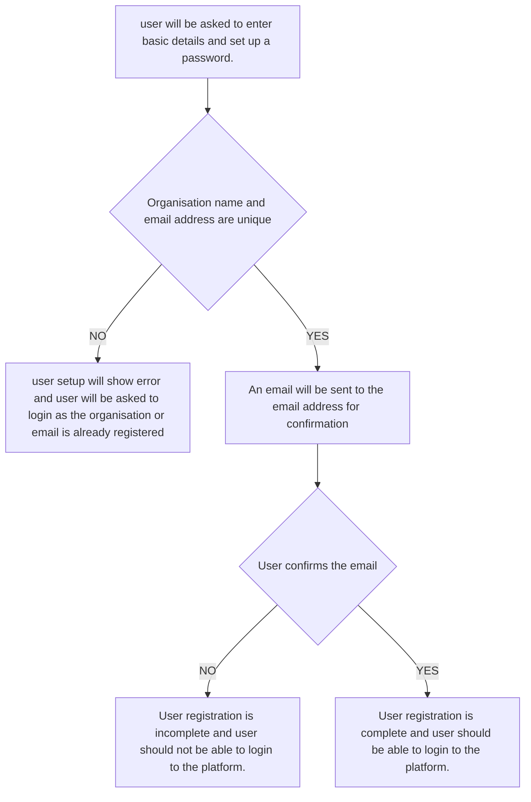
```mermaid
flowchart TD
  A[user will be asked to enter basic details and set up a password.]
  B{Organisation name and email address are unique}
  C[user setup will show error and user will be asked to login as the organisation or email is already registered]
  D[An email will be sent to the email address for confirmation]
  E{User confirms the email}
  F[User registration is complete and user should be able to login to the platform.]
  G[User registration is incomplete and user should not be able to login to the platform.]

  A --> B
  B -- NO --> C
  B -- YES --> D
  D --> E
  E -- NO --> G
  E -- YES --> F
```

### User Registration Version 1.0

- On Landing page of D-REC, user clicks on sign up button and update the basic mandatory details of organisation and individual along with setting up password and Secret Code, here validation will be in place for duplicate organisation name and secret key. This secret code setup is required only at the time of first registration for that organisation.

- Organization admin will invite employees for the registration by entering first name, last name, email address and access control lists (READ, WRITE, UPDATE and DELETE) along with role.

- D-REC platform will have User roles along with access control lists.

- Once the form is updated and user clicks on Register button, user will get the confirmation mail on provided mail id.

- While inviting user if admin doesn’t update any access level/role then user will have read only access.

- Admin user will be able to invite other users, user clicks on invitation link and go to update password URL and change password and also confirm email.

- Invited user will be able to login, change password(User will be able to login by changing password after accepting the invitation as no password will be shared at the time of invitation.) and accept/reject invitation after accepting invitation the role and org id will be updated from backend as per the specifications of admin.

- User role based users will be asked for changing the password once they click on invitation link.

- Admin user will have access to change permissions in ACL module, and if any permission is not available then APIs will return error message.

- The org admin will only be able to give permissions to the user, not any specific role.

- User will be able to login by changing his/her password after accepting the invitation as no password will be shared with him/her at the time of invitation.

Use Cases:

- Expected flow for invited user registration-

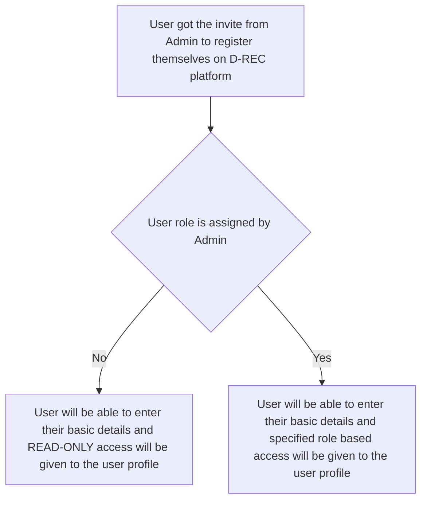
```mermaid
flowchart TD
  A[User got the invite from Admin to register themselves on D-REC platform]
  B{User role is assigned by Admin}
  C[User will be able to enter their basic details and READ-ONLY access will be given to the user profile]
  D[User will be able to enter their basic details and specified role based access will be given to the user profile]

  A --> B
  B -- No --> C
  B -- Yes --> D
```

- New user registration-

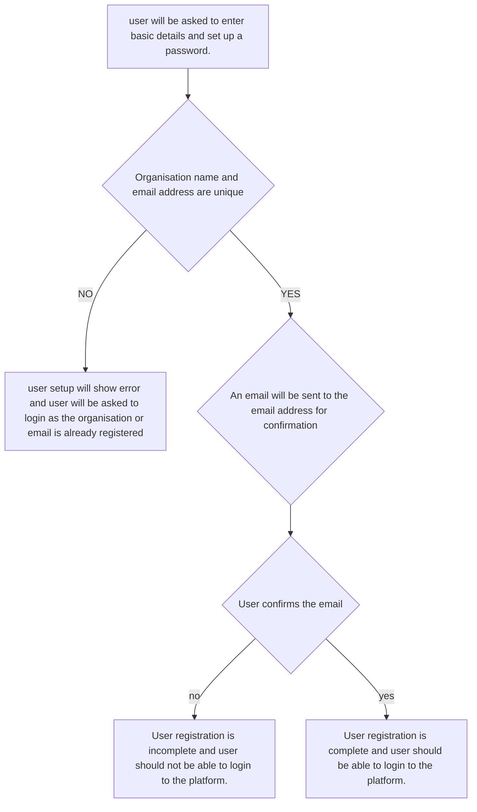
```mermaid
flowchart TD
  A[user will be asked to enter basic details and set up a password.]
  B{Organisation name and email address are unique}
  C[user setup will show error and user will be asked to login as the organisation or email is already registered]
  D{An email will be sent to the email address for confirmation}
  E{User confirms the email}
  F[User registration is complete and user should be able to login to the platform.]
  G[User registration is incomplete and user should not be able to login to the platform.]

  A --> B
  B -- NO --> C
  B -- YES --> D
  D --> E
  E -- no --> G
  E -- yes --> F
```

- Expected flow to enter Duplicate records-

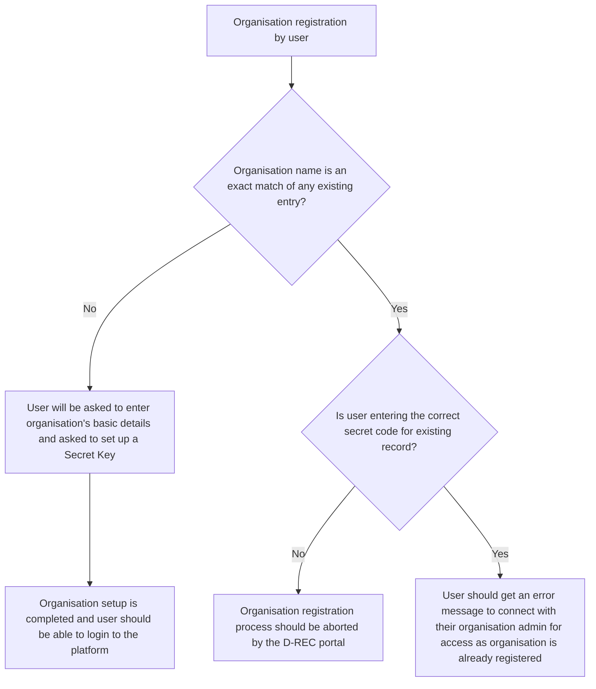
```mermaid
graph TD
  A[Organisation registration by user] --> B{Organisation name is an exact match of any existing entry?}
  B -- No --> C[User will be asked to enter organisation's basic details and asked to set up a Secret Key]
  C --> D[Organisation setup is completed and user should be able to login to the platform]
  B -- Yes --> E{Is user entering the correct secret code for existing record?}
  E -- No --> F[Organisation registration process should be aborted by the D-REC portal]
  E -- Yes --> G[User should get an error message to connect with their organisation admin for access as organisation is already registered]
```

### APIs and Responses

[Swagger UI](https://stage-api.drecs.org/swagger/#/user/UserController_me)

### User Login

- Before this use case can be initiated, the user must have registered his email ID.

  1. User must fill in the registered email ID in the “enter email ID section”.

  2. User must fill in the password used during registration and click on Login.

  3. If the email ID and password are correct, the user will be logged into the portal.

#### User pages for Developers

Organization

- This page will have information about the developer’s organization, which will contain:

          (Not yet implemented)

Devices

My Devices

**here, the developers can see the devices that they have added in a tabular format the fields will contain:**

    On boarding date:

        - date in which developer have added the device in the DREC portal.

    External id:

        - The external id is a friendly reference to the device, to allow the developer to uniquely identify the device. It is important to note that the DREC portal will assign it’s own Universally Unique ID (UUID) to each device registered.

    Country:

        - The country in which the device is located.

    Commissioning date:

        -  For how long the device has been operational

    Capacity:

        - This is the capacity of the device to generate power.

    Action:

        - Action menu will have two icons after each device.

            - edit icon- when the user clicks this icon, they will be redirected to “device update form” page where they can update the details of the device and update it,

            - device details – when the user clicks this icon, a pop-up window will open in which all the details of the device will be displayed.

    The user can also use filter menu to view devices according to their preferences. The filter menu contains following fields according to which devices can be filtered

    1. select country code.

    2. device type code.

    3. off taker

    4. capacity(kW).

    5. SDG benefits.

    6. commissioning date.

Add Devices

**In this page, developers can add devices by filling the following fields in the form:**

Project Name

- Here the developer can enter the name of the project from which the device belongs to.

External I.D (\*)

- It should be unique for each device. This is the ID that the developer uses internally to refer to the device. Does not need to be universally unique, as the platform will generate it's on UUID

Select country code (\*)

- Here the developer can choose the country code of the device from the drop-down menu of the list of countries.

Commissioning date (\*)

- Here, the developer must enter the date from which the device is operational.

- commissioning date should be equal to or before onboarding date.

Capacity (\*)

- Here, the developer should enter the capacity of the device in kW.

Off taker

- Here, the developer can choose the off taker of the power produced from the device from the drop-down menu, which will contain following options:

  School

  Health facility.

  Residential.

  Commercial

  Industrial

  Public sector

  Agriculture.

Fuel code (\*)

- Here the developer can select fuel code from the following options in the drop-down menu:

  Solar

  Co-fired with fossil: solar thermal concentrations. (removed)

- Only solar is available for now.

Device type code (\*)

- Here, the developer can select the type of device that they are registering from the drop-down menu:

  PV ground mounted.

  PV roof mounted (single installation).

  PV floating

  PV aggregated.

  Solar thermal concentration.

Impact story

- Here, the developers can write the impact they are creating with their projects.

Device description:

- Here, the device description can be chosen from the drop-down menu, which will contain following types:

  Solar lanterns.

  Solar home systems.

  Mini grid

  Rooftop solar.

  Ground mount solar.

SDG benefits:

- Here, the developers can choose from drop down menu, which SDG benefits they are providing through their projects. a developer can select as many additional UN SDGs as can be justified:

         SDG 1- No poverty

         SDG 2 - Zero hunger.

         SDG 3- Good health and well-being.

         SDG 4- Gender equality.

         SDG 5- clean water and sanitation.

         SDG 6- Affordable and clean energy.

         SDG 7- Decent work and economic growth.

         SDG 8- Industry, innovation, and infrastructure.

         SDG 9- Reduced inequality.

         SDG 10- Sustainable cities and communities.

         SDG 11- Responsible consumption and production.

         SDG 12- climate action.

         SDG 13- life below water.

         SDG 14- life on land.

         SDG 15- Peace and justice strong institutions.

         SDG 16- partnership to achieve SDG.

Address:

- Here, the developer can enter the address of the devices.

Latitude:

- Here, the developer can enter the latitude of the devices.

Longitude:

- Here, the developer can enter the add the longitude of the devices.

Quality labels:

- Here, the developer can enter the quality labels of the devices.

Grid inter connection:

- Here, the developer can choose whether the device is connected to grid or not from Boolean buttons “yes” or “no”.

Energy storage:

- Here, the developer can choose from “yes” or “no” if the device have energy storage or not.

Energy storage capacity:

- Here, the developer can enter energy storage capacity of the device.

### Note- Mandatory field are marked with(\*)

**After entering the mandatory fields, the developer can then submit the form by clicking the submit button, which will then submit the data into the DREC portal.**

**If, mandatory field are not submitted by the developer then the submit button will not be activated.**

**While the device external id should be unique for each device, different developers (of different organization) might enter same name in the external id field while filling the form for adding the devices. So, to differentiate the devices in the backend, each device will have unique id as well as unique organization id (unique for each organization).**

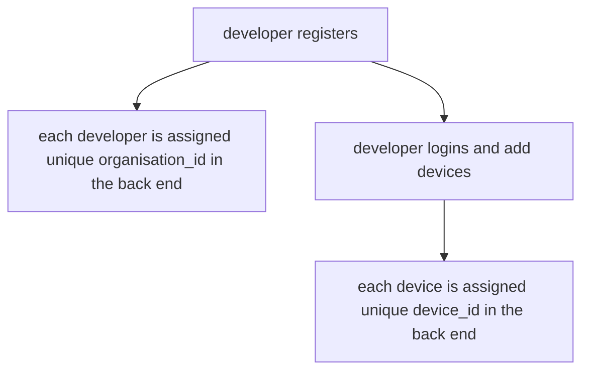
```mermaid
graph TD
  A[developer registers] --> B[each developer is assigned unique organisation_id in the back end]
  A --> C[developer logins and add devices]
  C --> D[each device is assigned unique device_id in the back end]
```

#### Device Registration Version 1

- A site manager/ organisation admin should be able to register devices by hitting device registration end point.

- Developers who use the programmatic interface can use the ID as External ID that they use for their systems, they don’t need to persist the ID that the DREC platform assigns. However, that means that even though an External ID is unique to a particular developer, it does not have to be unique across developers.

- About Device External ID:

- Developers might have same External ID whereas in backend ID will be a combination of Device Name and Organisation ID to identify devices across the platform.(as Device Names can be duplicate across developers)

- Backend External ID will be used to keep devices Identical and it will be used in meter reads influx DB consider production data.

- External ID validation not to include URL characters like #.

- It could restrict them to the Alphanumeric characters and then allow to use – and \_ .

- Platform will accept CSV file type, stores the file in S3 and shares the job id in email notification to the user. As it’s synchronous way of processing the data, platform will process the data at designated batch process or immediately (NOTE - this has to go as per design)

- Device Group Metadata: D-REC platform should allow user to specify impact stories, SDGs and project images. These details should be captured against to each project.

- Single/Individual Device Registration-

- A site manager/ organisation admin should be able to register devices by hitting device registration end point.

- The device registration end point accepts array of device details to register. External Id field is the mandatory field to avoid duplicate registration of devices.

### Bulk Upload

- Developers or users will be able to upload devices to D-Rec platform by selecting file upload option on user interface.

- D-REC will accept CSV file type.

- As it’s synchronous method of processing the data, platform will process the data at designated batch process or immediately.

- Object will be retrieved by the platform and data will be inserted in the respective tables.

- Once the file is uploaded, the user can click on “logs” icon to check the status of the bulk uploads

- If the mandatory fields are provided in the schema with proper enum values then the screen will redirected to device bulk registration status log where the user will be provided with table with following fields:

  1. ID

  2. Externalid: the external id added by the users for the devices.

  3. Error list: will provide user with the list of errors in statement form and will provide correct enum values that system accepts.

  4. Status

     - Success- in this status all the mandatory fields and enum values are correctly entered by the user

     - Success with validation errors, please update fields. – in this error the device will be added to the portal but with error and user can edit the fields that have error by clicking the “edit” button, which will redirect the user to device update form where user can enter and update correct values.

     - failed – in this status it means that the mandatory fields are not added and also the enum values are wrong and user will have to correctly enter the csv file schema and reupload.

  5. action

  ```mermaid
  graph TD
    A[Device Onboarding Types] --> B[Individual Device Onboarding]
    A --> C[Bulk Device Onboarding]
  ```

#### Bulk Device Upload Version 1.0

- Developers or users with (READ, WRITE and UPDATE ACLs) will be able to upload devices to D-Rec platform by selecting file upload option on user interface.

- D-REC will accept CSV file type, stores the file in PostgreSQL(helpful for data backup) and shares the sync job id in email notification to the user.

- As it’s synchronous method of processing the data, platform will process the data at designated batch process or immediately.

- Object will be retrieved by the platform and data will be inserted in the respective tables.

- API- Increase limit or query multiple times for issuance of meter read data as data is being sent at every 5 minutes.

Use Cases:

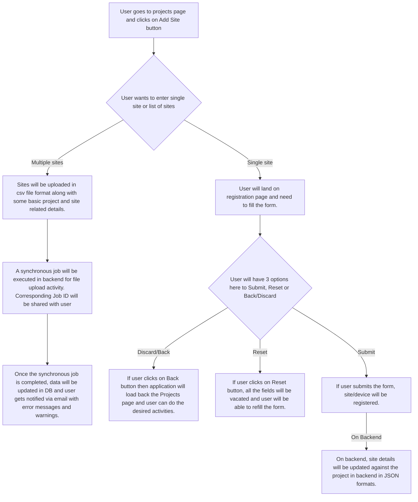
```mermaid
flowchart TD
  A[User goes to projects page and clicks on Add Site button] --> B{User wants to enter single site or list of sites}
  B --> |Single site| C[User will land on registration page and need to fill the form.]
  B --> |Multiple sites| D[Sites will be uploaded in csv file format along with some basic project and site related details.]
  D --> E[A synchronous job will be executed in backend for file upload activity. Corresponding Job ID will be shared with user]
  E --> F[Once the synchronous job is completed, data will be updated in DB and user gets notified via email with error messages and warnings.]
  C --> G{User will have 3 options here to Submit, Reset or Back/Discard}
  G --> |Discard/Back| H[If user clicks on Back button then application will load back the Projects page and user can do the desired activities.]
  G --> |Reset| I[If user clicks on Reset button, all the fields will be vacated and user will be able to refill the form.]
  G --> |Submit| J[If user submits the form, site/device will be registered.]
  J --> |On Backend| K[On backend, site details will be updated against the project in backend in JSON formats.]
```

#### Device Grouping and Ungrouping Version 1.0

#### Device Grouping

- Buyer reservation request consists of major fields such as Country Code, Fuel Type Code, Device Code, Off-Taker, Target Capacity.

- As per the entered details, application will display the eligible devices by grouping them together. The grouping can span across different organisations.

- Devices can only be part one reservation at any point of time.

#### Device Ungrouping

- In case if automatic release is failed, Developer or Users with UPDATE or DELETE ACLs shall be able to release the devices.

- In case of active registrations, users should not be able to update the device groups.

- D-REC application will initiate creating certificates once the group is created. While creating certificates, the developer has to pay gas fees to chain for the certification creation.

Use Cases:

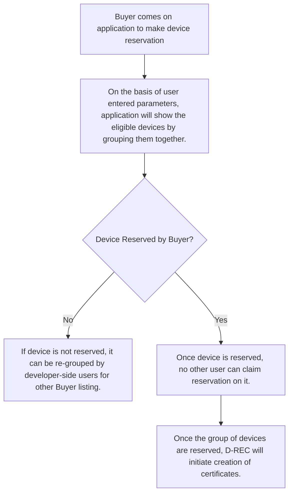
```mermaid
flowchart TD
  A[Buyer comes on application to make device reservation] --> B[On the basis of user entered parameters, application will show the eligible devices by grouping them together.]
  B --> C{Device Reserved by Buyer?}
  C --> |No| D[If device is not reserved, it can be re-grouped by developer-side users for other Buyer listing.]
  C --> |Yes| E[Once device is reserved, no other user can claim reservation on it.]
  E --> F[Once the group of devices are reserved, D-REC will initiate creation of certificates.]
```

#### I-REC Integration

I-REC and D-REC Integration process is divided into three categories:

- Platform Registration

- Device Registration

- Certificate Issuance

- Developers will have access to D-REC platform only and not to the I-REC registry.

- D-REC platform will have two accounts- Platform account and Redemption account.

- D-REC Platform automatically group the devices into device groups to make transaction of D-RECs easy, there will be additional functionality for developers to redefine the device groups.

- I-REC certificate will not be issued against a device’s reported production unless that device is a part of a device group (although groups can have just 1 device)

- The buyer will specify “Standard = IREC” at the time of Reservation.

- The certificate would be issued and transferred to the blockchain wallet associated with buyer organisation.

- The certificate will remain in the provisional account until the I-REC issuance is completed, and a serial number is assigned for the corresponding D-REC certificates.

- The redemption of certificate as I-REC or D-REC depends on the choice of Buyer.

- In Certificate Meta Data and logs, Transaction certificate id will be added.

The following outlines the proposed step-by-step process:

- During the Buyer Reservation process, the buyer will specify that they want to ensure that any certificates procured via the reservation process will be converted to I-RECs. This will do this when defining the Buyer Reservation with “Standard = IREC”

- The D-REC Platform will gather meter data from devices assigned to a Buyer Reservation as usual via the DRE devices calling the POST/api/meter-reads endpoint.

- As normal, the D-REC issuance window (default is daily) will close, and the platform will execute its automated validation algorithm to validate the data submitted by the devices.

- At this point, in a normal Buyer Reservation, the certificate would be issued and then transferred to the blockchain wallet associated with the buyer organisation. However, in the situation where the buyer has requested an I-REC conversion, this will not take place.

- Rather, the D-REC Platform will transfer the certificates to a provisional account associated with the Buyer (or other intermediary who owns the Buyer Reservation request). The provisional D-REC also will be written to the chain. At this point, the D-REC Platform will call into the I-REC registry to request I-REC issuance.

- The certificate will remain in the provisional account until the I-REC issuance is completed, and a serial number is assigned for the corresponding D-REC certificates.

- At that point, the I-REC serial number will be written into the metadata of the certificate. Both the starting and ending serial number will be noted in the D-REC certificate.

- From this point, how either the I-REC or D-REC certificate are handled will depend on how the buyer would like to account for the certificate, and whether it must be redeemed either as a D-REC or an I-REC.

Required fields of Certificate structure are:

- version

- buyer Reservation ID

- beneficiary

- is Standard Issuance Requested

- is Standard Issued

- type

- device IDs

- device Group :{

- created At

- updated At

- id

- device group ID

- name

- organisation Id

- fuel Code

- country Code

- standard Compliance

- device Type Codes

- off Takers

- installation Configurations

- sectors

- commissioning Date Range

- grid Interconnection

- aggregated Capacity

- capacity Range

- yield Value

- labels

- buyer ID

- buyer Address

- leftover Reads

- leftover Reads By Country Code

- frequency

- target Volume In Mega Watt Hour

- target Volume Certificate Generation Succeeded In Mega Watt Hour

- target Volume Certificate Generation Requested In Mega Watt Hour

- target Volume Certificate Generation Failed In Mega Watt Hour

- authority To Exceed

- reservation Start Date

- reservation End Date

- organization:{

- name

- blockchain Account Address}

- devices},

- group ID

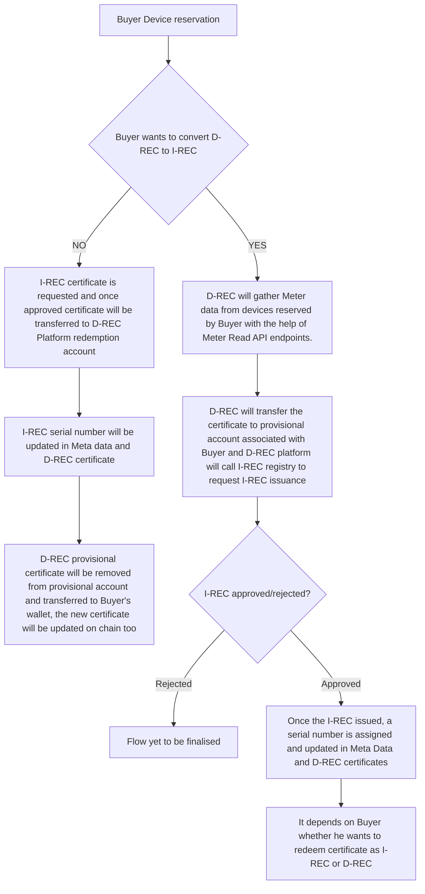
```mermaid
flowchart TD
  A[Buyer Device reservation] --> B{Buyer wants to convert D-REC to I-REC}
  B --> |NO| C[I-REC certificate is requested and once approved certificate will be transferred to D-REC Platform redemption account]
  C --> D[I-REC serial number will be updated in Meta data and D-REC certificate]
  D --> E[D-REC provisional certificate will be removed from provisional account and transferred to Buyer's wallet, the new certificate will be updated on chain too]
    
  B --> |YES| F[D-REC will gather Meter data from devices reserved by Buyer with the help of Meter Read API endpoints.]
  F --> G[D-REC will transfer the certificate to provisional account associated with Buyer and D-REC platform will call I-REC registry to request I-REC issuance]
  G --> H{I-REC approved/rejected?}
  H --> |Rejected| I[Flow yet to be finalised]
  H --> |Approved| J[Once the I-REC issued, a serial number is assigned and updated in Meta Data and D-REC certificates]
  J --> K[It depends on Buyer whether he wants to redeem certificate as I-REC or D-REC]
```

#### Meter Reads

Under this functionality, there are three fields:

##### All Reads

When the developer selects this field, the user will be redirected to the "All Reads" page with the title “Lists”. They can select the following drop-down items:

- External ID

This is the name of the devices; users can choose from the drop-down menu which device they want to see readings of.

- Start Date (\*)

Users must select the date from which they want to see the readings.

- End Date (\*)

Users must select the date until which they want to see the readings.

After selecting all the fields, the users will have two buttons in the UI:

- Filter:

When the users click this button, the system will provide the list of meter reads of the device that the user has selected from the UI form. The fields under which the data will be displayed are:

1. Start date time.

2. End date time.

3. Value (in Watt-hours).

4. Read type (“history” or “ongoing”).

5. Reset: When the user clicks this button, the values they selected in the UI form will be removed and they can enter the fields again.

##### Add Meter Read

When the developer selects this option, they will be redirected to the “Add Read” page where they can add the meter reading of their added devices. The fields they need to select in the UI form are:

- External ID (\*)

The user will have to enter the external ID name of the device for which they wish to add a meter reading.

- Time Zone

Users can choose the time zone where the device is located. They will be provided with the time zones that were entered at the time of adding the device.

- Read Type (\*)

1. History

   - History reads are the meter readings between the commissioning date (the date/time when the device started generating electricity) and the onboarding time (the time when the device is registered in the DREC platform).

   - History reads start time should always be before the device onboarding time.

   - The system will not accept history reads if the entered time period collides with an existing time period for which reads have been submitted before.

   - For history reads, the start and end times are used to calculate the metered period, and the device age is computed based on the difference between the commissioning date and the current date.

   - History meter data that is valid for certification is 3 years.

   - Historic meter read values should not be negative.

   - The DREC system allows users to submit history meter reads for devices they have registered before and forgot to submit meter reads for.

2. Aggregate

   - Aggregate readings are the current readings of the meter.

   - Aggregate readings are converted to delta readings in the backend of the system to generate certificates for the buyers.

   - Developers can enter data on a daily, weekly, or monthly basis as per their convenience.

   - Aggregate readings end time should not be before the device onboarding date.

   - Aggregate readings end time should not be greater than the current/system time.

   - Aggregate readings value should not be less than the previous value.

   - If the first device reading is aggregate, then it should not be able to change to other types of readings.

   - The first meter data submitted as an aggregate reading after the device has been onboarded (i.e., the first meter reading with a timestamp greater than the onboarding time) will not be considered by the DREC Platform. This first meter read will establish the “baseline”; it will be used to derive the delta meter read that will be submitted for verification.

   - When the user submits an aggregate meter read, they only submit an end timestamp and a meter value; the DREC Platform will keep track of the starting timestamp. Each timestamp provided will be used as the starting timestamp for the following meter read.

   - The DREC platform allows users to provide meter reads late, for which the time cycle has already moved to a different cycle. For this, a cron job will run every 4 hours in the system to include late-submitted meter reads for certificate generation.

3. Delta

   - Delta readings are the values pre-calculated by the developer, which will be entered in the system and should be considered for certification.

   - Delta = Current Meter Reads – Previous Meter Reads

   - Developers can enter data on a daily, weekly, or monthly basis as per their convenience.

   - Similar to aggregate meter reads, the first meter data submitted as a delta reading after the device has been onboarded (i.e., the first meter reading with a timestamp greater than the onboarding time) will not be considered by the DREC Platform. This first meter read will establish the “baseline”; the meter value will be discarded, and the timestamp will be used as the starting timestamp to certify the next meter read.

   - In the case of the first read entry for the device, the application will wait for the next data entry to calculate Delta.

   - Delta readings end time should not be before the device onboarding date.

   - Delta readings end time should not be greater than the current/system time.

   - If the first device reading is delta, then it should not be able to change to other types of readings.

   - When the user submits a delta meter read, they only submit an end timestamp and a meter value; the DREC Platform will keep track of the starting timestamp, which will be the end timestamp of the last read.

   - The DREC platform allows users to provide meter reads late, for which the time cycle has already moved to a different cycle. For this, a cron job will run every four hours in the system background to include late-submitted meter reads for certificate generation.

   - Important Points Related to Meter Readings:

   - The meter readings will be validated based on the capacity of the devices and the time period for which the electricity is generated.

   `Formula = Device capacity [kW] * (Yield [kWh/kW] / 8760) * metered time period [h] * (1-degradation [%/year])^(device age [years] - 1)`

4. Unit

Here, the user have to select the unit of electricity. Users can select from:

- Wh.

- kWh.

- MWh.

- GWh.

The units entered by the users will be converted to Watt hours (Wh) to store in the system back end.

- Start time stamp.

Here, the user have to select the start time of the meter reads.

Only the history type meter reading will have start time.

- End time stamp.

Here, the user will select the end time of the meter read

- Certified meter reads

Here all the certificates will be displayed for the devices which have generated certificates.

Each certificate will display following details:

1. Generation starts date.

2. Generation end date

3. Owned volume

Per single device contribution: in this user can drop-down to see per device contribution for the certificates, each device will have:

1. start date

2. end date

3. device name

4. read value.

5. device details icon which can be clicked, and a pop-up window will be presented to the user in which all the details of the device will be displayed.

Certificates can be filtered based on the filter menu provided in the UI. The fields contain:

1. select country code

2. off taker

3. SDG benefits

4. certificate date range.

#### Meter Readings Version 1.0

- Meter Reading process is segregated into three main categories:

  - Historic Readings

  - Delta Readings (Calculated)

  - Aggregate Readings (Running)

- There should be a single endpoint which will allow developers to share the Meter Reads of the above mentioned types.

- Historic Readings(Back-dated): This type of Meter readings will be entered in the system with time duration of reads(start date to end date). The maximum back date threshold will also be pre-defined.

- Delta Readings(Calculated): This type of Meter readings will be entered in the system by developer on daily, weekly or monthly basis as per the predefined tenure . If the gap in meter read entries is more than 30 days than previous values will be discarded.

- On the first instance of reading entry, reading value will be discarded and only the end time will be recorded which will be considered as start time moving forward. After proceeding further, from next entry onwards both the values read value and end time will be logged.

- If there is gap in shared reading tenures more than the predefined threshold then these readings will be considered as fresh calculation initiating readings.

- At the initial time of registration, the equivalent watt hours of per meter read should be asked from the developer.

- **_Aggregate Readings(Running):_** This type of Meter readings will be entered in the system as the Reading count, the calculation will take place on the basis of Current shared reading and last reading count.

- The formula/logic for the same will look like:

`Delta= Current Meter Reads – Previous Meter Reads`

- In case of first entry for that particular device, application will wait for next data entry to calculate Delta.

- Also, if the tenure of last entry and current entry is more than predefined threshold than current entry will be considered as initial entry and application will wait for next entry to apply logic/formula.

- User will need to enter the back dated data related to meter reads of devices which are registered previously but had not logged any read values or if developer missed to enter read values for any intermediate tenure.

- These read values can be considered for certification also until and unless it is not more than -365 days.

- On the first instance of reading entry, reading value will not be considered for certification and only the end time will be recorded for calculations.

- Delta readings are the values pre-calculated by the Developer, which will be entered in the system and should be considered for certification.

- For Delta type of Meter Read entries, the end time of current entry will be considered as start time of next entry.

Use Cases:

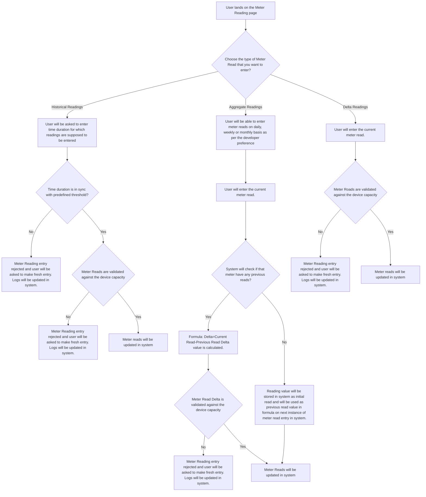
```mermaid
graph TD
  A[User lands on the Meter Reading page] --> B{Choose the type of Meter Read that you want to enter?}
  B --> |Aggregate Readings| B1[User will be able to enter meter reads on daily, weekly or monthly basis as per the developer preference]
  B1 --> C[User will enter the current meter read.]
  B --> |Delta Readings| D[User will enter the current meter read.]
  B --> |Historical Readings| E[User will be asked to enter time duration for which readings are supposed to be entered]
    
  E --> F{Time duration is in sync with predefined threshold?}
  F --> |No| G[Meter Reading entry rejected and user will be asked to make fresh entry. Logs will be updated in system.]
  F --> |Yes| I{Meter Reads are validated against the device capacity}
  I --> |No| J[Meter Reading entry rejected and user will be asked to make fresh entry. Logs will be updated in system.]
  I --> |Yes| K[Meter reads will be updated in system]
    
  C --> L{System will check if that meter have any previous reads?}
  L --> |Yes| M[Formula: Delta=Current Read-Previous Read Delta value is calculated.]
  L --> |No| N[Reading value will be stored in system as initial read and will be used as previous read value in formula on next instance of meter read entry in system.]
    
  M --> O{Meter Read Delta is validated against the device capacity}
  O --> |No| P[Meter Reading entry rejected and user will be asked to make fresh entry. Logs will be updated in system.]
  O --> |Yes| Q[Meter Reads will be updated in system]
    
  N --> Q
    
  D --> R{Meter Roads are validated against the device capacity}
  R--> |No| T[Meter Reading entry rejected and user will be asked to make fresh entry. Logs will be updated in system.]
  R --> |Yes| U[Meter reads will be updated in system]
```

Historical type of data will have configuration value as 12 months, even for this data type system should not discard older data instead it should prompt developer for acceptance.

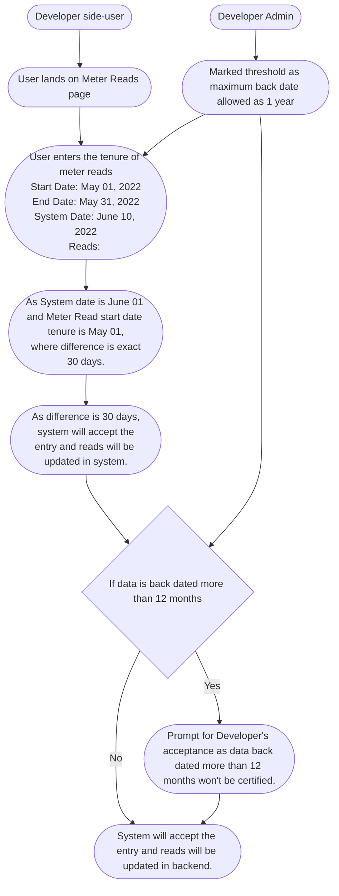
```mermaid
flowchart TD
  A([Developer side-user]) --> B([User lands on Meter Reads page])
  B --> C([User enters the tenure of meter reads<br>Start Date: May 01, 2022<br>End Date: May 31, 2022<br>System Date: June 10, 2022<br>Reads: <value>])
  C --> D([As System date is June 01 and Meter Read start date tenure is May 01,<br> where difference is exact 30 days.])
  D --> E([As difference is 30 days,<br> system will accept the entry and reads will be updated in system.])
  E --> F{If data is back dated more than 12 months}
  F --> |No| G([System will accept the entry and reads will be updated in backend.])
  F --> |Yes| H([Prompt for Developer's acceptance as data back dated more than 12 months won't be certified.])
  H --> G
  A1([Developer Admin]) --> I([Marked threshold as maximum back date allowed as 1 year])
  I --> C
  I --> F
```

Historical Readings: User with incorrect time duration as per threshold.

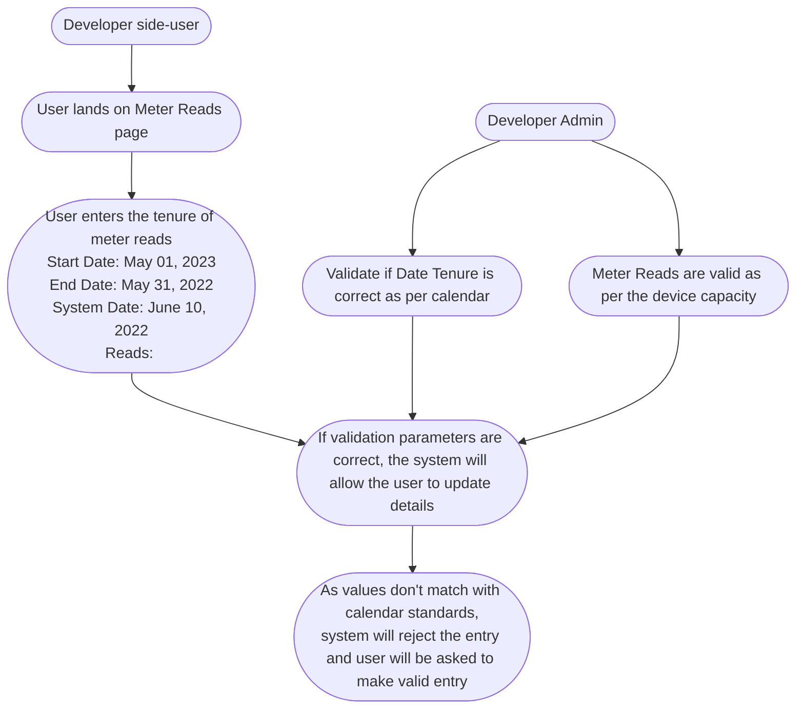
```mermaid
flowchart TD
  A([Developer side-user]) --> B([User lands on Meter Reads page])
  B --> C([User enters the tenure of meter reads<br>Start Date: May 01, 2023<br>End Date: May 31, 2022<br>System Date: June 10, 2022<br>Reads: <value>])
  C --> D([If validation parameters are correct, the system will allow the user to update details])
  D --> E([As values don't match with calendar standards,<br>system will reject the entry and user will be asked to make valid entry])
    
  F([Developer Admin]) --> G([Validate if Date Tenure is correct as per calendar])
  F --> H([Meter Reads are valid as per the device capacity])
    
  G --> D
  H --> D
```

Historical Readings: User with correct time duration as per threshold

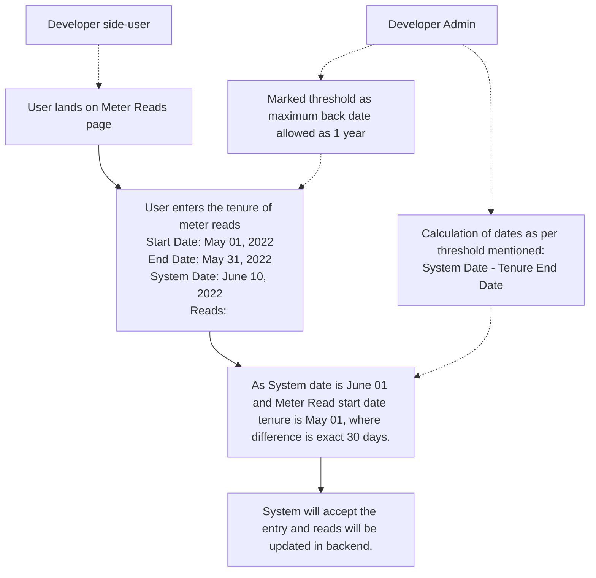
```mermaid
graph TD
  A[User lands on Meter Reads page] --> B[User enters the tenure of meter reads<br>Start Date: May 01, 2022<br>End Date: May 31, 2022<br>System Date: June 10, 2022<br>Reads: <Value>]
  B --> C[As System date is June 01 and Meter Read start date tenure is May 01, where difference is exact 30 days.]
  C --> D[System will accept the entry and reads will be updated in backend.]
    
  D1[Developer side-user] -.-> A
  D2[Developer Admin] -.-> F[Marked threshold as maximum back date allowed as 1 year]
  D2 -.-> E[Calculation of dates as per threshold mentioned:<br>System Date - Tenure End Date]
  F -.-> B
  E -.-> C
```

#### User pages for Buyers

Buyers – or market intermediaries acting on behalf of buyers who wish to initiate I-REC issuances – will use the DREC Platform’s Buyer Portal to set up and manage reservations. Reservations refer to the process by which buyers identify from which devices they want DREC tokens – and eventually

I-REC certificates – to be generated. A reservation has a start time and end time along with the set of devices that are “reserved” – this now means that this device is no longer available to another buyer.

Once a buyer logs into the system, they will be redirected to the buyer’s page where they will see following options in the UI

1. My reservation

In this page, buyers can see the list of their reserved devices.

they will be provided with UI filter form, from which they can select following fields:

- Country.

Show one or more reservations with devices that are installed in this country

Buyer can select from the drop-down country list.

- Fuel code.

Here the buyer can filter from fuel code from the following options in the drop-down menu:

    - Solar

    - Co-fired with fossil: solar thermal concentrations.

- Off taker.

Here, the buyer can filter from the off taker of the power produced from the device from the drop-down menu, which will contain following options:

    1. School

    2. Health facility.

    3. Residential.

    4. Commercial

    5. Industrial

    6. Public sector

    7. Agriculture.

- SDG benefits.

Here, the buyers can filter from drop down menu, SDG benefits.

        SDG1. No poverty

        SDG 2. Zero hunger

        SDG 3. Good health and well-being.

        SDG 4. Gender equality.

        SDG 5. clean water and sanitation.

        SDG 6. Affordable and clean energy.

        SDG 7. Decent work and economic growth.

        SDG 8. Industry, innovation and infrastructure.

        SDG 9. Reduced inequality.

        SDG 10. Sustainable cities and communities.

        SDG 11. Responsible consumption and production.

        SDG 12. climate action.

        SDG 13. life below water.

        SDG 14. life on land.

        SDG 15. Peace and justice strong institutions.

        SDG 16. partnership to achieve SDG.

- reservation status

Buyers can select reservation status of the devices to filter from the list by selecting one of the radio buttons with following options:

1. All: it will display all the devices

2. Active: it will display devices which are under reservation period.

- Reservation date

Here user can select date range between which they wish to view reservation.

After selecting the fields, buyers can select ‘filter’ button to filter the list based on the selected preferences or can click ‘reset’ button to reset the preferences.

The filter form is not mandatory, buyers can directly see the list of devices from full list.

The list will contain following fields:

1. action buttons: will contain two icons:

- certificates icon: when user clicks this icon , they will be redirected to certificate page where they will be able to see certificates generated through reservation.

- device details: when user clicks this button, they will be redirected to a page which will show reservation details in the top and a list of devices with all the details in a tabular format.

The information that will be included about the reservation:

1. name .: this is the name given to the reservation by the buyer.

2. start date. Start sate of the reservation

3. end date: date at which the reservation end

4. target capacity: the target capacity which is selected by the buyer.

5. frequency: frequency of token to be generated (hourly, daily, weekly, monthly).

6. off takers: which off takers buyers selected when reserving devices.

7. number of devices: number of devices in the reservation

8. status: whether the reservation is active or inactive on the current date.

9. SDG benefits :which SDG benefits buyers selected when reserving devices

Below this will be the list of devices that were included in the reservation. The information that will be shown about each device:

List:

1. Onboarding date: date at which developer have registered the device in the DREC portal.

2. Project name: project name from which the device belongs to

3. Name: name of the device

4. Country: country from where the device belongs to.

5. Capacity (kW): capacity of the device in kilo watt.

6. Offtaker: off taker of the device.

7. Device code: type of device.

8. Commissioning date: date from which device is operational.

9. SDG benefits: SDG benefits device is providing

#### Buyer Reservation Version1.0\*\*

- Buyer whoever wants to consume the energy generated will need to make reservations via platform to get the certified energy generated.

- The certificate issuance process for any generated energy can be initiated when the source device is in active reservation.

- Once a device is reserved by a buyer, it is no longer available for any other buyer. [As there is no feature of partial reservation in current environment]

- Certificate Beneficiary will be the Buyer for all the energy units generated during their reservation from all the devices irrespective of the Device Owner.

- Buyer will have two options at the time of reserving the device with respect to the target capacity, i.e., Authority to exceed or Authority not to exceed.

- A cron job will be scheduled to re-pick history data on redundant basis until and unless reservation ends.

- Buyer should be able to filter the devices on the below listed parameters while making a reservation:

(1) Country Code

(2) Fuel Type (Fuel Code)

(3) Off Taker

(4) Device Code

(5) Target Capacity (kW)

- Data Schema

| **Field**                  | **Description**                                                                                                                                                                                                                                                                                          |
| -------------------------- | -------------------------------------------------------------------------------------------------------------------------------------------------------------------------------------------------------------------------------------------------------------------------------------------------------- |
| **Reservation ID**: String | This is autogenerated by the system when a reservation is first setup.                                                                                                                                                                                                                                   |
| **Standards**: String      | Indicates whether the platform also needs to call into other registries (I-REC, Gold Standard, VERRA) … for now, it can only be one value.                                                                                                                                                               |
| **Frequency**: String      | How frequently certificates should be issued, possible values are: hourly, daily, weekly, monthly, quarterly.                                                                                                                                                                                            |
| **Start Time**: String     | Time from which issuance will start, this time could be in the past or in the future. If it’s in the past, it must not be more than 12 months from the current time.                                                                                                                                     |
| **End Time**               | Time after which issuance will stop, this time could be in the past or in the future. If it’s in the past, it must not be more than 12 months from the current time. This time also must be later than the start time.                                                                                   |
| **Target Volume**          | The total volume, in MWh, that the buyer wants to purchase.                                                                                                                                                                                                                                              |
| **Authority To Exceed**    | If this is set, then the platform will continue to create D-REC certificates even if the target volume is reached, until the end time is reached. This allows the platform to override the volume quantity. If the buyer or intermediary wants to stop the reservation, they can delete the reservation. |
| **Target Address**         | This is the public wallet address where the certificates must be assigned.                                                                                                                                                                                                                               |
| **Device IDs**             | \[ device IDs - list of individual device IDs \]                                                                                                                                                                                                                                                         |

- Endpoints

|--------------|--------------------------------------------------------------------------------------------------|
| **Endpoint** | **Description** |
| **POST** | Allows the buyer to send in a set of device IDs in batch or individually. |
| **DELETE** | Allows the buyer to delete or close a reservation. |
| **PATCH** | Allows the user to add or remove individual devices within a single reservation. |

- Developer should be notified on every reservation of their device.

- Each and every device reservation should be logged on chain for the Buyer’s reference.

- For the Netflix contract, once the certificate issuance frequency is defined, it should remain intact for the whole reservation.

- Whenever a reservation is ended, we can have 12 hours of waiting period on reserved devices for re-reserving the same .

- Once 12 hours are passed from conclusion of reservation, the devices will be relieved for another reservation.

- Certificate Issuance: Reservations contains devices belonging to multiple organisation so first certificate ownership cannot be organisation but rather it will directly be transferred to buyer.

- Once certificate issuance frequency is fixed it should be fixed at-least for this Netflix contract. For frequency of certificate generation there will be lot of cases for us to handle if frequency is changing.

- **Device Grouping:** As per the fields(Country Code, Fuel Type Code, Device Code, Off Taker, Target Capacity) from Buyer Reservation form, platform will show eligible devices by grouping them together. This grouping can span across different organisations which are from the same country.

- **Device Ungrouping:** Developer with (UPDATE or DELETE ACLs) can update the devices which are part of reservation.

- System will automatically release the devices which are part of expired reservations.

In case automatic release of device is unsuccessful, then users shall be able to release the devices manually whereas in case of active reservations, users should not be allowed to update the device groups.

- Use Cases

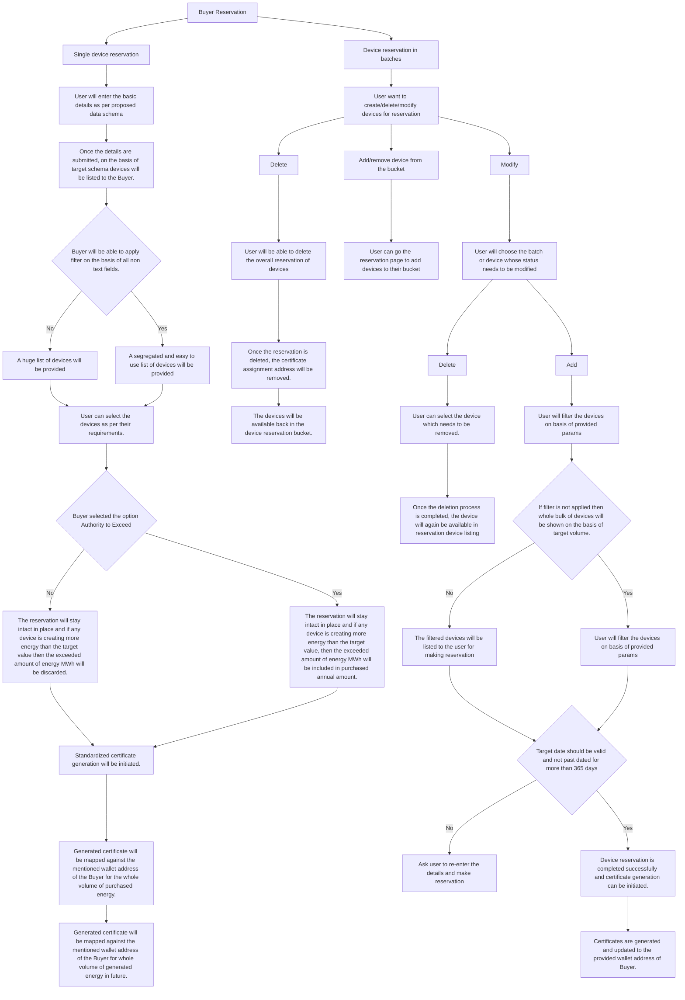
```mermaid
graph TD
  A[Buyer Reservation] --> B[Single device reservation]
  A --> C[Device reservation in batches]

  B --> D[User will enter the basic details as per proposed data schema]
  D --> E[Once the details are submitted, on the basis of target schema devices will be listed to the Buyer.]
  E --> F{Buyer will be able to apply filter on the basis of all non text fields.}
  F -->|No| G[A huge list of devices will be provided]
  F -->|Yes| H[A segregated and easy to use list of devices will be provided]
  G --> I[User can select the devices as per their requirements.]
  H --> I
  I --> J{Buyer selected the option Authority to Exceed}
  J -->|No| K[The reservation will stay intact in place and if any device is creating more energy than the target value then the exceeded amount of energy MWh will be discarded.]
  K --> L[Standardized certificate generation will be initiated.]
  J -->|Yes| M[The reservation will stay intact in place and if any device is creating more energy than the target value, then the exceeded amount of energy MWh will be included in purchased annual amount.]
  M --> L
  L --> N[Generated certificate will be mapped against the mentioned wallet address of the Buyer for the whole volume of purchased energy.]
  N --> O[Generated certificate will be mapped against the mentioned wallet address of the Buyer for whole volume of generated energy in future.]

  C --> P[User want to create/delete/modify devices for reservation]
  P --> Q[Modify]
  P --> R[Add/remove device from the bucket]
  P --> S[Delete]

  Q --> T[User will choose the batch or device whose status needs to be modified]
  R --> U[User can go the reservation page to add devices to their bucket]
  S --> V[User will be able to delete the overall reservation of devices]
  V --> W[Once the reservation is deleted, the certificate assignment address will be removed.]
  W --> X[The devices will be available back in the device reservation bucket.]

  T --> Y[Add]
  T --> Z[Delete]
  Y --> AA[User will filter the devices on basis of provided params]
  Z --> AB[User can select the device which needs to be removed.]
  AB --> AC[Once the deletion process is completed, the device will again be available in reservation device listing]
  AA --> AD{If filter is not applied then whole bulk of devices will be shown on the basis of target volume.}
  AD -->|No| AE[The filtered devices will be listed to the user for making reservation]
  AD -->|Yes| AF[User will filter the devices on basis of provided params]
  AE --> AG{Target date should be valid and not past dated for more than 365 days}
  AF --> AG
  AG -->|No| AH[Ask user to re-enter the details and make reservation]
  AG -->|Yes| AI[Device reservation is completed successfully and certificate generation can be initiated.]
  AI --> AJ[Certificates are generated and updated to the provided wallet address of Buyer.]
```

- No Authority to Exceed

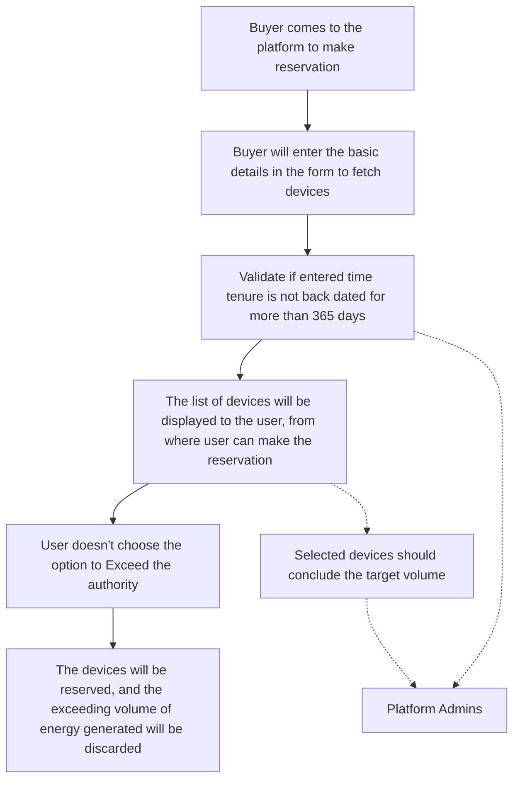
```mermaid
graph TD
  A[Buyer comes to the platform to make reservation] --> B[Buyer will enter the basic details in the form to fetch devices]
  B --> C[Validate if entered time tenure is not back dated for more than 365 days]
  C --> D[The list of devices will be displayed to the user, from where user can make the reservation]
  D --> E[User doesn't choose the option to Exceed the authority]
  E --> F[The devices will be reserved, and the exceeding volume of energy generated will be discarded]

  C -.-> G[Platform Admins]
  D -.-> H[Selected devices should conclude the target volume]
  H -.-> G
```

- Authority to Exceed

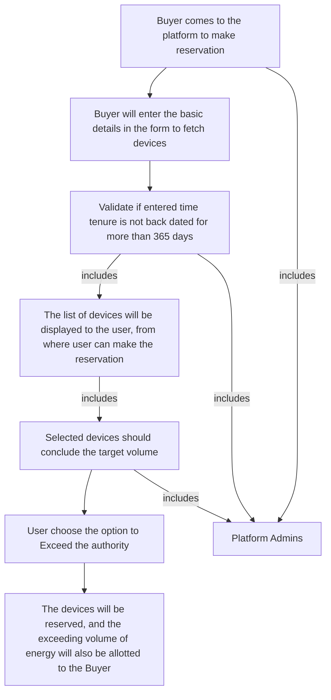
```mermaid
graph TB
  A[Buyer comes to the platform to make reservation] --> B[Buyer will enter the basic details in the form to fetch devices]
  B --> C[Validate if entered time tenure is not back dated for more than 365 days]
  C -- includes --> D[The list of devices will be displayed to the user, from where user can make the reservation]
  D -- includes --> E[Selected devices should conclude the target volume]
  E --> F[User choose the option to Exceed the authority]
  F --> G[The devices will be reserved, and the exceeding volume of energy will also be allotted to the Buyer]
    
  A --> |includes| H[Platform Admins]
  C --> |includes| H
  E --> |includes| H
```

- Target Capacity vs target end date:\*\*

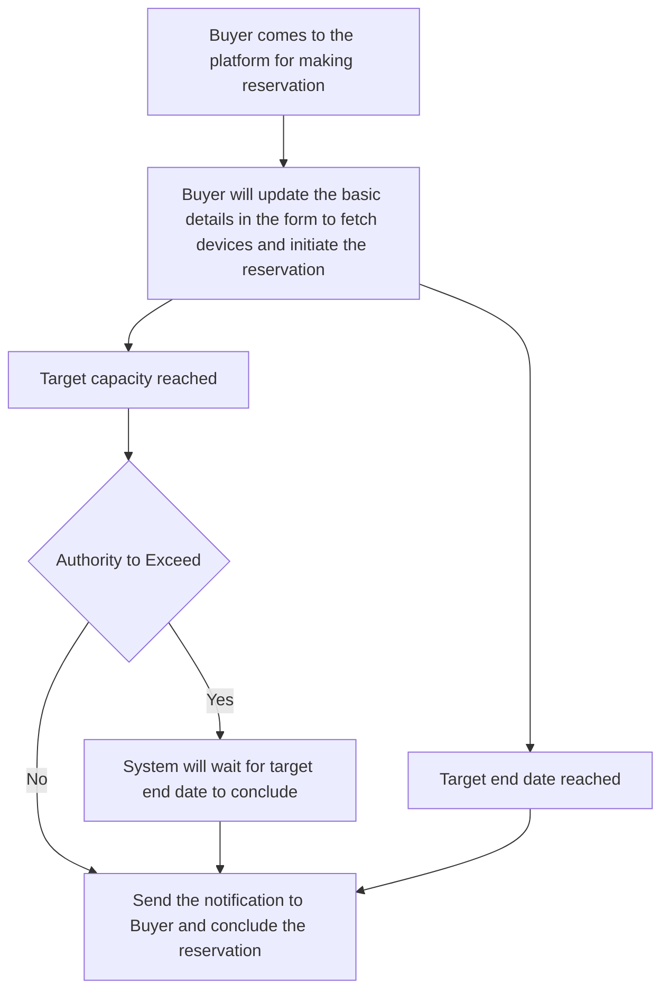
```mermaid
graph TB
  A[Buyer comes to the platform for making reservation] --> B[Buyer will update the basic details in the form to fetch devices and initiate the reservation]
  B --> C[Target capacity reached]
  B --> E[Target end date reached]
  C --> D{Authority to Exceed}
  D -- No --> F[Send the notification to Buyer and conclude the reservation]
  D -- Yes --> G[System will wait for target end date to conclude]
  G --> F
  E --> F
```

#### TimeZone

- API should store time zone of the device if it sends meter reads, provided time zone column is null.

- UI should show date and time in meter reads listing according to the time zone.

- Certificates should show meter reads date and time according to device's time zone.

1. time zone of different countries should included.

2. different time zone of each devices should be displayed when the - devices are grouped from same country which have different time zones.

- In the UI, Time zone drop-down to be updated for meter reads based on device's country.

- Get meter reads and certificate log should return time zone converted times along with UTC.

#### Certificate

Here all the certificates will be displayed for the reservations which have generated certificates.

Each certificate will display following details:

1. Generation starts date: – this is when the DREC tokens began being minted as part of this reservation

   Generation end date- this is when the DREC token creation stopped, and all the devices were released from the reservation

   Owned volume- the total amount of certified data

2. Per single device contribution: in this user can drop-down to see per device contribution for the certificates, each device will have:

   1. start date - the start of the verified meter read period

   2. end date- the end of the verified meter read period

   3. device name.

   4. read value- the certified volume from that device

   5. device details icon which can be clicked, and a pop-up window will be presented to the user in which all the details of the device will be displayed.

Certificates can be filtered based on the filter menu provided in the UI. The fields contain:

- select country code

- off taker

- SDG benefits

- certificate date range.

#### Add reservation

Here, the buyer can make reservations of the devices to obtain certificates. Buyers will have to fill following details from the UI form:

- Name (\*)

Buyers must enter the name of the reservation.

- Target capacity.

Buyers can enter the target capacity for the reservation in MWh. This is the amount of certified generation that the buyer wants to purchase from the underlying devices – this will correspond with the total amount of I-REC certificates that will be issued corresponding to the highlighted time period

- Start date (\*)

Buyers have to select start date for the reservation.

- End date (\*)

Buyers have to select end date for the reservation.

- frequency (\*)

Buyers must select the frequency at which they want the data from the devices to be certified – this can be hourly, daily, weekly, or quarterly.

- authority to exceed.

Buyers have to choose from the radio button the authority to exceed the target capacity or not.

Radio buttons will have two options:

1. true: when this is selected, the authority is given to exceed the target capacity. This will allow the devices to continue the registration and produce electricity which is bought by the buyers till the reservation end date.

2. false: when this is selected the reservation will be active till the target capacity is reached and the reservation will end even if the end date is not reached.

After filling the reservation form, buyers will have the option to filter the list of devices by selecting following fields:

1. Select country code.

2. device type

3. off taker

4. capacity (kW)

5. SDG benefits

6. commissioning date range.

After clicking the ‘filter’ button, the list of devices will be displayed based on filter values. Filtering the devices is not mandatory, buyer can directly view list of unreserved devices from the UI. Buyers can select the devices they want to reserve and click submit button, which will then add the device to buyer’s reservation.

Important points regarding device registration.

- Buyer whoever wants to consume the energy generated will need to make reservations via platform to get the certified energy generated.

- The certificate issuance process for any generated energy can be initiated when the source device is in active reservation.

- Once a device is reserved by a buyer, it is no longer available for any other buyer. [As there is no feature of partial reservation in current environment]

- Certificate Beneficiary will be the Buyer for all the energy units generated during their reservation from all the devices irrespective of the Device Owner.

- | Buyer will have two options at the time of reserving the device with respect to the ta | **TERM**                                   | **DEFINITION** |
  | -------------------------------------------------------------------------------------- | ------------------------------------------ | -------------- |
  | **REC**                                                                                | Renewable Energy Certificate               |
  | **GDPR**                                                                               | General Data Protection Regulations        |
  | **I-REC**                                                                              | International Renewable Energy Certificate |
  rget capacity, i.e., Authority to exceed or Authority not to exceed.

### Architectural Descriptoion Verion 1.0


```mermaid
graph TD
  A[DERMS] --> B[User Management]
  A --> C[Event Management]
  A --> D[Power Forecast]
  A --> E[Asset Management]
  A --> F[Market Management]
  A --> G[Power Flow]

  B --> B1[User Acceptance]
  B --> B2[Add User]
  B --> B3[View User]
  B --> B4[Remove User]

  C --> C1[Manage Employees]
  C --> C2[Approve Programs]
  C --> C3[Add Event]
  C --> C4[Manage Roles]
  C --> C5[Manage Events]
  C --> C6[Manage Employees]

  D --> D1[Meter Data]
  D --> D2[Power Forecast]

  E --> E1[Add & Edit Historical Transactions]
  E --> E2[View Transactions]
  E --> E3[View & Edit Historical Transactions]

  F --> F1[Manage Certificates]
  F --> F2[Issue Certificates]
  F --> F3[Revoke Certificates]

  G --> G1[Asset Management]
  G --> G2[Site Management]
  G --> G3[Grid Events]

  subgraph Event Management
    C1
    C2
    C3
    C4
    C5
    C6
  end

  subgraph Power Management
    D1
    D2
  end

  subgraph Asset Management
    E1
    E2
    E3
  end

  subgraph Certificates
    F1
    F2
    F3
  end

  subgraph DER Management
    G1
    G2
    G3
  end

  B2 --> |includes| H[Power Tool]
  B3 --> |includes| I[Power Tool]

  H --> J[Manage Employees]
  H --> K[Manage Events]
  H --> L[Manage Sites]
  H --> M[Manage Roles]

  I --> N[Manage Transactions]
  I --> O[Power Forecast]
  I --> P[Family]
  I --> Q[Site Management]
  I --> R[Programs]
  I --> S[Assets]
  I --> T[Devices]
  I --> U[Inverters]
  I --> V[ESS]
  I --> W[DER Contracts]
  I --> X[EWF Blockchain]

  X --> Y[Blockchain]

  J --> Z[Grid Events]
  K --> Z
  L --> Z
  M --> Z
  N --> Z
  O --> Z
  P --> Z
  Q --> Z
  R --> Z
  S --> Z
  T --> Z
  U --> Z
  V --> Z
  W --> Z
  Y --> Z
```

### Deployment Description V1

- The deployment plan for the is prescribed by D-REC team and the tool will be deployed on D-REC cloud environment.

### Compliance Requirements

- GDPR Compliances should be matched for the country where REC transactions are taking place.

### Key Terms V1

| **TERM**  | **DEFINITION**                             |
| --------- | ------------------------------------------ |
| **REC**   | Renewable Energy Certificate               |
| **GDPR**  | General Data Protection Regulations        |
| **I-REC** | International Renewable Energy Certificate |

### References

| **DOCUMENT NAME** | **DESCRIPTION** | **LOCATION** |
| ----------------- | --------------- | ------------ |
| Confluence Pages  |                 |              |
