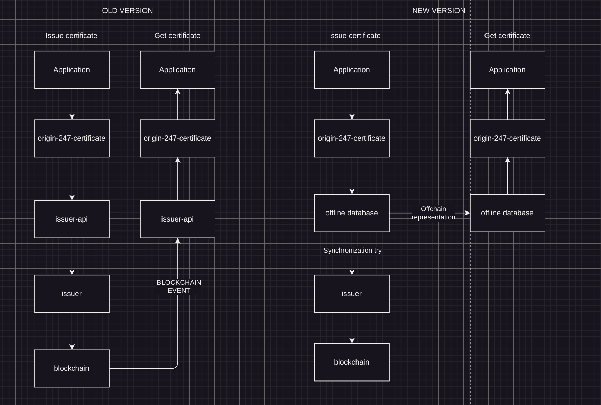

# Instructions On Upgrade EWF Issuance

Besides, on the topic of upgrading. The graph attached shows old version, and new version.
The difference between the two is primarly the introduction of offchain database.
Any action on the certificate is immediately reflected on the offchain database, therefore can be immediately querying.

Then, from time to time (configurable) these offchain representations are synchronized into blockchain in an effective way (batched transaction, and so on).This gives us eventual consistency with blockchain, but allows pushing any number of transactions (which is not useful in your case I think), retrying synchronization in the background if any error happens, and storing synchronization errors.

We actually implemented this to increase the throughput of transactions, and handle synchronization problems (retry + logging). Now the retry is automated, so no action is required from the user (doesn't need to resend data or something).Also, offchain certificates are available immediately, so frontend could just query them from the database directly, to show them to user.

In the UI user can be presented with the information whether these changes are visible on the blockchain or not (using synchronization state information).We are using this approach on other applications, tested hundreds of thousands of certificates if not more, and didn't see any data corrupted.Because as much as I would like to solve the problem that you encounter on EWF chain, this may be just anything to be honest (including network error etc), and whenever such integration between two systems (app and blockchain in this case) happens
it's best practice to use Outbox pattern -> and upgraded version of origin-247-certificate works exactly like outbox.Adapting this to your case will make application run flawlessly from the end user perspective, even if there were some problems with the blockchain (like you currently have)



## Origin 247 Certificate README

[https://github.com/energywebfoundation/origin-247-sdk/tree/master/packages/origin-247-certificate](https://github.com/energywebfoundation/origin-247-sdk/tree/master/packages/origin-247-certificate)

## After upgrading origin-247-certificate following steps would be required

### Cleanup

1. `@energyweb/issuer-api` dependency can be removed (leave it, if you want to query old certificates as well) and its entities

### Adding new entities

1. Add `OnChainCertificateEntities` (imported from package) to `TypeORM.forRoot`

2. Add `OffChainCertificateEntities` (imported from package) to `TypeORM.forRoot`

### Adding migrations

1. Add `"typeorm:run:certificate": "node_modules/typeorm/cli.js migration:run --config node_modules/@energyweb/origin-247-certificate/dist/js/ormconfig.js",` to package json, and call this migration in `migrate` script

### Environment variables

You may already have configured these variables for old version, but please double check the names.

1. Add `ISSUER_PRIVATE_KEY` (key for deployer) environment variable

2. Add `WEB3` (RPC address)

### Deploying configuration

Now, local environment will require fresh contract etc.

But production environment probably will require reusing valua) `this.onChangeCertificateFacade` is `@Inject(OnChainCertificateFacade)` (see README, required `OnChainCertificateModule` module)es already inserted in `blockchain_properties` (by issuer_api). How to solve this is up to you.

#### Local environment

1. In `onApplicationBootstrap` hook in AppModule add following code:

  ```ts
  await this.onChangeCertificateFacade.deploy();
  ```

2. `this.onChangeCertificateFacade` is `@Inject(OnChainCertificateFacade)` (see README, required `OnChainCertificateModule` module)

#### Production

1. In `onApplicationBootstrap` hook in AppModule add following code:

```ts
const isDeployed = await this.deploymentRepository.propertiesExist();

if (!isDeployed) {
  await this.deploymentRepository.save({
    registry: registryValueString,

    issuer: issuerValueString,
  });
}
```

- `this.deploymentRepository` is `@Inject(DeploymentPropertiesRepository)` (requires `OnChainCertificateModule` imported)

- `registryValueString` is current `registry` field from `issuer_blockchain_properties` table

- `issuerValueString` is current `issuer` field from `issuer_blockchain_properties` table

### Code Update

Whenever you add certificates, transfer, claim or query certificates:

1. Import `OffChainCertificateModule`

2. Use `OffChainCertificateService` (generic type represents certificate metadata interface)

3. Use `.issue`, `.claim`, `.transfer` methods, or their `batchIssue/Claim/Transfer` flavors.

4. Use `.getAll` or `.getById` or `.getByIds` methods to query

Now everything will be stored in the offchain database.

If you use `issuer-api` certificates somewhere, you can somehow connect these two results.

To synchronize with blockchain:

1. Import `OffchainCertificateModule`

2. Use `BlockchainSynchronizeService` as `synchronizationService` for example

3. Call `await this.synchronizationService.synchronize()`

Example synchronizing code using NestJS scheduler [https://docs.nestjs.com/techniques/task-scheduling](https://docs.nestjs.com/techniques/task-scheduling):

```ts
import { Injectable, Logger } from '@nestjs/common';

import { Cron, CronExpression } from '@nestjs/schedule';

import { BlockchainSynchronizeService } from '@energyweb/origin-247-certificate';

@Injectable()
export class SynchronizeBlockchainTask {
  private logger = new Logger(SynchronizeBlockchainTask.name);

  constructor(private synchronizationService: BlockchainSynchronizeService) {}

  @Cron(CronExpression.EVERY_2_HOURS)
  public async synchronizeblockchain() {
    this.logger.log(`Synchronizing blockchain started`);

    await this.synchronizationService.synchronize();
  }
}
```

In this example synchronization with blockchain will happen every 2 hours.

### Tests

For tests you can use `OffChainCertificateForUnitTestsModule` if you don't want to connect to blockchain.

\*\*\*\*THERE has been changes in this integration which were updated in code and communicated in slack. So some instructions might be missing please refer to code for updated.

I found two issues in origin-247-certificate, which is fixed in version 4.1.2. They were affecting your upgrade,
CERTIFICATE_QUEUE_DELAY can be set to 10000 – currently it is set to 60000 which is very large and makes no sense. In our tests 10000 was almost always enough. If there is nonce conflict blockchain error, it can be increased further to 20000. Lower values make testing easier and synchronization works more seamlessly.
ISSUE_BATCH_SIZE has to be set to lower value. Default is 10, in your case you can put 5 which is safe enough. It caused error due to a lot of metadata you put into certificate, which increases transaction cost. Lowering the batch makes the transaction smaller.
I ran through tests few times, resulting in 50 certificates published on Volta and properly synchronized without single error. if you are able to achieve something similar, which surely you will taking my findings into consideration, you can try migrating to production EWF chain. From there we'll see what's happening, as all error will be saved (btw I fixed the issue that "undefined" error was saved for IssuePersisted event), and data won't be lost.
