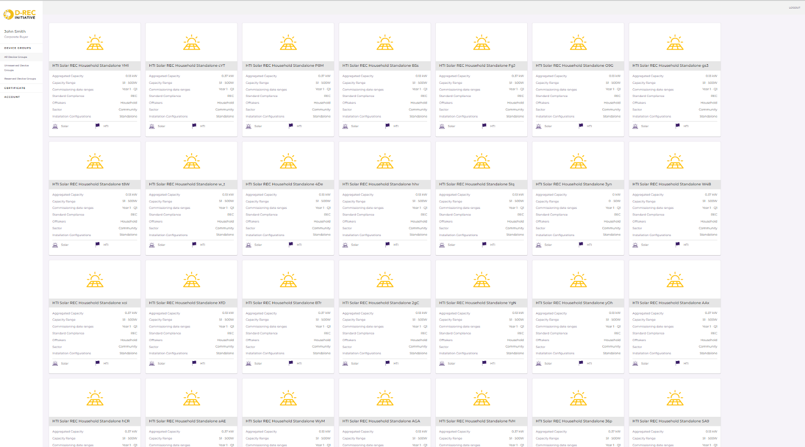

# D-MRV Technology Overview

## Introduction

An overview of D-MRV technology, why it was conceptualized and its importance in the broader context of D-REC.

The D-REC Platform was designed to facilitate the issuance of International RECs (I-RECs) from D-REC certificates through an automated approach. Current environmental markets require a largely manual exchange of data, such as generation reports, in order to receive renewable energy certificates. D-RECs utilize technology to overcome the challenges prohibiting small devices from accessing environmental markets.

The primary value propositions for a technical solution include:

- **Improved discoverability:**
Technology can make it easier for buyers and other stakeholders to discover projects that are closely aligned with their purchase criteria through a standardised data model that describes a variety of DRE assets.

- **Lower transaction costs:**
Automating validation can shorten the time needed to issue certificates and thereby lower transaction costs.

- **Scalability for smaller devices:**
Aggregation allows developers to achieve scale that is material to buyers, allows for quicker monetization cycles, and ensures issuance frequency through unreliable data connections.

- **Clear traceability and provenance:**
Buyers can streamline their procurement reporting by utilising the public ledger to document data origination and verification; the public ledger also reduces the risk of double-counting as all tokens (which represent I-REC issuance requests) are publicly discoverable.

Critically, the D-REC Platform has been designed to eliminate the burden of issuance requests which today falls upon the renewable energy project developer. In a traditional model, the developer must submit generation data and all associated metadata when they request the issuance of RECs. However, the D-REC Platform essentially takes the onus away from the developer, allowing them to register projects and provide meter data when convenient. If a buyer wishes to purchase a REC one or more of the developer’s projects, the DREC Platform automatically validates the meter data provided by the developer and initiates the issuance process. This process allows for smaller-scale developers to engage with REC markets as it removes the need for them to own the issuance process.

### Initial Vision

Outline of the original tech specs and functionality vision. What was the technology supposed to achieve? What problems was it meant to solve?

The D-REC originally was envisioned to be a “fungible” instrument. a digitally-certified, tradable instrument that represents 1 kWh of renewable electricity generated from one or more distributed “behind-the-meter” devices, including off-grid assets. It was never meant to be governed as a new standard, but rather was meant to align closely with existing standards such as I-REC and provide a way for small-scale devices to participate in global environmental markets. However, it was the intention of the D-REC Initiative when it first started that buyers would have the option to purchase D-RECs, and based upon need, “upgrade” the D-REC to an I-REC or other instrument (e.g. carbon credit).

This was driven because, in consultation with early buyers, they noted that their auditors required the following in order to account for a REC purchase:

- Convey title of the attribute to the purchaser;

- Information about the renewable energy attribute, including the date, location, type of renewable energy, etc.;

- Have a unique identifier for the attribute to prevent double-counting; and

- Have a system to track and retire attributes.

In addition to ensuring that the above criteria could be met by designing a system to capture the relevant metadata and attribute data, the following also were established as “critical to quality” objectives:

- Supporting the creation of D-RECs from multiple DRE assets types (e.g. microgrids, mini grids, solar home systems, etc.)

- Specifying the provenance of a D-REC in a publicly verifiable manner, from the creation of the D-REC through its trading and redemption

- Supporting the integration with multiple environmental standards such as the International REC (I-REC) Standard

- Enable the developer to register and provide meter data that could lead to the issuance of D-RECs without the need to explicitly request such issuance

- Provide the D-REC buyer with an interface (UI and programmatic) that would enable them to identify and select the devices from which they wanted to purchase D-RECs

- Support the aggregation of D-RECs from multiple device types based on certain characteristics desired by the buyer (e.g. off-taker type, region, etc.)

- Facilitate near real-time reporting and issuance in an automated manner; generation data could be supplied programmatically, and D-RECs would be issued with minimal manual intervention on an ongoing basis

The above design led to the creation of key functional components of the D-REC Platform:

- Device aggregation - individual devices would be grouped based on similar characteristics (e.g. developer, device type, country)

- Buyer reservation - provide a way for the REC buyer to specify from which projects they are interested in purchasing D-RECs, and subsequently to automate the issuance process

- Automated validation - use heuristics to validate meter data that has been submitted by devices prior to incorporating that data into issuance

The reason for automated verification and issuance: The primary reason that the DREC Platform needed to enable automated verification was because the current best practice of validating issuance requests from solar generators would not be applicable. Today, when a solar operator wants to issue RECs (such as through the I-REC Standard), a third-party such as a grid operator must provide validating information, such as a dispatch log, which can then be used to verify the generation data that has been submitted by the solar operator.

However, in the case of distributed renewable energy, such third-party utility or grid operator verification is not possible, primarily because these entities do not have visibility into the generation of individual DRE assets. Therefore, other means must be used to ensure that the data being reported is valid.

While ensuring a robust verification process will require multiple steps, the initial step that was implemented for the platform involves a “digital twin lite” process. In this case, the reported generation is compared with a theoretical expectation based on several different parameters describing the solar installation. The key value proposition is that such an equation “protects the upside.” In other words, because it compares the reported generation to a theoretical maximum, it ensures that developers cannot report more generation than possible (and therefore issue more DRECs to earn additional revenue).

The implemented equation is as follows:

$$
\text{Acceptable meter read must be} \leq (\text{Device capacity} \ [kW] \times \frac{\text{Yield} \ [kWh/kW]}{8760} \times \text{metered time period} \ [h] \times (1 - \text{degradation} \ [\%/\text{year}])^{(\text{device age} \ [\text{years}] - 1)} \times 1.2)
$$

$$
\text{Device capacity [kW]} \times \frac{\text{Yield [kWh/kW]}}{8760} \times \text{metered time period [h]} \times \left(1 - \text{degradation} \left[\frac{\%}{\text{year}}\right]\right)^{\text{device age [year]} - 1}
$$

- Device capacity: the size of the solar asset

- Yield: the specific estimate of how much solar energy can be generated per kWp of solar capacity, based on the GHI of a specific location among other variables. While yield varies by location, the DREC Platform currently uses a country-wide average

- Metered time period: the number of hours of generation for which a certificate may be issued

- Degradation: assumed to be 0.5% per year to account for performance degradation of the panels

One important thing to note: Because the yield estimate is not precise at the moment, the upper bound is increased by 20% to account for further variation, based on panel tilt, azimuth, and other site-specific conditions

The following section outlines the D-REC Platform at the time it was conceptualized:

- **Device Registration:**
Developers would onboard their devices on the D-REC Platform primarily through two means – the first was a “bulk upload” in which they provided devices either in a JavaScript Object Notation (JSON) or Comma-Separated Values (CSV) file through the UI. The second option would be to utilize the D-REC Platform’s API to register devices.

Upon logging in to the D-REC Platform, users can view all of the device groups that have been registered on the system. All devices that are registered from a particular DRE developer are grouped into one or more device groups; each device group represents a collection of devices that share similar characteristics. The platform enables either auto-grouping (by default) or enables the developer to create a device group. However, as initially designed, devices could not be standalone - they would need to be part of a device group in order for their generation to be certified and included in subsequently issued D-RECs. 

This design decision was made for the following reasons:

- Achieve scale in a more efficient manner to address buyer demand;

- Reduce transaction costs, because validation occurs against the group rather than against each individual device;

- Monetize the D-RECs from smaller devices (i.e. lanterns) faster, as there is no limit to the number of devices that can be organised into a single device group; and

- Allow for certificate issuance in the event of an unreliable communication link – even if certain devices are unable to transmit data, others that maintain connectivity can still submit data for certificate issuance.

The following screenshots highlights the primary landing page identifying all of the device groups that have been registered on the system, as well as a close-up of a single instance to illustrate the type of information presented:



.png>)

Each item in the above screenshot lists key information about the device group, such as:

- Total nameplate capacity of the device group
- When the devices have been commissioned
- The electricity offtaker

A D-REC buyer could explore individual device groups, understanding the underlying devices that comprise a device group. Upon selecting an individual device group, the platform provides metadata about each device constituting the group. 

This screenshot shows the information for a single device group, a collection of solar home systems in Benin:

.png>)

Each device is listed as a separate entry, and its location is marked with a pin on the map. Each of the devices registered on the D-REC platform is represented by metadata. 

For example, the first entry in the screenshot above was described as follows during the device registration period:

```json
{
   "external ID": "3703716",   // the ID the developer uses internally to refer to the device
   "OrganizationID": "2",   // assigned automatically by D-REC platform
   "projectName": "Baknoura Fenix Radio +3",  // descriptive project name
   "Address": "Baknoura, 2Ème Arrondissement, Parkou",  
   "Latitude": "9.304655",
   "Longitude": "2.707943",
   "countryCode": "BJ",
   "fuelCode": "ES100",   // the type of renewable energy
   "deviceTypeCode": "T02001",   // additional renewable energy classification
   "installationConfiguration": "StandAlone",  // single installation or microgrid
   "Capacity": "0.01",   // nameplate capacity in kW
   "commissioningDate": "15/04/2019",
   "gridInterconnection": "FALSE",
   "offTaker": "Residential"
}
```

The D-REC Platform, upon the registration of a device, will automatically assign it to a group. The platform will define a group based on the following criteria: Country, Fuel Type, Standard Compliance, deviceCategoryType, Off-taker. As noted earlier, all device groups will only contain devices from a single organization.

If the user wishes to reassign a device to a different group, or put a single device in its own group, then the DRE asset owner can choose to go through a manual grouping process. This can be done via the D-REC Platform UX or progamatically. However, to reassign a device to a group, the device must first be removed from a group – it is then considered ungrouped. Note that, as per above, a D-REC will not be issued against any generation data submitted for this device, as it is not a member of a group. The DRE asset owner can then choose to add the ungrouped device to an exiting group, or a new group.

Once a device has been registered on the D-REC Platform, it can submit meter reads for validation – this is done via the D-REC Platform’s POST /api/meter-reads/{id} endpoint, in which {id} refers to the identifier the developer uniquely assigns to each installation. The only way in which data could be submitted to the platform was via the API. At the end of each day, the platform would validate the data using an algorithm to determine whether the data submitted by the device would be expected given its location, capacity, etc.

Once the validation was successful, then a DREC would be issued and assigned to the buyer wallet. The platform UI was designed to list all of the D-REC certificates:

.png>)

Each line represents a digital certificate representing 1 or more kWh of verified energy generated from a device group; each certificate can only correspond to a single device group. Once the certificate has been issued, it can then either be traded or redeemed (if the organization that owns the certificate is a corporate buyer). If the certificate is to be traded, then the destination wallet is specified (as noted below); only an entity which has a certificate in its wallet can redeem the certificate.

.png>)

When a DREC buyer redeems a certificate, they must specify the reporting period for which the certificate is being redeemed as well as the purpose for redemption. For example, if a buyer wishes to redeem a certificate against their electricity emissions for the 2021 year, and that certificate was generated at some point within the year, then for the Start Date they would specify 01/01/2021, and for End Date they would specify 31/12/2021.

The following screenshot shows how a corporate buyer would redeem a certificate in their possession that was generated on December 10th, 2021, for their 2021 reporting period:

.png>)

When a certificate is redeemed, it generates a redemption report that can be used for reporting purposes. As noted earlier, there were several criteria that potential DREC buyers had outlined as necessary metadata in order to ensure the DREC could be used in reporting. 

The following screenshot shows how those details were displayed:

.png>)

.png>)

- **Convey title of the attribute to the purchaser:** 
At present this is listed in the "Claim Beneficiaries" section which lists the company, address, etc. that is claiming title to the certificate.

- **Information about the renewable energy attribute, including the date, location, type of renewable energy, etc.:**
The certificate has three dates – the first is the start of the period in which generation was measured (in this case, December 5), the second is the day on which measuring the generation output stopped (December 6, because we are currently issuing certificates on a daily basis), and the third day is the date on which the certificate was created (the "Creation Date" which in this case is December 6, again because we currently issue on a daily basis). Also note that in the "Claim Beneficiaries" section there is a reporting period noted, in this case December 10, 2021. This is the time window for which the certificate is being redeemed. This can be an annual time span, but in this case is a single day to illustrate how it can be used for daily reconciliation for a 24/7 approach.

- **The location, type of renewable energy, etc.:**
The certificate at present does not explicitly list these parameters; rather, it is a combination of the device group owner (the entity that owns the asset which generated the certificate) and the Facility Name ... right now, that is a descriptive name that includes the developer name, country ("IN" for India), technology type ("Solar"), and offtaker type ("Commercial").

- **Have a unique identifier for the attribute to prevent double-counting:**
The Certificate ID is the unique ID for the certificate (27 in this case), and will be unique across the entire D-REC platform. Also, the provenance of the certificate (when it was issued, how it was traded, who redeemed and when) will all be queryable on the public blockchain. The amount of generation being claimed is the "Claimed Energy" piece (which in this case is 551kWh).

- **Have a system to track and retire attributes:**\
This is the purpose of the D-REC Platform and the underlying Energy Web Chain; all certificate transactions will be written to the chain, providing an immutable record of each certificate’s provenance.

How the platform was validated: The DREC Platform’s initial functionality was validated by onboarding several different device types and generating certificates. The developers that were included in the initial pilot release of the platform included: Engie Energy Access, Okra, Distributed Energy, Candi Solar, BBoxx, and New Sun Road. The types of assets involved in the PoC included mini-grids, solar home systems, and C&I rooftop solar. Further, the platform was demoed to potential corporate DREC buyers and other stakeholders including the I-REC Foundation. From these conversations, several changes were instituted to change the design and architecture of the system.

### Current Status

A snapshot of where D-MRV technology stands today. How has it evolved from the original vision? What functionalities have been realized? Have any changes in goals or scope occurred?

Since the introduction of the DREC Platform alpha release at the end of 2021, several changes were instituted to the overall platform architecture to reflect updated use cases.

These can be categorized into the following:

- User Roles
- Device Groups
- Meter Reads
- Buyer Reservations
- Certificate Structure
- Trading and Redemption

**Changes to User Roles:** 
In the alpha release of the platform, there was no distinction between different users within a single organization and what access they may have to make modifications on the platform. 

As a result, for the beta release of the platform, there were three user roles that were created:

- Super administrator: This super admin has access to all parts of the platform, and can perform actions on behalf of any user on the system. It was intended that one or more personnel within the DREC Organisation would have success permissions

- Organization administrator: each organization (e.g. developer or intermediary) on the platform would have an administrator that would have full access to add, remove, or modify devices for that organization. The organization administrator also can add and remove additional users from that organisation.

- User: In the beta of the platform, a user has full permissions other than being able to add or remove users from a particular organisation.

**Device Groups:**
As noted earlier, in the Alpha release of the platform, devices were grouped automatically based on certain variables. In that design, a DREC was not issued against generation of a specific device, but rather the aggregate generation provided by the group. However, based on design conversations with the I-REC Standard, this design was altered. Specifically, the grouping of devices upon registration was removed in the Beta release. This primarily was because the I-REC Standard was seeking to ensure that individual devices would be registered on the tracking system. 

The implications of this change, with respect to certification, meant that individual devices would need to be validated prior to DREC issuance, whereas before there could be instances where a specific device would not report data but a DREC certificate would be issued against the aggregated reported generation of the device group. However, the actual DREC issuance would still support aggregation, but rather than being a developer-defined aggregation, it would correspond to a buyer-defined aggregation (i.e. the Buyer Reservation).

The primary motivation to continue maintaining aggregation functionality would be to allow for future integration with the carbon standards (i.e. the Gold Standard and VCS). In such a case, aggregating devices will enable developers to obtain more material CO2 credit generation rather than generating a CO2 credit per device.

**Meter Reads:**
In the Alpha release of the platform, a developer could only submit meter data that correspond to time periods after the device was registered on the platform. Using a CRON scheduler implementation, the DREC Platform had a “sliding window” that would intake data that corresponded to the window’s start and end time, and then issue DREC certificates for that time period. This would enable a “go-forward” basis of issuing DRECs.

However, this implementation left out a few different variations which were encountered during the discovery phase, namely that that devices should have the opportunity to certify data prior to onboarding onto the DREC Platform, and that they way in which they report data may vary. This led to the introduction of the following meter read types:

- History: this meter read type accounts for electricity that was generated prior to the device being registered on the DREC Platform, but after the commercial online date (COD). When this meter read type is submitted, both the start time and the end time along with the meter data must be submitted.

- Aggregate: this meter read type was introduced for meters that “spin up” and only can provide aggregate generation since the solar system began generating electricity. For this meter read type, the device submits an end time stamp and a meter read value; the DREC platform will keep track of the prior read (both the time stamp and the value) and then subtract the latest read from the prior to derive the specific generation amount between the two time stamps

- Delta: This was the default way in which data would be reported by the device. This type of meter read refers to the specific generation quanta between two time periods
