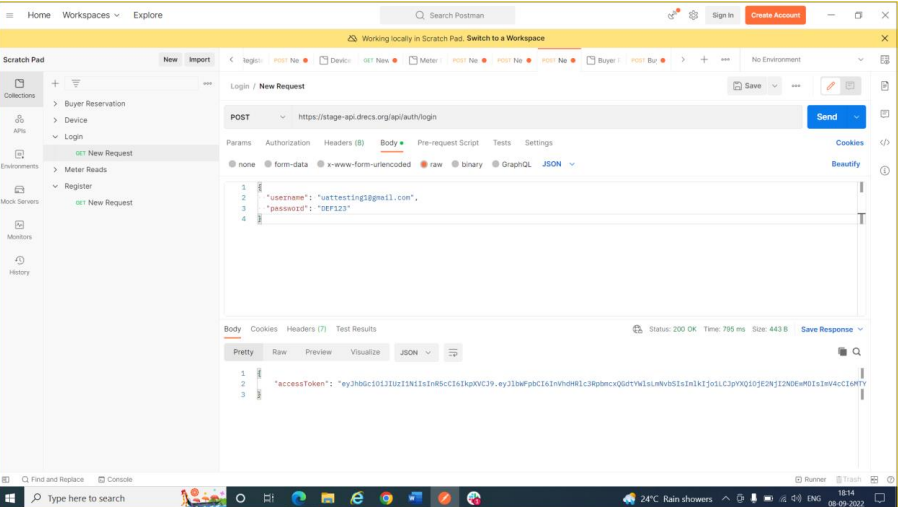
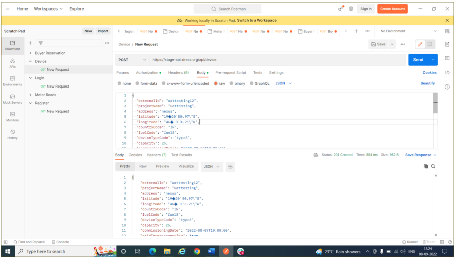

# STAGE API Guide

## Register With Organization

Endpoint:Post: [https://stage-api.drecs.org/api/user/registerWithOrganization](https://stage-api.drecs.org/api/user/registerWithOrganization)

### Input Payload Register With Organization

```json
{
"firstName": "UAT",
"lastName": "Testing",
"email": "uattesting1@gmail.com",
"organizationType": "developer",
"password": "DEF123",
"confirmPassword": "DEF123",
"orgName": "rooftop solar",
"orgAddress": "Hyderabad",
"secretKey": "AB0123"
}

```

### Response


## Login

Endpoint: [https://stage-api.drecs.org/api/auth/login](https://stage-api.drecs.org/api/auth/login)

### Request payload

```json
{
 "username": "uattesting1@gmail.com",
 "password": "DEF123"
}
```

### Login Response



## Device Registration

End point: Post: [https://stage-api.drecs.org/api/device](https://stage-api.drecs.org/api/device)

### Input payload Login

```json
{
 "externalId": "uattesting12",
 "projectName": "uattesting",
 "address": "nexus",
 "latitude": "19�20'50.97\"S",
 "longitude": "46� 3'3.21\"W",
 "countryCode": "IN",
 "fuelCode": "fuel8",
 "deviceTypeCode": "type3",
 "capacity": 25,
 "commissioningDate": "2022-08-09T19:00:00",
 "gridInterconnection": true,
 "offTaker": "School",
 "yieldValue": 0,
 "labels": "demoo",
 "impactStory": "Demo impact story",
 "data": "",
 "images": [
 "string"
 ],
 "deviceDescription": "Rooftop Solar",
 "energyStorage": true,
 "energyStorageCapacity": 0,
 "qualityLabels": "quality labels",
 "groupId": 0,
 "SDGBenefits": 1
}
```

### Device Registration Response



## Device registration2

Endpoint: Post: [https://stage-api.drecs.org/api/device](https://stage-api.drecs.org/api/device)

### Request Payload

```json
{
 "externalId": "uattesting123",
 "projectName": "uattesting",
 "address": "nexus",
 "latitude": "19�20'50.97\"S",
 "longitude": "46� 3'3.21\"W",
 "countryCode": "IN",
 "fuelCode": "fuel8",
 "deviceTypeCode": "type3",
 "capacity": 25,
 "commissioningDate": "2022-08-09T19:00:00",
 "gridInterconnection": true,
 "offTaker": "School",
 "yieldValue": 0,
 "labels": "demoo",
 "impactStory": "Demo impact story",
 "data": "",
 "images": [
 "string"
 ],
 "deviceDescription": "Rooftop Solar",
 "energyStorage": true,
 "energyStorageCapacity": 0,
 "qualityLabels": "quality labels",
 "groupId": 0,
 "SDGBenefits": 1
}
```

### Device Registration2 Response


## Registered Devices

End point: GET: [https://stage-api.drecs.org/api/device/my](https://stage-api.drecs.org/api/device/my)

### Registered Devices Request payload

null

### Registered Devices Response


## Meter Reads

### History

Endpoint: [https://stage-api.drecs.org/api/meter-reads/new/uattesting12](https://stage-api.drecs.org/api/meter-reads/new/uattesting12)

### Request payload Meter Reads

```json
{
 "type": "History",
 "unit": "Wh",
 "reads": [
 {
 "starttimestamp": "2022-09-08T12:50:47.335Z",
 "endtimestamp": "2022-09-08T12:51:47.335Z",
 "value": 5000
 }
 ]
}
```

### Meter Reads Response


### Delta

Endpoint: [https://stage-api.drecs.org/api/meter-reads/new/uattesting123](https://stage-api.drecs.org/api/meter-reads/new/uattesting123)

### Request payload Delta

```json
{
 "type": "Delta",
 "unit": "Wh",
 "reads": [
 {
 "starttimestamp": "",
 "endtimestamp": "2022-09-08T12:55:47.335Z",
 "value": 50000
 }
 ]
}
```

### Delta Response


### Aggregate

End point: [https://stage-api.drecs.org/api/meter-reads/new/uattesting123](https://stage-api.drecs.org/api/meter-reads/new/uattesting123)

### Aggregate Request payload

```json
{
 "type": "Aggregate",
 "unit": "Wh",
 "reads": [
 {
 "starttimestamp": "",
 "endtimestamp": "2022-09-08T12:55:47.335Z",
 "value": 55000
 }
 ]
}
```

### Aggregate Response


