# User Flows

## Certificate Management

- According to energy webs documentation : [https://energyweb.atlassian.net/wiki/spaces/EWF/pages/719847470/Transaction+Costs+Overview](https://energyweb.atlassian.net/wiki/spaces/EWF/pages/719847470/Transaction+Costs+Overview) access setting gas price lower is one of the factors but it shouldn't be too lower else transaction will never be accepted but after exploring to some extent in EWF packages I couldn't find a way to set gas limit for the transaction or a gas price for the transaction(issuance of certificate).

- After searching found this link GitHub - [energywebfoundation/gasprice: estimate ethereum gas price](https://github.com/energywebfoundation/gasprice) for getting standard, faster gas prices of energy-web but its in python need a way to be in NodeJS.

- Chain [API for the Energy Web Chain - BlockScout](https://explorer.energyweb.org/api-docs) doesn't contain api to provide information on getting gas fees for validation in faster, slower, standard prices.

- After going through some EWF documentation and external documentation I believe we are looking for

Fast Validation gas price(take <30 seconds to success), standard validation gas price(takes < 5 mins to confirm), slow validation gas price(takes < 30 min to confirm or might not even confirm due to low gas fees) => please can you confirm this is what we are looking for

1. I went through the packages DREC utilises from EWF and also API provided by energy web API for the Energy Web Chain - BlockScout but I don't find way to get those gas price

2. And there is one concern, here in the code we are just requesting for issuance of certificate but there is no setting up for gas price that we are willing to pay for that particular transaction.

- [GitHub - energywebfoundation/gasprice: estimate ethereum gas price](https://github.com/energywebfoundation/gasprice) this might be useful a repo to check gas price but its in python.

Following are the requirements for certificate structure -

"Version": "v1.0" (Version 1.0 needed in certificate structure),

"buyerReservationId":"4c619b19-4e4d-4a81-9c27-d2cf46101333",

“beneficiary“: ““ (Please add this field to certificate structure),

"isStandardIssuanceRequested":"REC" (Please change the value to “I-REC”),

"isStandardIssued":false,

"type":"Carbon Credit" (Please change value to “REC”),

"deviceIds":[135],

"deviceGroup":{"

createdAt":"2022-10-05T16:09:03.076Z",

"updatedAt":"2022-10-05T16:09:03.076Z",

"id":14 (What is the significance of this field?),

"devicegroup_uid":"4c619b19-4e4d-4a81-9c27d2cf46101333",

"name":"Feroke_Board_Test",

"organizationId":75,

"fuelCode":"ES100",

"countryCode":"IND",

"standardCompliance":null,

"deviceTypeCodes":["TC100"],

"offTakers":["School"] (Make it as NULL),

"installationConfigurations":null,

"sectors":null,

"commissioningDateRange":["15 years+"] (Please make it as “1 year”),

"gridInterconnection":true,

"aggregatedCapacity":80,

"capacityRange":"51 - 500W" (Will it create any impact in case if this field got removed),

"yieldValue":0 (Please remove this field),

"labels":["Demo"] (Leave this field as blank),

"buyerId":75,

"buyerAddress":"0x410CB6672F7ebE397F866fC2CE1020cB18Ac6C5F",

"leftoverReads":0,

"leftoverReadsByCountryCode":{},

"frequency":"hourly",

"targetVolumeInMegaWattHour":100,

"targetVolumeCertificateGenerationSucceededInMegaWattHour":0,

"targetVolumeCertificateGenerationRequestedInMegaWattHour":0,

"targetVolumeCertificateGenerationFailedInMegaWattHour":0,

"authorityToExceed":false,

"reservationStartDate":"2022-10-04T14:00:00.223Z",

"reservationEndDate":"2022-10-04T16:00:00.223Z",

"organization":{

"name":"Hyd121",

"blockchainAccountAddress":"0x410CB6672F7ebE397F866fC2CE1020cB18Ac6C5F"},

"devices":[]},

"groupId":"14" (what does this refer to?),

**Requirements gathered in February meetings:**

- Transaction certificate id add in certificate and log too. Add transaction certificate ID.

- cron job history to re-pick history until reservations end.

## Meter Reads v1

Meter Reading process is segregated in three main categories:

1. Historic Readings

2. Delta Readings(Calculated)

3. Aggregate Readings(Running)

- At the time of device registration, Developer should enter the equivalent watt hours of per meter read.

- Application will be accommodating the Developers with single endpoint to update all the types of Meter reads.

- As per I-REC compliance, Data older than 3 year will not be considered for certificate issuance.

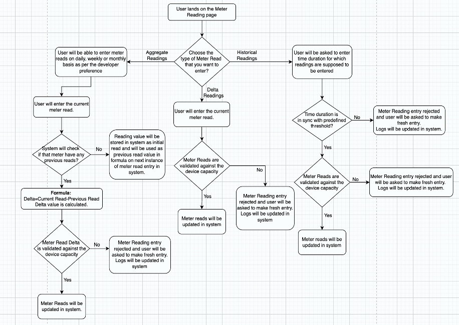

**Historic Readings(Back-dated):**

Use Cases:

- Historical type of data will have configuration value as 3 years, even for this data type system should not discard older data instead it should prompt developer for acceptance.

- Historical Readings: User with incorrect time duration as per threshold

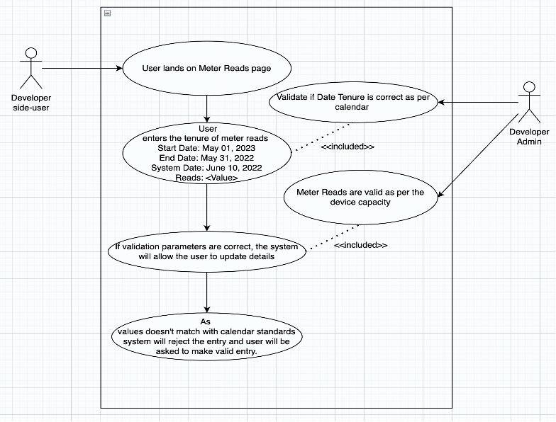

Requirements:

- Historic Meter reads needs to be validated that it should not be back dated more than 3 years , as data older than that is not valid for certification.

- As of now, we are not rejecting any data so just to notify user about it.

- This type of Meter readings will be entered in the system with time duration of reads(start date to end date).

Business Logic:

- User will need to enter the back dated data related to meter reads of devices which are registered previously but had not logged any read values or if developer missed to enter read values for any intermediate tenure.

- These read values can be considered for certification also until and unless it is not more than -365 days.

API Input:

```json
{
  "type": "history",

  "reads": [
    {
      "starttimestamp": "2020-01-01T00:00:00Z",
      "endtimestamp": "2020-01-01T00:00:00Z",
      "value": 10000000
    }
  ],
  "unit": "Wh"
}
```

API Output:

```json
{
  "endtimestamp": "2020-01-01T00:00:00Z",
  "value": 10000000
}
```

Validation:

- Historic Meter Read value should not be negative.

- Reading tenure start date should not be less than the device onboarding date.

- Meter read tenure should not be starting from value which is less than “system date-3 years“.

**Delta Readings(Calculated)**:

Use Cases:

- Delta Readings: Correct Data

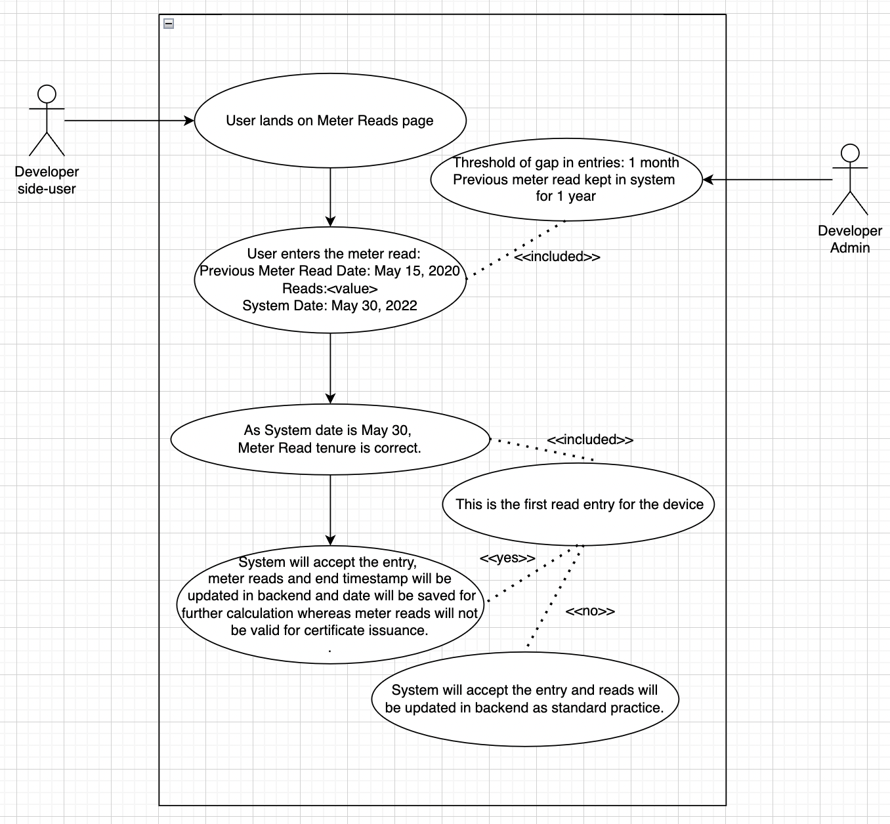

- Delta Readings: Incorrect Data (Threshold of gap in entries)

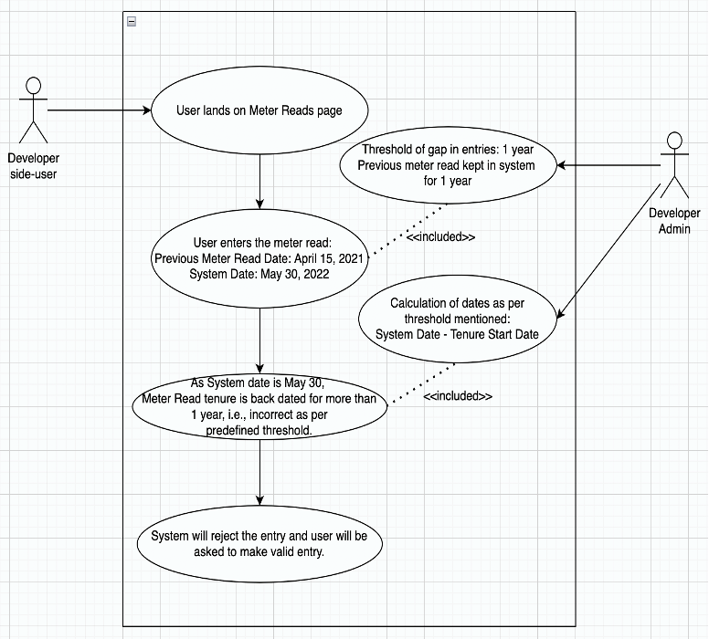

Requirements:

- Developer can enter data on daily, weekly or monthly basis as per the convenience.

- On the first instance of reading entry, reading value will not be considered for certification and only the end time will be recorded for calculations.

- Delta readings are the values pre-calculated by the Developer, which will be entered in the system and should be considered for certification.

- For Delta type of Meter Read entries, the end time of current entry will be considered as start time of next entry.

Business Logic:

- Developers will need to update the read values in the system for devices registered under their organisation.

- In this case, Developers will be updating the pre-calculated meter read values in the system.

API Input:

```ts
{

"type": "delta",
"reads":

[{
           "endtimestamp": "2020-01-01T00:00:00Z",
           "value": 10000000
}],

"unit": "Wh",

}
```

API Output:

```json
{
  "endtimestamp": "2020-01-01T00:00:00Z",
  "value": 10000000
}
```

Validation:

- Validation formula for DELTA:

  `const maxEnergy = capacity * meteredTimePeriod * deviceAge * degradation * yieldValue`

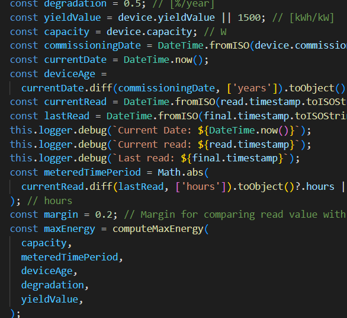


- Read value should not be negative.

- Gap between two entries should not be more than 365 days as data older than that will not be eligible for I-REC certification.

**Aggregate Readings(Running):**

Use Case:

- Aggregate Readings: Correct Entry

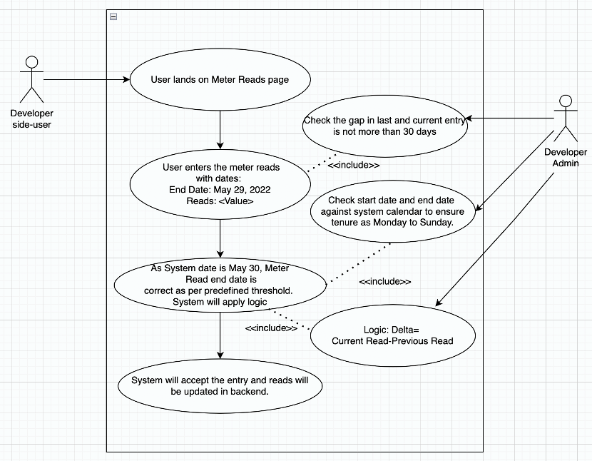

- Aggregate Readings: Incorrect Entry (Week days are not correct)

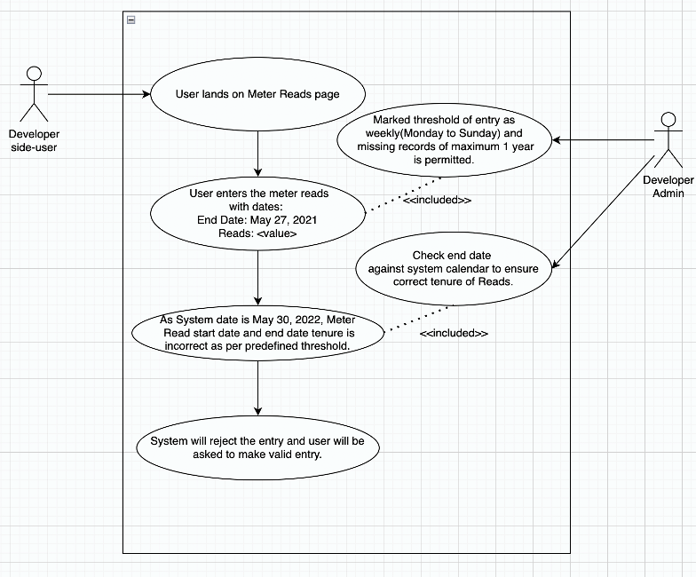

Requirements:

- The calculation will take place on the basis of Current shared reading and last reading count. The formula/logic for the same will look like:

  `Delta= Current Meter Reads – Previous Meter Reads`

- In case of first read entry for the device, application will wait for next data entry to calculate Delta.

Business Logic:

- Developers will need to update the read values in the system for devices registered under their organisation.

- In this case, Developers will be updating the raw meter read values in the system and application will have backend logic to be implemented for the calculation of exact value to be used for certificate issuance.

API Input:

```json
{
  "type": "meter read",
  "reads": [
    {
      "endtimestamp": "2020-01-01T00:00:00Z",
      "value": 10000000
    }
  ],
  "unit": "Wh"
}
```

API Output:

```json
{
  "endtimestamp": "2020-01-01T00:00:00Z",
  "value": 10000000
}
```

Validation:

- Meter read values should not be negative.

- Meter read values should be calculated on the basis of current entry and most recent past dated entry.

- Gap between two entries should not be more than 365 days as data older than that will not be eligible for I-REC certification.

**Switch across the Meter Read types:**

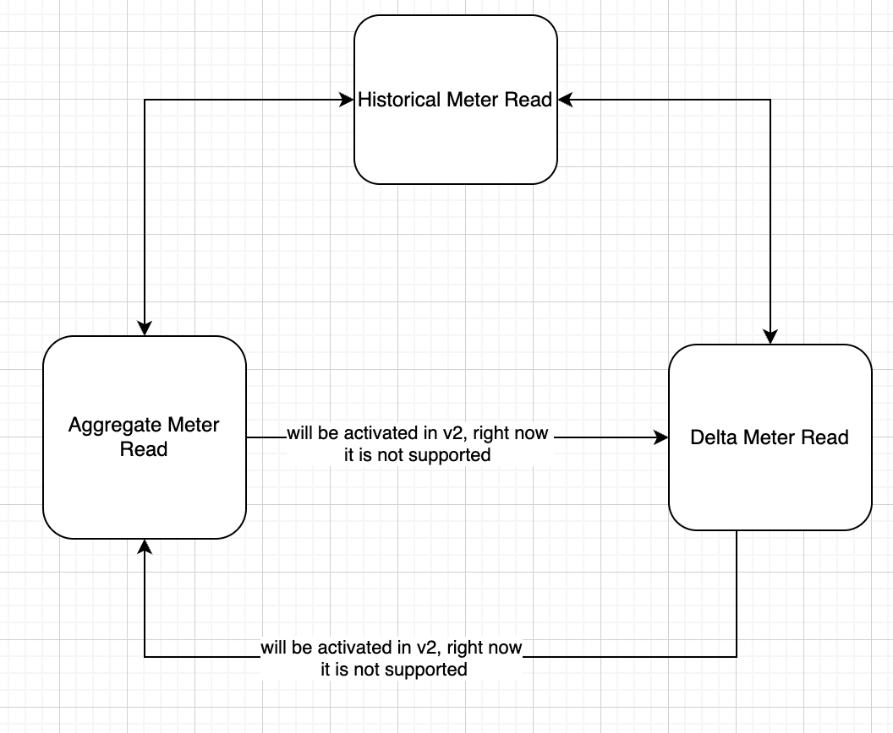

In current scenario, Developer can switch from:

- Aggregate → History and vice-versa

- Delta → History and Vice-versa

In future, Developer may have functionality to switch from Aggregate to Delta and vice-versa too.

## Buyer Reservation v1

Business Logic:

- Buyer whoever wants to consume the energy generated will need to make reservations via platform to get the certified energy generated.

- The certificate issuance process for any generated energy can be initiated when the source device is in active reservation.

- Once a device is reserved by a buyer, it is no longer available for any other buyer. [As there is no feature of partial reservation in current environment]


- Certificate Beneficiary will be the Buyer for all the energy units generated during there reservation from all the devices irrespective of the Device Owner.

- Buyer will have two options at the time of reserving the device with respect to the target capacity, i.e, Authority to exceed or Authority not to exceed.

Use Cases:

   **_No Authority to Exceed_**

   

   **_Authority to Exceed_**

   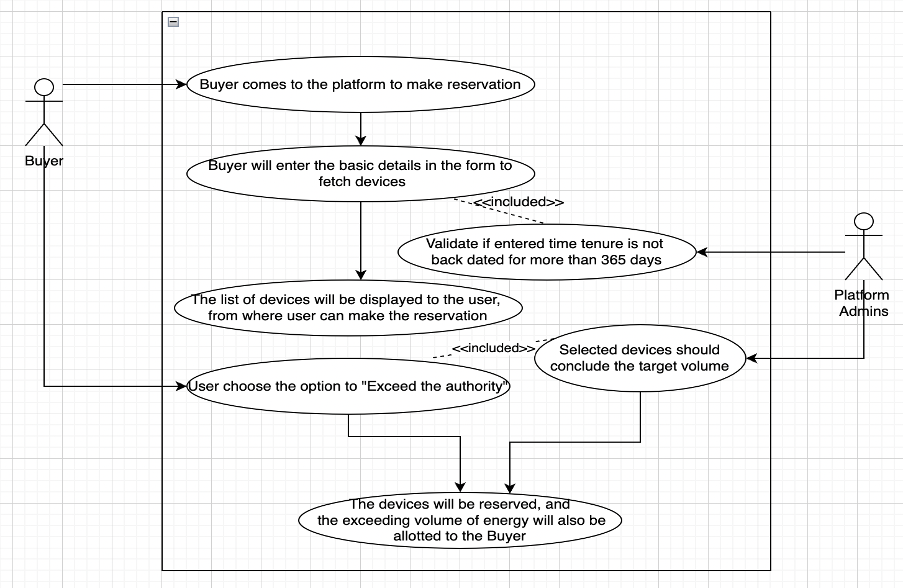

Requirements:

- A device must be reserved by a buyer to be eligible for certificate issuance.

- Target capacity vs target end date

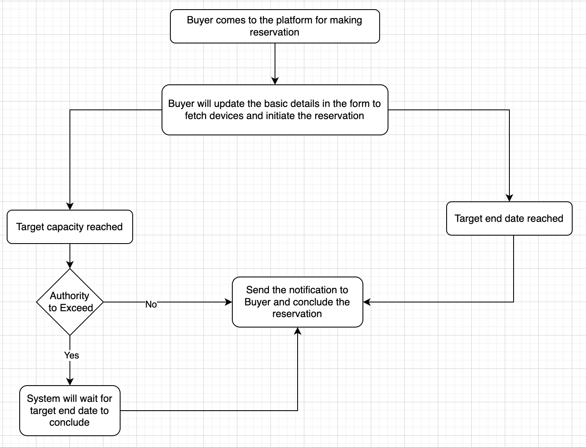

- Buyer should be able to filter the devices on the below listed parameters while making a reservation:

  1. Country Code

  2. Fuel Type (Fuel Code)

  3. Off Taker

  4. Device Code

  5. Target Capacity (kW)

- Data Schema

| Field             | Type    | Description                                                                                                                                                                                                                                                                                              |
| ----------------- | ------- | -------------------------------------------------------------------------------------------------------------------------------------------------------------------------------------------------------------------------------------------------------------------------------------------------------- |
| Reservation ID    | String  | This is autogenerated by the system when a reservation is first set up                                                                                                                                                                                                                                   |
| Standards         | String  | Indicates whether the platform also needs to call into other registries (I-REC, Gold Standard, VERRA). For now, it can only be one value                                                                                                                                                                 |
| Frequency         | String  | How frequently certificates should be issued, possible values are: hourly, daily, weekly, monthly, quarterly                                                                                                                                                                                             |
| StartTime         | String  | Time from which issuance will start, this time could be in the past or in the future. If it’s in the past, it must not be more than 12 months from the current time.                                                                                                                                     |
| EndTime           | String  | Time after which issuance will stop, this time could be in the past or in the future. If it’s in the past, it must not be more than 12 months from the current time. This time also must be later than start time.                                                                                       |
| TargetVolume      | String  | The total volume, in MWh, that the buyer wants to purchase                                                                                                                                                                                                                                               |
| AuthorityToExceed | Boolean | If this is set, then the platform will continue to create D-REC certificates even if the target volume is reached, until the end time is reached. This allows the platform to override the volume quantity. If the buyer or intermediary wants to stop the reservation, they can delete the reservation. |
| TargetAddress     | String  | This is the public wallet address where the certificates must be assigned                                                                                                                                                                                                                                |
| DeviceIDs         | Array   | List of individual device IDs                                                                                                                                                                                                                                                                            |

- Endpoints

| Endpoint      | Method | Description                                                                    |
| ------------- | ------ | ------------------------------------------------------------------------------ |
| /devices      | POST   | Allow the buyer to send in a set of device IDs in batch or individual          |
| /reservations | DELETE | Allow the buyer to delete or close a reservation                               |
| /reservations | PATCH  | Allow for user to add or remove individual devices within a single reservation |

- Developer should be notified on every reservation of their device.

- Each and every device reservation should be logged on chain for the Buyer’s reference.

- For the Netflix contract, once the certificate issuance frequency is defined, it should remain intact for the whole reservation.

- Whenever a reservation is ended, we can have 12 hours of waiting period on reserved devices for re-reserving the same .

- Once 12 hours are passed from conclusion of reservation, the devices will be relieved for another reservation.

- **Certificate Issuance:** Reservations contains devices belonging to multiple organisation so first certificate ownership cannot be organisation but rather it will directly be transferred to buyer.

- Once certificate issuance frequency is fixed it should be fixed at-least for this Netflix contract. For frequency of certificate generation there will be lot of cases for us to handle if frequency is changing.

- **Device Grouping:** As per the fields(Country Code, Fuel Type Code, Device Code, Off Taker, Target Capacity) from Buyer Reservation form, platform will show eligible devices by grouping them together. This grouping can span across different organisations which are from the same country.

- **Device Ungrouping:** Developer with (UPDATE or DELETE ACLs) can update the devices which are part of reservation.
  System will automatically release the devices which are part of expired reservations.
  In case automatic release of device is unsuccessful, then users shall be able to release the devices manually whereas in case of active reservations, users should not be allowed to update the device groups.

**Requirements Gathered in February Meetings:**

- capacity can be changed while in reservation.

- device capacity can be changed in future then old certificate will have conflict as capacity changed even though - add in device log table the device's capacity and commissioning date.

API Input:

```json
{
  "name": "string",
  "deviceIds": [0],
  "targetCapacityInMegaWattHour": 0,
  "reservationStartDate": "2022-12-18T13:00:50.476Z",
  "reservationEndDate": "2022-12-18T13:00:50.476Z",
  "continueWithReservationIfOneOrMoreDevicesUnavailableForReservation": true,
  "continueWithReservationIfTargetCapacityIsLessThanDeviceTotalCapacityBetweenDuration": true,
  "authorityToExceed": true,
  "frequency": "string",
  "blockchainAddress": "string"
}
```

**Device Grouping:**

```json
{
"countryCode": "string",
"fuelCode": "string",
"deviceCode": “string”,
"offTaker": “string”,
"frequency": “string”,
"starttime": “string”,
"endtime": “string”,
"targetVolume" : float
}
```

API Response:

```json
{
  "id": 0,
  "name": "string",
  "organizationId": 0,
  "countryCode": "string",
  "fuelCode": "string",
  "standardCompliance": "string",
  "deviceTypeCodes": ["string"],
  "offTakers": ["School"],
  "installationConfigurations": ["StandAlone"],
  "sectors": ["Agriculture"],
  "gridInterconnection": true,
  "aggregatedCapacity": 0,
  "capacityRange": "string",
  "commissioningDateRange": ["Year 1 - Q1"],
  "yieldValue": 0,
  "labels": ["string"],
  "devices": [
    {
      "id": 0,
      "externalId": "string",
      "status": "string",
      "organizationId": 0,
      "projectName": "string",
      "address": "string",
      "latitude": "string",
      "longitude": "string",
      "countryCode": "string",
      "fuelCode": "string",
      "deviceTypeCode": "string",
      "capacity": 0,
      "commissioningDate": "string",
      "gridInterconnection": true,
      "offTaker": "string",
      "yieldValue": 0,
      "labels": "string",
      "impactStory": "string",
      "data": "string",
      "images": ["string"],
      "integrator": "string",
      "deviceDescription": "string",
      "energyStorage": true,
      "energyStorageCapacity": 0,
      "qualityLabels": "string",
      "groupId": 0,
      "SDGBenefits": 0
    }
  ],
  "organization": {
    "id": 0,
    "name": "string",
    "secretKey": "string",
    "address": "string",
    "zipCode": "string",
    "city": "string",
    "country": "string",
    "organizationType": "string",
    "status": "Submitted",
    "documentIds": ["string"],
    "signatoryDocumentIds": ["string"],
    "blockchainAccountAddress": "string",
    "blockchainAccountSignedMessage": "string"
  },
  "frequency": "string",
  "reservationStartDate": "2022-12-18T13:00:50.478Z",
  "reservationEndDate": "2022-12-18T13:00:50.478Z",
  "targetVolumeInMegaWattHour": 0,
  "targetVolumeCertificateGenerationSucceededInMegaWattHour": 0,
  "targetVolumeCertificateGenerationRequestedInMegaWattHour": 0,
  "targetVolumeCertificateGenerationFailedInMegaWattHour": 0,
  "authorityToExceed": true,
  "leftoverReadsByCountryCode": {},
  "buyerId": 0,
  "buyerAddress": "string",
  "leftoverReads": 0
}
```

Validation:

- One blockchain address can be used for multiple reservations.

- If the set target end date is before the current date, then the reservation panel should flag this as an error.

- In case, set target date or volume has reached before other, then the reservation should end if “volume to exceed is marked as NO“ then Warning should be raised for the Buyer..

- In case, set target date or volume has reached before other, then the reservation should end if “volume to exceed is marked as YES“ then Error should be raised for the Buyer.

- Required certificate issuance frequency should be in sync with the devices read entry frequency.

  **Example:** If the certificate issuance frequency is weekly, but the device is reporting monthly, then that device will only be included when it has data. If the buyer reservation only has one device, and that device has not reported anything when the buyer has requested issuance, it would be great if we can log a warning (not error) saying that there is no data from which to issue.

## Device Registration v1

Business Logic

- Developers whoever is generating renewable energy and is part of D-REC ecosystem will be registering their devices on D-REC platform.

- There are 2 methods of Device onboarding

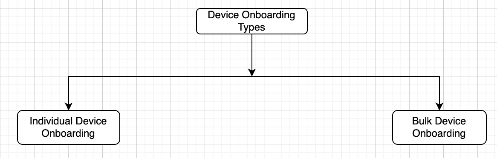

- Individual Device onboarding is by using User Interface fields whereas Bulk Device onboarding will be accommodated with csv file upload option provided on User Interface.

Use Cases:

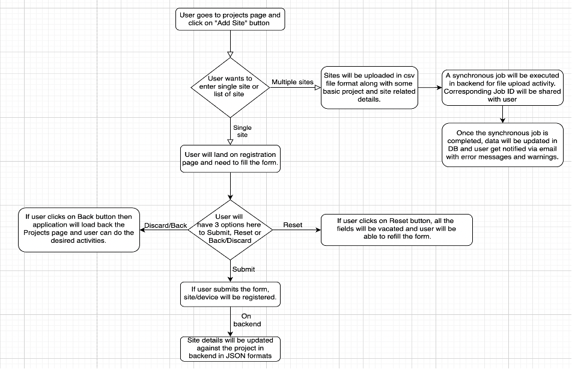

Requirements:

- A site manager/ organisation admin should be able to register devices by hitting device registration end point.

- Developers who use the programmatic interface can use the ID as External ID that they use for their systems, they don’t need to persist the ID that the drec platform assigns. However, that means that even though an externalID is unique to a particular developer, it does not have to be unique across developers.

- Platform will accept CSV file type, stores the file in S3 and shares the job id in email notification to the user. As it’s synchronous way of processing the data, platform will process the data at designated batch process or immediately (NOTE - this has to go as per design)

- **Device Group Metadata:** D-REC platform should allow user to specify impact stories, SDGs and project images. These details should be captured against to each project

- **Requirements collected during February Meetings:**

**_Device ExternalId discussion:_**

- As developers(from different organisations) might have same externalId we currently cannot make externalId as unique (Srinivas suggestion use device name + organisation id ), make use of deviceId in the meter reads in influx db consider production data.

- Update the external ID validation not to include URL characters like #.(what will we do for French characters?). We could restrict them to the Alphanumeric characters and then allow to use – and \_ .

API Input

- For individual device registration:

```json
[
  {
    "version": "v0.1",
    "externalId": "DREC01",
    "deviceGrpId": "UUID",
    "orgId": "5560b4ea-a6d8-4776-aee2-d3424fd18547",
    "organisationName": "Project Device 1",
    "deviceOnBoardedBy": "developer",
    "deviceOEM": "SCHNDLR",
    "address": "",
    "latitude": "34.921213",
    "longitude": "135.717309",
    "countryCode": "DE",
    "postalCode": "",
    "fuelCode": "ES200",
    "deviceTypeCode": "T020001",
    "deviceDescription": "solar home system",
    "capacity": 1500,
    "commissioningDate": "2012-07-01",
    "gridInterconnection": false,
    "energyStorage": true,
    "energyStorageCapacity": 324,
    "offTaker": "School",
    "qualityLabels": "Label 1",
    "SDGBenefits": "string",
    "impactStory": "string",
    "images": ["string"]
  }
]
```

- For bulk device registration, CSV file entries should look like:

**File Header:**

  `“version” |”externalId” |“deviceGrpId” |”orgId” |”organisationName” |”deviceOnBoardedBy” | ”deviceOEM” |”address” |”latitude” |”longitude” |”countryCode” |”postalCode” |”fuelCode” | ”deviceTypeCode” | ”capacity”| ”commissioningDate”| ”gridInterconnection”| ”energyStorage”| ”energyStorageCapacity”| ”offTaker”| ”qualityLabels”| ”SDGBenefits”| ”impactStory”| ”images”`

**Content:**

  `“v2.0”| ”23e3ac67-b3c2390”| ”bd98c08c-547f-486a-b348-17b5bf740b60”| ”86a85a81-1b4b-4261-9874-106d7b2410c3”| ”THAISOLPWR”| ”7aac19cc-40d5-415a-b1fc-eebfdc605efe”| ”SWEYA”| ”DEVELOPER”| ”SCHNDLR”| ”50/565-6 Gp 5 Navamintr Klong Goom Buengkhum”| ””| ””| ””| ””| ”ES100”| ”TC110”1200 | ”2012-07-10”| true| false| 0| ”HealthFacility”| ”Label 1”| 1 | ”120 jobs created”| ”image.png”`

- For Device Group MetaData

```ts
{
"deviceGrpId": “string”,
"deviceGrpName": “string”,
“SDGBenefits”: “string” [This shouldn’t be a text field, but rather a numeric field, with perhaps each bit set for a particular SDG (so bit 0 would be SDG1, bit 1 would be SDG2, etc. This could cleanly support multiple SDGs)],
"impactStory": "string",
"images": ["string"]
}
```

**API Response**

**Validation**

- **Validations on Requirements collected during February Meetings:**

  - Old devices registered before shall also be able to send the meter reads data

  - New devices registered shall also be able to send the meter reads data.

  - Also certificates shall be issued to old devices history and ongoing properly.

  - Also certificates shall be issued to new devices history and ongoing properly.

  - External ID validation not to include URL characters like #. We could restrict them to the Alphanumeric characters and then allow to use – and \_ .

## User Registration v1

## Inviting Users

for developer’s dash board.

There should be a menu item “invitation” under “organization” in the side menu of the DREC platform. When the user clicks on “invitation”, they should be redirected to the “invitation page” where there should be two menu items to select page

1. Invite user: here, there should be following text fields to enter by the user:

   - First name

   - Last name

   - Email address

   - Role (should be drop down) to choose roles from

     - Device owner

     - User

  After entering all the details, the “submit” button should be activated and user can click the button to add the user and send the email invitation to the user.

2. Invitation:

under this menu we will show the invitation details that have been sent in a tabular format under following fields:

- Sender: user that have sent the invitation

- Email: the email address in which the invitation has been sent and user added.

- Status: accepted/ not accepted.

- Action: “delete user” icon, can only be done by organization admin.

the first user will have the role of organization admin who registers the organization in the platform, and he should be able to invite other users to the platform through invitation process.

user role description:

1. organization admin- can invite users to the organization, delete users, add devices, edit device details, delete devices, add meter reads, view meter reads, view certificates.

2. device owner- can invite users to the organization, add devices, edit device details, delete devices, add meter reads, view meter reads, view certificates.

3. users- he can just view the organization info, users, and devices and meter reads.

organization admin and device owner roles will have same permissions that we currently have for developers, but the organization admin will have one more permission - to delete the device owners and users, which the device owner will not have.

An email should be sent to the entered email address from DREC with random generated password which the invited user can use to login to the platform.

**Email Body:**

```text
dear >email address<

you have been invited to register with D-REC from >organization name<. Use your email and the password below to login into D-REC Initiative.

>email<

>random generated password<


Thank you

Best Regards

DREC initiative
```

after the invited user logins with the password and email address, the status of the invitation should be changed to “accepted” in the invitation table.

for buyer’s dashboard.

There should be a menu item “invitation” under “organization” in the side menu of the DREC platform. When the user clicks on “invitation”, they should be redirected to the “invitation page” where there should be two menu items to select page

1. Invite user: here, there should be following text fields to enter by the user:

   - First name

   - Last name

   - Email address

   - Role (should be drop down) to choose roles from

     - sub buyer

     - User

  After entering all the details, the “submit” button should be activated and user can click the button to add the user and send the email invitation to the user.

2. Invitation:

under this menu we will show the invitation details that have been sent in a tabular format under following fields:

- Sender: user that have sent the invitation

- Email: the email address in which the invitation has been sent and user added.

- Status: accepted/ not accepted.

- Action: “delete user” icon, can only be done by organization admin.

the first user will have the role of organization admin who registers the organization in the platform, and he should be able to invite other users to the platform through invitation process.

user role description:

1. organization admin- can invite users to the organization, delete users, create reservation, view reservations, view certificates.

2. sub buyer- can invite users to the organization, create reservation, view reservations, view certificates.

3. users- will have all the view permissions, cannot create reservation.

organization admin and sub-buyers roles will have same permissions that we currently have for buyers, but the organization admin will have one more permission - to delete the sub buyers and users, which the sub buyer will not have.

an email should be sent to the entered email address from DREC with random generated password which the invited user can use to login to the platform.

**Email Body:**

```text
dear >email address<

you have been invited to register with D-REC from >organization name<. Use your email and the password below to login into D-REC Initiative.

>email<

>random generated password<


Thank you

Best Regards

DREC initiative
```

after the invited user logins with the password and email address, the status of the invitation should be changed to “accepted” in the invitation table.
