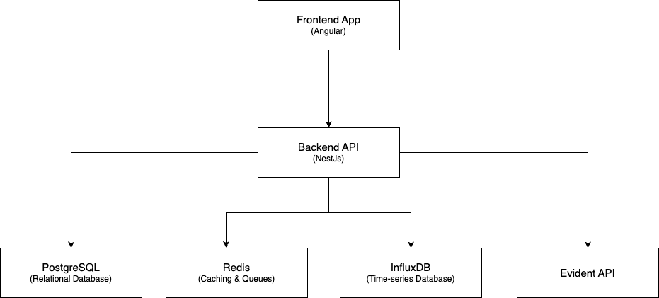

# Platform Architecture

## Components Overview

### **Frontend (Angular)**

- Connects to the **NestJS API backend** for data retrieval and real-time updates.
- Does not directly interact with any database or caching layer.

### **Backend (NestJS)**

- Serves as the central hub for managing and processing requests.
- Interacts with:
  - **PostgreSQL**: Stores relational data such as user accounts, configurations, and logs.
  - **Redis**: Used for:
    - **Caching**: Frequently accessed data (e.g., session tokens, configuration values).
    - **Queues**: Background job processing and real-time event handling (e.g., WebSocket message distribution).

### **PostgreSQL**

- Manages structured, relational data.
- Stores business-critical data with long-term persistence.

### **Redis**

- Functions as an **in-memory data store** for high-speed operations.
- Used for:
  - Session storage for authentication tokens.
  - Caching expensive query results from PostgreSQL.
  - Pub/Sub messaging and job queues for background tasks.

## Deployment Overview

- **AWS EKS** – Manages containerized frontend and backend services.
- **AWS RDS** – Provides managed PostgreSQL database services.
- **AWS ElastiCache** – Manages Redis for caching and high-speed data access.
- **AWS VPC** – Defines secure network infrastructure.
- **AWS ALB** – Handles load balancing for application traffic.

## Service Deployment Details

### **Frontend Deployment**

- **Platform**: Deployed on **AWS EKS** as a Docker container.
- **Configuration**:
  - Serves static assets via **NGINX** within Kubernetes pods.

### **Backend Deployment**

- **Platform**: Deployed on **AWS EKS** as a Docker container.
- **Configuration**:
  - Exposed via Kubernetes **Ingress**, secured with AWS **ALB**.
  - Communicates with PostgreSQL (AWS RDS).
- **Security**:
  - Manages secrets using Kubernetes **Secrets**.

### **PostgreSQL Deployment**

- **Platform**: Managed via **AWS RDS** for high availability.
- **Configuration**:
  - Secured with **private VPC access**.
  - Optimized with **read replicas** for heavy read workloads.

### **Redis Deployment**

- **Platform**: Managed via **AWS ElastiCache** for high-performance, in-memory data storage.
- **Configuration**:
  - Optimized with **read replicas** for heavy read workloads.
  - Secured with **private VPC access**.
