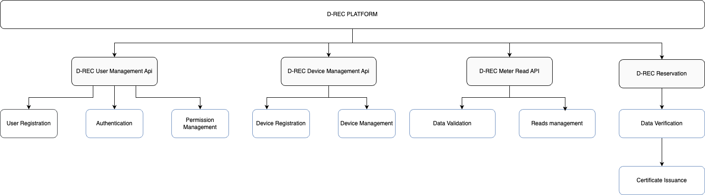

# Platform Functionality

The D-REC platform (open-source software) was developed in partnership with the Energy Web Foundation and manages the D-REC certificate lifecycle. Built upon the open-source Origin toolkit, the platform allows for account and device registration, submission of meter reads for verification as well as the issuance of certificates. All certificate lifecycle stages are recorded on the Energy Web Chain. The platform was designed to closely mirror the Evident registry structure and functionality to ensure maximum compatibility. The following diagram outlines the key functional components:



This platform is designed to meet the needs of various user groups, such as administrators, DRE project developers, corporate buyers, and market intermediaries offering them customized tools suited to their unique operational requirements.

The various modules are as follows:

- User Management: The D-REC platform’s UI or API enables users to add or remove users and interact with the system, including registering or removing devices or requesting certificate issuance.
- Device Management: This section involves adding, removing, or editing individual devices. Below is the data schema outlining the fields for device registration; devices can be registered through the UI or the API.
- Meter Reads: Through an API interface, devices can submit meter readings of three types: historical, aggregate, or delta. Aggregate refers to the running total of electricity produced since the device’s commissioning; delta indicates the specific generation amount between each submission of meter data to the D-REC Platform; historical denotes submitting data from a previous period for certification issuance.
- Buyer Reservation: Certificate issuance occurs only when a buyer for the D-REC certificates specifically requests it. In this regard, the buyer identifies the devices from which they wish to issue certificates. The data schema for the reservation is outlined below. For interaction with the Evident registry, there are three main points where data ~~is~~ will be exchanged between the two registries: when a device ~~is~~ will be registered (i.e., it ~~is~~ will be reflected in both the D-REC Platform and the Evident registry), when a certificate ~~is~~ will be issued. Each step in the process is documented below:

## User Registration

Users register on the D-REC platform by completing the necessary formalities at the time of user registration (please refer to the ‘Application Submission’ steps). The platform then sends an email, which the user verifies. The first user to register in a particular organization is designated as an administrator and can invite other users from their organization to join the platform. All users are granted either read, write, or delete privileges. Once logged in, users are provided an access token, after which they can access other platform functionality.

## Device Registration

Developers onboard their devices on the D-REC Platform primarily through two means – the first is a “bulk upload” in which they provide device metadata either in a JavaScript Object Notation (JSON) or a Comma-Separated Values (CSV) file. The second method is to use the D-REC Platform API to submit data. Users must be logged in and have a valid access token in order to register devices. Upon logging in to the D-REC Platform, users can view all the devices that they have registered on the system. Note that during device registration the user must provide detailed metadata via the schema below, and only a subset of the data is shown on the main landing page.

The device schema is as follows:

```json
{
  "id": "number",
  "externalId": "string",
  "developerExternalId": "string",
  "status": "string",
  "organizationId": "number",
  "projectName": "string",
  "address": "string",
  "latitude": "string",
  "longitude": "string",
  "countryCode": "string",
  "fuelCode": "string",
  "deviceTypeCode": "string",
  "capacity": "number",
  "commissioningDate": "string",
  "gridInterconnection": "boolean",
  "offTaker": "string",
  "yieldValue": "number",
  "labels": "string",
  "impactStory": "string",
  "data": "string",
  "images": ["string"],
  "integrator": "string",
  "deviceDescription": "string",
  "energyStorage": "boolean",
  "energyStorageCapacity": "number",
  "qualityLabels": "string",
  "groupId": "number",
  "SDGBenefits": ["string"]
}
```

## **Meter Reads**

Once a device is registered on the D-REC Platform, it can submit meter reads for validation—this occurs through the D-REC Platform’s POST /api/meter-reads/new/{id} endpoint, where {id} refers to the identifier that the developer uniquely assigns to each installation. Alternatively, this can also be done via a file upload. As mentioned earlier, there are three types of meter reads: historical, aggregate, and delta. However, no certificate is issued.

## **Buyer Reservation**

A buyer must specify which devices they wish to have certificates issued from. Before making a reservation, a device can submit meter data, but no certificates will be issued. Once a reservation is made, the platform will start validating the submitted data and then issue the corresponding D-REC. The reservation schema is as follows:

```json
{
  "reservationId": "string",
  "standards": "string",
  "frequency": "string",
  "starttime": "string",
  "endtime": "string",
  "targetVolume": double,
  "authorityToExceed": boolean,
  "targetAddress": "string",
  "deviceIDs": [ // list of individual device IDs
    "UUIDs"
   ]
}
```

Once the Buyer Reservation is set, the platform begins validating data from the devices identified in the reservation. The platform then validates the data using an algorithm (a “digital twin lite”) to determine whether the data submitted by the device aligns with expectations based on its location, capacity, and other factors. Currently, the platform utilizes a simplified algorithm that will be further enhanced with input from various stakeholders. As more data becomes available, the expected tolerance band will decrease from two standard deviations. The upper range is likely to be reduced further as the primary risk being mitigated is the reporting of overproduction rather than underproduction (overproduction could result in more D-RECs being issued than are actually attributable to the asset).

```math
Expected generation μ = Solar irradiance * Nameplate capacity *(1 - 0.5%)^(Years since Commissioning - 1)

Assume expected generation distributed normally with mean μ and standard deviation σ, and reported generation daily value x:

If (μ – 1.5σ) ≤ x ≤ (μ + 1.5σ), then the reported generation data is accepted
```

Once the validation has been successful, a certificate will be issued and assigned to the Buyer’s wallet (organization blockchain address). The platform user interface (UI) will list all of the issued certificates:

Each line represents a digital certificate representing 1 or more kWh of verified energy generated from a reservation; each certificate can only correspond to a single reservation.
