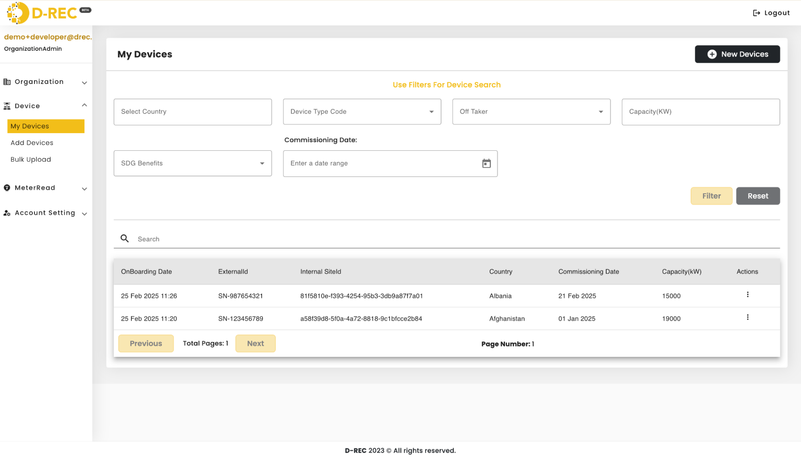
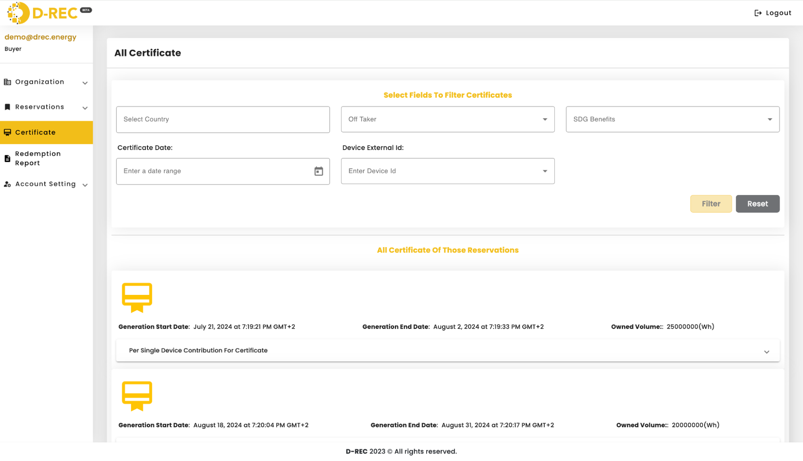

# Platform Functionality

## Overview

The D-REC platform is open-source software developed in partnership with the Energy Web Foundation that manages the D-REC certificate lifecycle. Built upon the open-source Origin toolkit, the platform enables:

- Organization Registration
- Device registration
- Submission of meter reads for verification
- Issuance of certificates

All certificate lifecycle stages are recorded on the Energy Web Chain. The platform is designed to closely mirror the Evident registry structure and functionality to ensure maximum compatibility.

This platform serves various user groups, including:

- Platform Operator (Admin)
- DRE project developers
- Corporate buyers
- Market intermediaries

Each group has access to customized tools suited to their unique operational requirements.

## Service Architecture


### Key Modules

| Module | Description |
|--------|-------------|
| **User Management** | Enables users to add/remove users and interact with the system, including registering devices or requesting certificate issuance through UI or API |
| **Device Management** | Handles adding, removing, or editing individual devices through UI or API using a standardized data schema |
| **Meter Reads** | Allows devices to submit meter readings via API in three formats: historical, aggregate, or delta |
| **Buyer Reservation** | Manages certificate issuance, which only occurs when a buyer specifically requests it for selected devices |

## User Registration Process

1. Users complete the registration process on the D-REC platform
2. The platform sends a verification email
3. The first user to register for an organization is designated as an administrator
4. Administrators can invite other users from their organization
5. All users are granted either read, write, or delete privileges
6. Upon login, users receive an access token for platform functionality

## Device Registration

Developers can onboard devices through two primary methods:

1. **Bulk Upload**: Providing device metadata in JSON or CSV format
2. **API Submission**: Using the D-REC Platform API

Users must be logged in with a valid access token to register devices. The platform's dashboard displays all registered devices, though only a subset of the detailed metadata is shown on the main landing page.

### Device Schema

```json
{
  "id": "number",
  "externalId": "string",
  "developerExternalId": "string",
  "status": "string",
  "organizationId": "number",
  "projectName": "string",
  "address": "string",
  "latitude": "string",
  "longitude": "string",
  "countryCode": "string",
  "fuelCode": "string",
  "deviceTypeCode": "string",
  "capacity": "number",
  "commissioningDate": "string",
  "gridInterconnection": "boolean",
  "offTaker": "string",
  "yieldValue": "number",
  "labels": "string",
  "impactStory": "string",
  "data": "string",
  "images": ["string"],
  "integrator": "string",
  "deviceDescription": "string",
  "energyStorage": "boolean",
  "energyStorageCapacity": "number",
  "qualityLabels": "string",
  "groupId": "number",
  "SDGBenefits": ["string"]
}
```

### Dashboard Device View



## Meter Reads

Once registered, devices can submit meter reads for validation through:

- The D-REC Platform's API endpoint: `POST` `/api/meter-reads/new/{id}`
  - Where `{id}` is the identifier uniquely assigned to each installation
- File upload

Three types of meter reads are supported:

- **Historical**: Data from a previous period
- **Aggregate**: Running total of electricity produced since commissioning
- **Delta**: Specific generation amount between data submissions

*Note: Submitting meter reads alone does not trigger certificate issuance.*

## Buyer Reservation

Certificate issuance requires a buyer to specifically request it by selecting devices. The reservation process follows these steps:

1. Buyer specifies which devices should issue certificates
2. Platform begins validating submitted data from selected devices
3. Upon successful validation, certificates are issued and assigned to the buyer's wallet

### Reservation Schema

```json
{
  "reservationId": "string",
  "standards": "string",
  "frequency": "string",
  "starttime": "string",
  "endtime": "string",
  "targetVolume": "double",
  "authorityToExceed": "boolean",
  "targetAddress": "string",
  "deviceIDs": [
    "UUIDs"  // list of individual device IDs
  ]
}
```

## Data Validation

The platform validates device data using an algorithm ("digital twin lite") to determine whether submitted data aligns with expectations based on:

- Device location
- Capacity
- Other relevant factors

The validation process consists of two key components: calculating expected generation and applying acceptance criteria.

### Expected Generation Formula

$$\mu = I \times C \times (1 - 0.005)^{(Y-1)}$$

Where:

- $\mu$ = Expected generation (kWh)
- $I$ = Solar irradiance (kWh/m²)
- $C$ = Nameplate capacity (kW)
- $Y$ = Years since commissioning

### Validation Criteria

The reported generation is assumed to be normally distributed with:

- Mean: $\mu$ (calculated from the formula above)
- Standard deviation: $\sigma$

A reported daily generation value $x$ is accepted when it falls within the following range:
$$(\mu - 1.5\sigma) \leq x \leq (\mu + 1.5\sigma)$$

## Certificate Issuance

After successful validation:

- Certificates are issued and assigned to the buyer's wallet (organization blockchain address)
- Each certificate represents 1 or more kWh of verified energy from a reservation
- Each certificate corresponds to a single reservation


