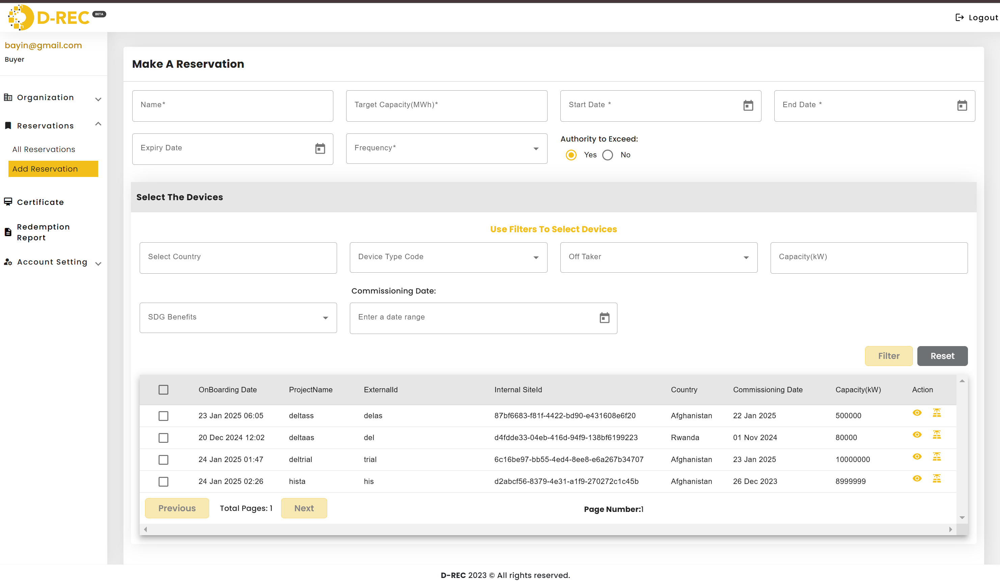
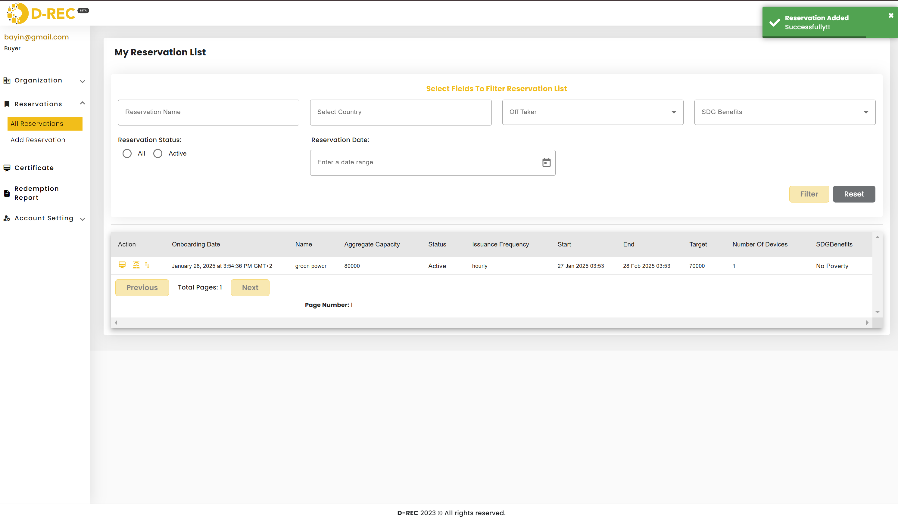

# Buyer User Guide

This guide covers all features available to Buyers in the D-REC platform, including making reservations, managing certificates, and viewing reservation statuses.

## Reservations Management

### Add a Reservation

1. Navigate to Reservations > Add Reservation in the left sidebar
2. Fill in the required reservation details:
   - Name\*
   - Target Capacity (MWh)\*
   - Start Date\*
   - End Date\*
   - Expiry Date
   - Frequency\*
   - Authority to Exceed (Yes/No)

#### Select Devices for Reservation

1. Under "Select The Devices" section, use filters to find appropriate devices:
   - Select Country
   - Device Type Code
   - Off Taker
   - Capacity (KW)
   - SDG Benefits
   - Commissioning Date range
2. Click "Filter" to apply selections or "Reset" to clear filters
3. Select devices from the displayed list by checking the boxes
4. Review device details:
   - OnBoarding Date
   - ProjectName
   - ExternalId
   - Internal SiteId
   - Country
   - Commissioning Date
   - Capacity(KW)

> **Note:** Only available devices not currently reserved will be displayed.

Before finalizing the reservation, you'll be prompted to confirm:

- Whether to continue if some devices become unavailable
- Whether to proceed if the target capacity is less than the estimated reachable capacity

### View Reservations

1. Access Reservations > All Reservations from the left menu
2. Use the filter options to find specific reservations:
   - Reservation Name
   - Select Country
   - Off Taker
   - SDG Benefits
3. Filter by Reservation Status:
   - All
   - Active
4. Set Reservation Date range
5. View reservation details in the table:
   - Onboarding Date
   - Name
   - Aggregate Capacity
   - Status
   - Issuance Frequency
   - Start/End Dates
   - Target
   - Number of Devices
   - SDG Benefits

## Certificate Management

### View Certificates

1. Navigate to Certificate in the left sidebar
2. Use the filter options to locate specific certificates:
   - Select Country
   - Off Taker
   - SDG Benefits
   - Certificate Date range
3. View certificate details:
   - Generation Start Date
   - Generation End Date
   - Owned Volume (Wh)
   - Per Single Device Contribution details

### Certificate Details

Each certificate shows:

- Generation period (Start and End dates)
- Total owned volume
- Device contributions
- Certificate number (displayed as an icon)

### Filter Certificates

Use the "Select Fields To Filter Certificates" section to:

- Search by country
- Filter by Off Taker
- Filter by SDG Benefits
- Set specific certificate date ranges

## Redemption Reports

Access Redemption Report from the left sidebar to:

- View redemption history
- Track certificate usage
- Generate reports for redeemed certificates

## Tips for Buyers

1. **Reservation Planning:**

   - Check device availability before making reservations
   - Consider device capacities when setting target volumes
   - Plan reservation periods based on certificate needs

2. **Certificate Management:**

   - Regularly review certificate generation status
   - Monitor owned volumes against reservation targets
   - Track certificate expiry dates

3. **Device Selection:**

   - Use filters to find devices matching your requirements
   - Consider SDG Benefits for sustainability reporting
   - Check device locations and capacities

4. **Best Practices:**
   - Keep track of reservation expiry dates
   - Monitor certificate generation frequency
   - Review device contributions regularly
   - Use filter functions to efficiently manage large numbers of certificates
