# DRE Project Developer Guide

This guide provides detailed instructions for DRE Project Developers to manage their devices and meter reads on the platform. Follow the steps below to register devices, view and manage device details, and handle meter read entries both individually and in bulk.

## Device Registration

### Accessing Device Registration

1. Log in to your DRE Project Developer account
2. In the left sidebar menu, click on "Device"
3. Select "Add Devices" from the dropdown menu

You can register devices using one of the following methods:

### 1. Single Device Registration

To register one device at a time:

1. Navigate to Device > Add Devices
2. Fill in the required fields:
   - Project Name
   - External ID (unique identifier for your device)
   - Select Country
   - Commissioning Date
   - Capacity (kW)
   - Address
   - Latitude and Longitude (decimal format)
   - Fuel Code (e.g., Solar)
   - Device Type Code (e.g., PV Ground mounted)
   - SDG Benefits
3. Click "Add More Details" if you need to provide additional information
4. Click "Submit" to register the device

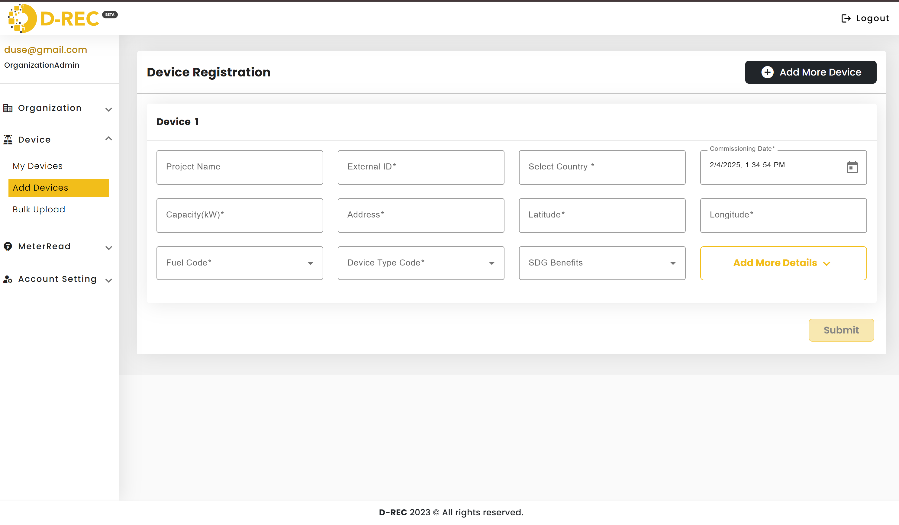

### 2. Multiple Device Registration

For registering several devices at once:

1. On the device registration page, fill in details for the first device
2. Click the "Add More Device" button in the top right corner to add another device form
3. Fill in the details for each additional device
4. Click "Submit" when all devices are entered

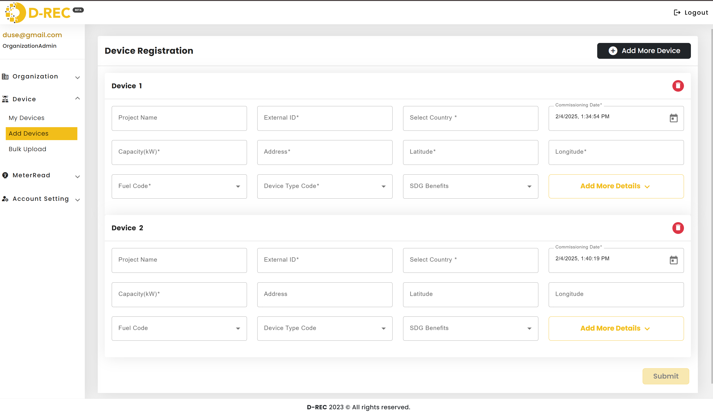

### 3. Bulk Upload (CSV)

For large-scale device registration:

1. Navigate to Device > Bulk Upload
2. Select your organization from the dropdown (if applicable)
3. Click "Please click here to select file" to upload your CSV
4. Click "Upload" to process the file
5. Monitor the status in the table below
6. Check the "Logs" column for any validation errors or success messages

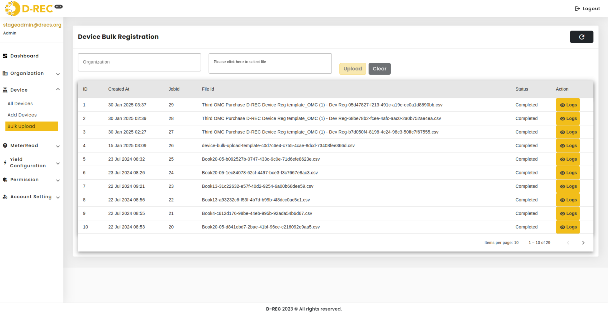

You can also review detailed information and error messages related to the bulk upload process in the logs:

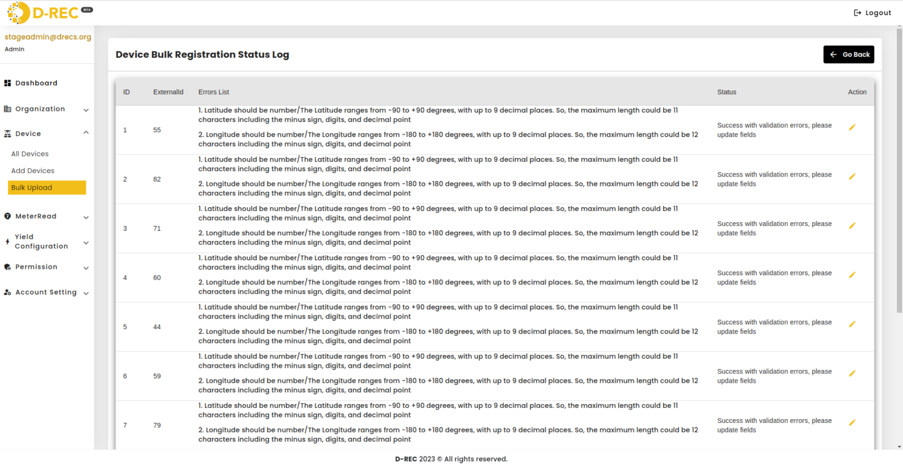

## Device Management

### Viewing Devices

1. In the left sidebar, go to Device > My Devices
2. Use the filter options at the top to search for specific devices:
   - Select Country
   - Device Type Code
   - Off Taker
   - Capacity (KW)
   - SDG Benefits
   - Commissioning Date range
3. Use the search bar for quick lookups by ExternalId or other fields

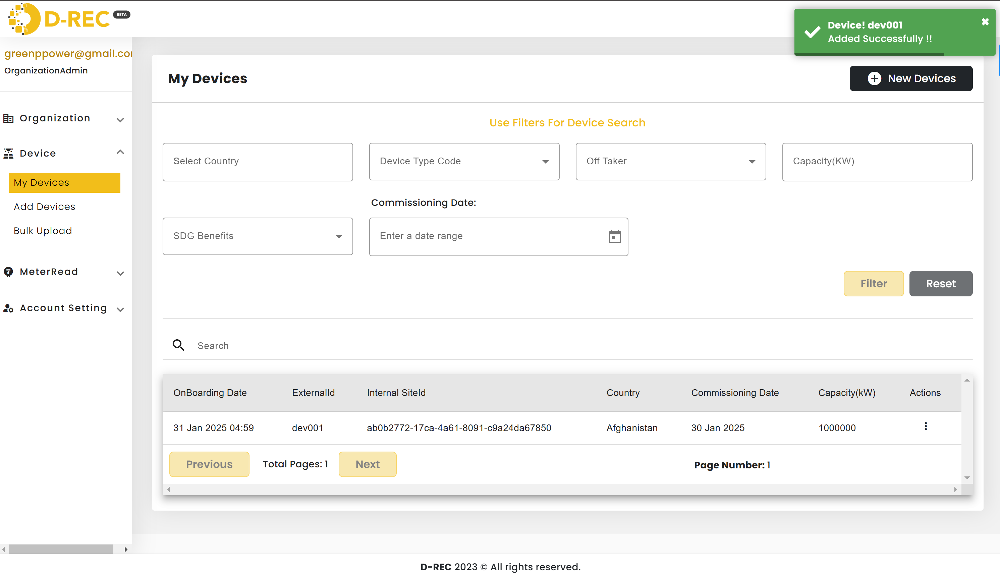

### Managing Device Details

From the My Devices page, use the three-dot menu (⋮) in the Actions column to:

1. **View Device Details:**
   - Click the menu and select view option
   - Review comprehensive device information including energy storage details

   

2. **Edit Device:**
   - Select edit from the menu
   - Update necessary fields in the Device Update Form
   - Click "Update" to save changes
   - Click "Cancel" to discard changes

   

3. **Delete Device:**
   - Choose delete from the menu
   - Confirm deletion in the popup dialog

   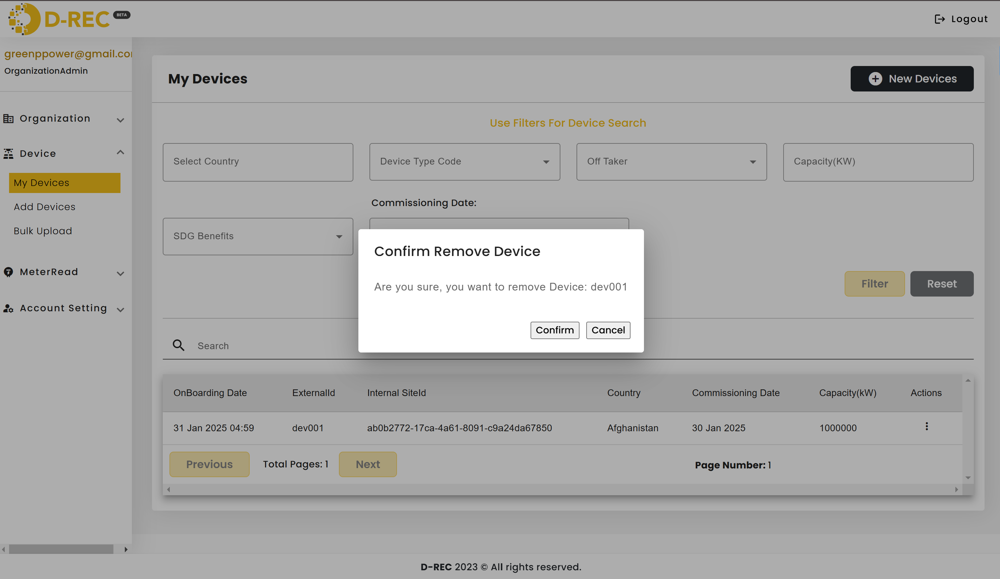

## MeterRead Management

### Adding Single MeterRead

1. Navigate to MeterRead > Add MeterRead in the left sidebar
2. Fill in the required information:
   - External ID (of the device)
   - Select Timezone
   - Read Type (History/Aggregate/Delta)
   - Unit (kWh)
   - Meter Read value
   - Start Datetime (for History reads)
   - End Datetime
3. Click "Submit" to save the meter read

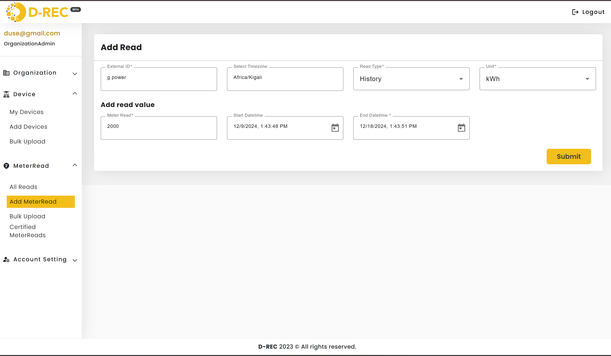

### Viewing MeterReads

1. Access MeterRead > All Reads
2. Use the filters at the top:
   - External ID
   - Start Date
   - End Date
3. Click "Filter" to apply the selection
4. Click "Reset" to clear filters

### Bulk MeterRead Upload

1. Go to MeterRead > Bulk Upload
2. Click "Download Template" to get the correct CSV format
3. Fill in the template with your meter read data
4. Return to the Bulk Upload page
5. Select your file and click "Upload"
6. Monitor the upload status and check logs for any issues

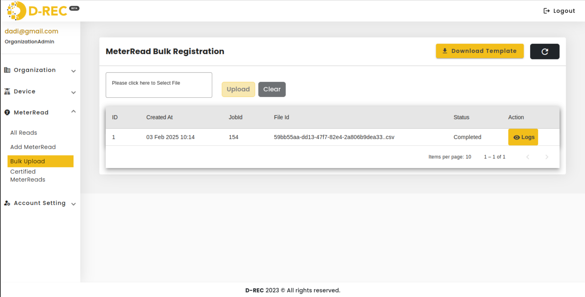

If the bulk upload fails, review the error details by clicking the logs action:

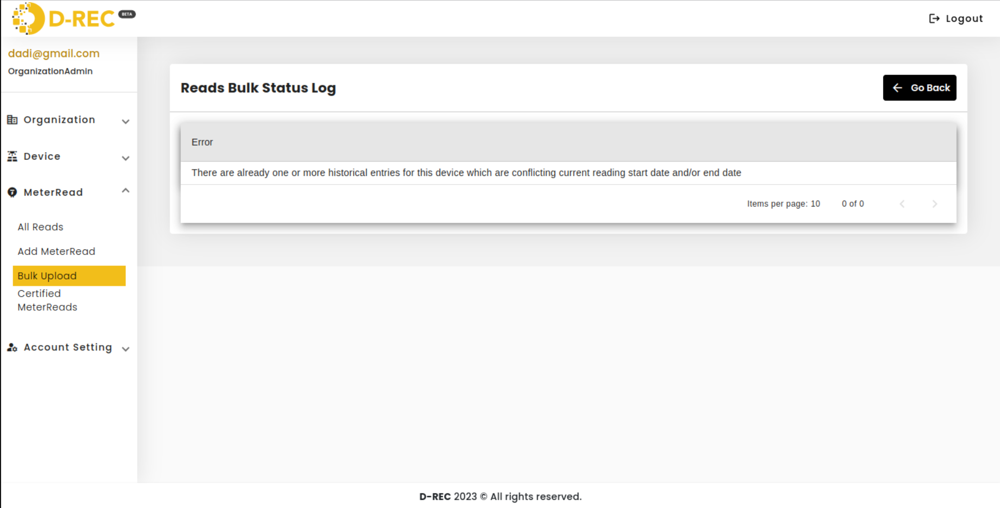

To check the uploaded meter reads, navigate to the "All Reads" section and filter by external ID:

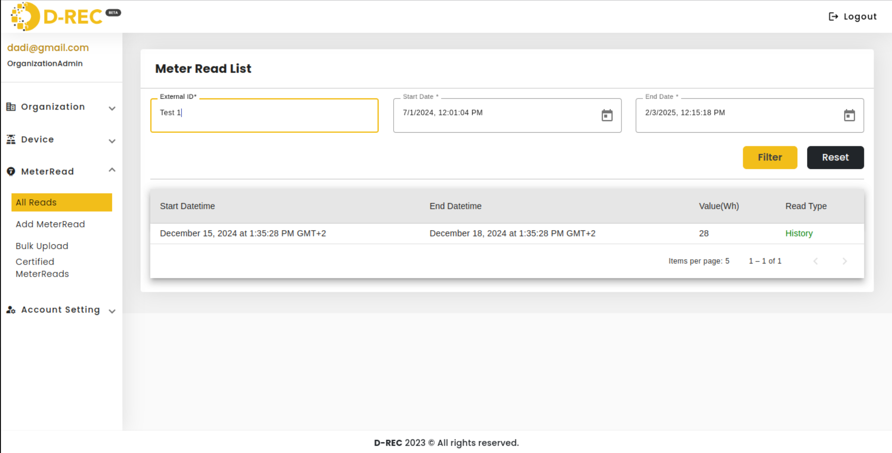

### Certified MeterReads

1. Navigate to MeterRead > Certified MeterReads
2. Use the same filtering options as All Reads
3. View only the meter reads that have been certified

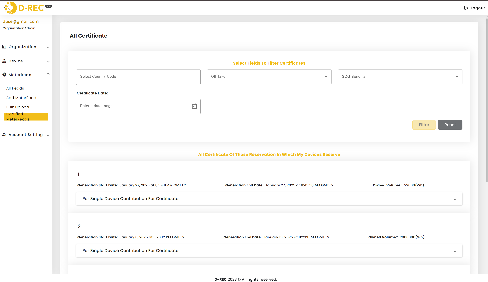

## Tips and Best Practices

- Always verify device External IDs before adding meter reads
- For bulk uploads, review the template format carefully before submission
- Check for validation errors in the logs immediately after bulk uploads
- Use the filter functions to efficiently manage large numbers of devices or reads
- Keep track of commissioning dates for accurate historical records

> **Note:** The system will validate all entries automatically. Pay attention to error messages and validation requirements, especially for coordinates and date formats.
