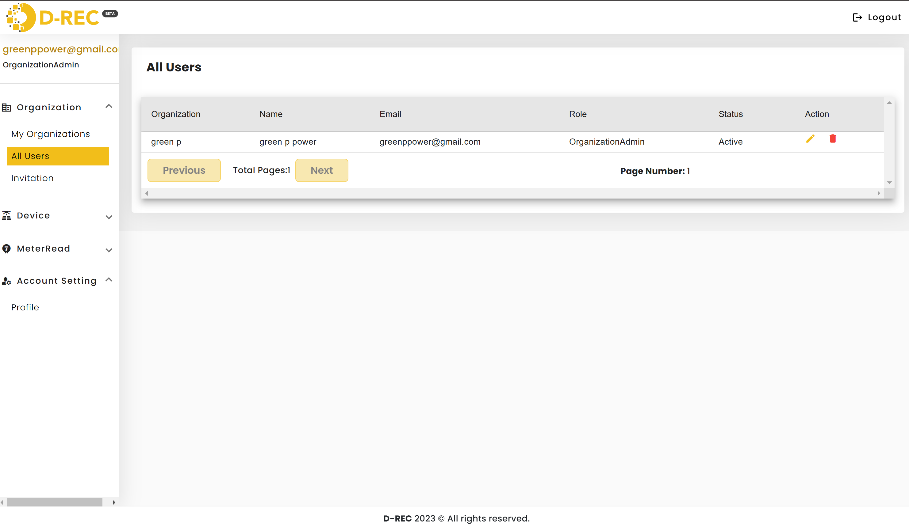
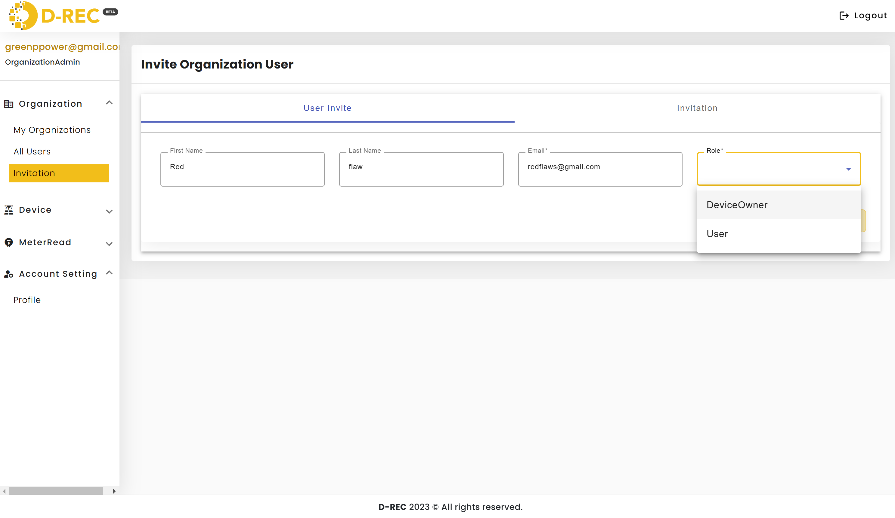
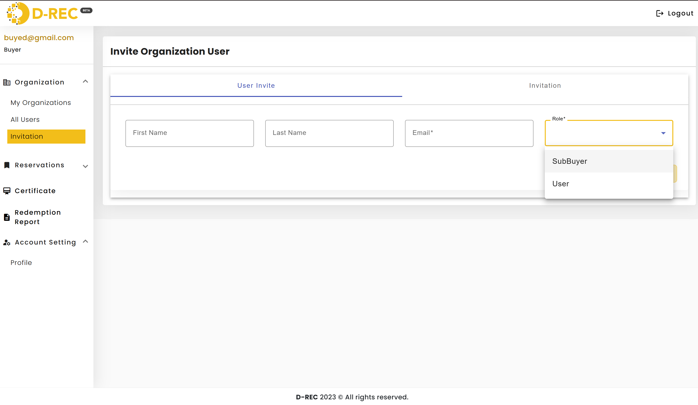
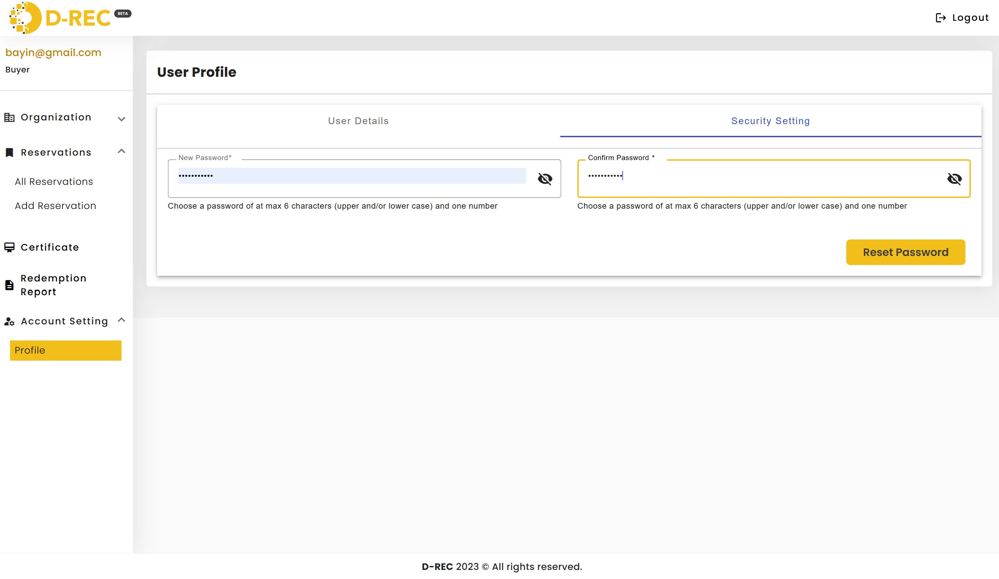

# Common Platform Features

This section covers the features and functionalities shared across different user roles in the D-REC platform.

## Organization Management

### Viewing Organization

1. Access the Organization menu from the left sidebar
2. View organization details and structure
3. Access organization-specific features based on your role

### User Management (Organization Admin)

Organization administrators have access to comprehensive user management capabilities:

1. **View All Users**
   - Navigate to Organization > All Users
   - See all users within your organization
   - View details including Name, Email, Role, and Status

2. **User Actions**
   - Edit user details using the pencil icon
   - Remove users using the delete icon
   - Monitor user status (Active/Inactive)

## User Invitation System

### Inviting New Users

1. Navigate to Organization > Invitation
2. Fill in required information:
   - First Name
   - Last Name
   - Email\*
   - Role\*

> **Note:** Available roles differ based on your user type

#### Role Assignment Options

- **For Developers:**
  - DeviceOwner
  - User
    

- **For Buyers:**
  - SubBuyer
  - User
    

### Managing Invitations

After sending an invitation:

1. System redirects to the Invitation tracking page
2. View all sent invitations
3. Monitor invitation status (Pending/Accepted)
4. System automatically sends two emails to invitee:
   - Confirmation link
   - Login credentials

## Account Management

### Profile Settings

Access your profile settings through Account Setting > Profile to:

1. Update personal information
2. Manage account preferences
3. View account status

### Password Security

Reset your password through Account Setting > Profile:

1. Navigate to Security Setting tab
2. Enter new password following requirements:
   - Maximum 6 characters
   - Combination of upper and/or lowercase letters
   - Include at least one number
3. Confirm new password
4. Click "Reset Password"

## Device Search Features

All users have access to the device search functionality with these filters:

- Select Country
- Device Type Code
- Off Taker
- Capacity(KW)
- SDG Benefits
- Commissioning Date range

Common search features include:

1. Filter button to apply selected criteria
2. Reset button to clear all filters
3. Search bar for quick lookups
4. Pagination controls

## Best Practices

1. **User Management:**
   - Regularly review user access and permissions
   - Update or remove inactive users promptly
   - Verify email addresses before sending invitations

2. **Account Security:**
   - Change passwords periodically
   - Use strong passwords meeting all requirements
   - Keep profile information up to date

3. **Organization Management:**
   - Maintain clear role assignments
   - Document user responsibilities
   - Regular audit of user access levels
