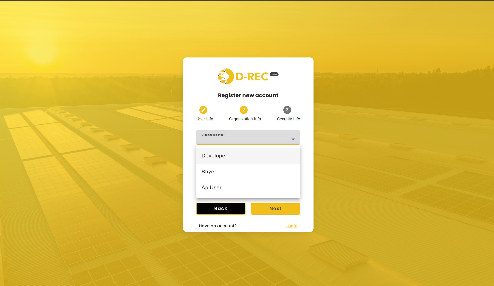
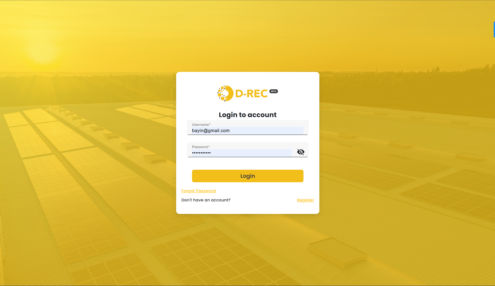
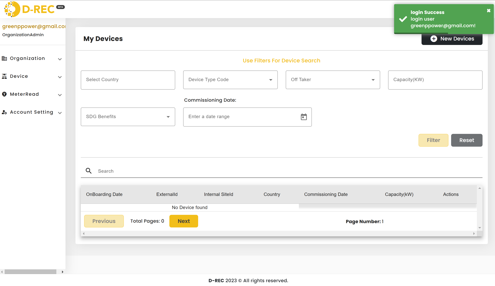
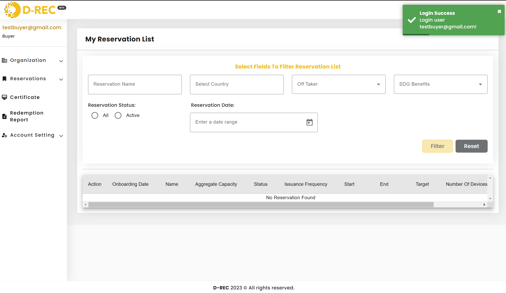

# Get Started

This guide will help you sign up, log in, and navigate the platform with ease. Whether you are a **Buyer** or a **DRE Project Developer**, you’ll find clear instructions, useful tips, and troubleshooting advice to ensure a smooth experience.

## Introduction

Our platform is designed to meet the specific needs of both Buyers and DRE Project Developers:

- **Buyers** can manage reservations and view digital certificates.
- **DRE Project Developers** can manage their energy generation devices and record meter reads.

In addition, all users can manage their organization settings, ensuring that team members and permissions are correctly maintained.

## Signing Up

All new users follow the same registration process. The only difference occurs during the **Organization Information** step, where you must select the appropriate organization type:

- **Buyer:** Select this option if you are signing up as a Buyer.
- **Developer:** Select this option if you are signing up as a DRE Project Developer.

### Registration Workflow

1. **Access the Signup Page:**  
   Navigate to the signup page.

2. **Enter Personal Information:**  
   Fill out your name, contact details, and any other relevant personal data.

3. **Organization Information:**  
   Provide your company or organizational details. When prompted, select your organization type:
   - **Buyer:** Choose this option if you are registering as a Buyer.
   - **Developer:** Choose this option if you are registering as a DRE Project Developer.

4. **Set Up Security Information:**  
   Create a strong password (see [Security Best Practices](#security-best-practices) for recommendations).

5. **Review and Submit:**  
   Verify your information and click the **Sign Up** button.

6. **Confirmation and Auto-Login:**
   - Once your registration is complete, you will be automatically logged in.
   - A confirmation email will be sent to your registered email address. (If required, click the verification link to activate your account.)

## Logging In

1. **Access the Login Page:**  
   Once registered, navigate to the landing page and enter your email and password to log in.

2. **Forgot Password?**  
    If you forget your password, click the **"Forgot Password"** link and follow the instructions to reset it via the email you receive.
   

3. **Role-Based Dashboard Redirection:**
   - **DRE Project Developers:** Upon logging in, DRE Project Developers are directed to a dashboard that highlights tools for managing devices and meter reads.

     

   - **Buyers:** Upon logging in, Buyers are taken to a dashboard that provides access to reservation management and certificate viewing.

     

## Navigating the Dashboard

Once logged in, you will see a dashboard customized to your role. Below are the key features available for each user type:

### DRE Developer Dashboard Overview

- **Managing the Organization:**  
  Adjust organizational settings, manage team members, and set permissions as needed.

- **Device Management:**
  - **Add Devices:** Register new energy generation devices.
  - **View Devices:** Monitor and review details of your registered devices.
  - **Bulk Upload:** Easily add multiple devices at once via CSV upload.

- **Meter Reads:**
  - **Add Meter Reads:** Record meter readings for your devices to track energy production.
  - **View Meter Reads:** Access detailed records of all meter readings.
  - **Bulk Upload:** Upload multiple meter read entries in one go to streamline data entry.

### Buyer Dashboard Overview

- **Managing the Organization:**  
  Update your organizational details and manage team permissions as required.

- **Reservation Management:**
  - **Add Reservations:** Create new reservations that link to specific energy consumption commitments.
  - **View Reservations:** Review and monitor your existing reservations.

- **Certificate Viewing:**
  - **Digital Certificates:** Access and review generated certificates along with their detailed information, ensuring transparency and traceability of energy production.

_Tip:_ Use the help icons and tooltips within the dashboard to get quick guidance on each feature.

## Password Management

- **Creating a Strong Password:**  
  Use a combination of uppercase and lowercase letters, numbers, and special characters. Avoid using easily guessable information.

- **Resetting Your Password:**  
  If you forget your password:
  1. Click the **"Forgot Password"** link on the login page.
  2. Enter your registered email address.
  3. Follow the instructions in the email to set a new password.

- **Regular Updates:**  
  It’s advisable to update your password periodically for enhanced security.

## Frequently Asked Questions (FAQ)

**Q: I did not receive my confirmation email. What should I do?**  
_A:_ Please check your spam or junk folder. If it’s not there, click the "Resend Confirmation Email" option on the signup page or contact support.

**Q: Can I update my organization details after registration?**  
_A:_ Yes, you can update your personal and organizational details anytime in the **Settings** section of your dashboard.

**Q: What should I do if I forget my password?**  
_A:_ Click the **"Forgot Password"** link on the login page and follow the instructions to reset your password.

## Security Best Practices

- **Email Verification:** Always verify your email address to secure your account.
- **Strong Passwords:** Use unique, complex passwords for your account.
- **Keep Software Updated:** Ensure your browser and operating system are up to date to prevent security vulnerabilities.
- **Logout on Shared Devices:** Always log out from your account when using public or shared devices.
