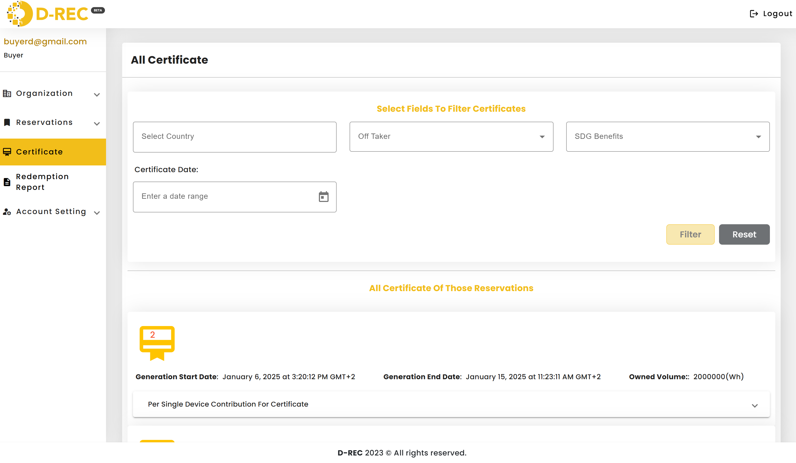
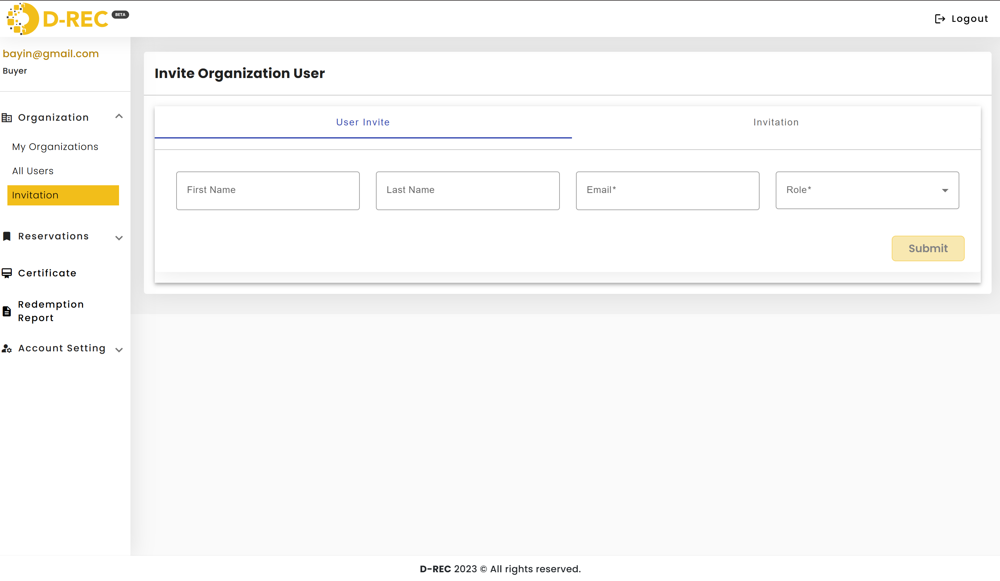

# Feature Walkthroughs

## **Feature 1: Add a Reservation**

Once a buyer can interact with the platform, they can add a reservation.
as a buyer, you will be required to add your reservation name, the capacity you are targetting the starting date you want your reservation to start, and the end date you want your reservation to end, . . . .
Devices displayed on their page indicate available energy ready to be reserved, as these devices only appear when they are not already reserved by someone else.
You can also filter devices by country, device type, capacity, SDB benefits, or device commission date.
The buyer can reserve a specific amount of energy based on their consumption needs. If a single device does not provide the required energy, the buyer can select multiple devices whose combined energy matches the desired amount.

Before submitting the reservation, the buyer will be prompted with two questions in a popup:

- Continue reservation if some devices are unavailable
- Continue reservation if the target capacity is less than the estimated reachable capacity of devices within the selected period
  and they will choose either yes or no for each of the questions.

## **Feature 2: View Reservation**

After submitting the reservation, the buyer will be redirected to the reservation page, where they can view its status.

## **Feature 3: View Certificate**

Once the reservation is submitted, certificates are generated for the devices whose reservations were accepted. The buyer can view their certificate from the certificate page.

## **Feature 4: Buyer can invite a user to the platform**

The user can either be a SubBuyer or a user

After successfully inviting a user, the buyer will be redirected to the invitations page, where they can monitor the invitation's status (e.g., whether the user has accepted it).
The invited user will receive an email with a confirmation link to accept the invitation and another one containing the password to log in to the platform.

## **Feature 5: They can reset their password**

From the account setting navigation link user can reset their password by adding a new password fulfilling these requirements

- Maximum 6 characters
- Upper and/or lower case
- One number

  <!--  -->
