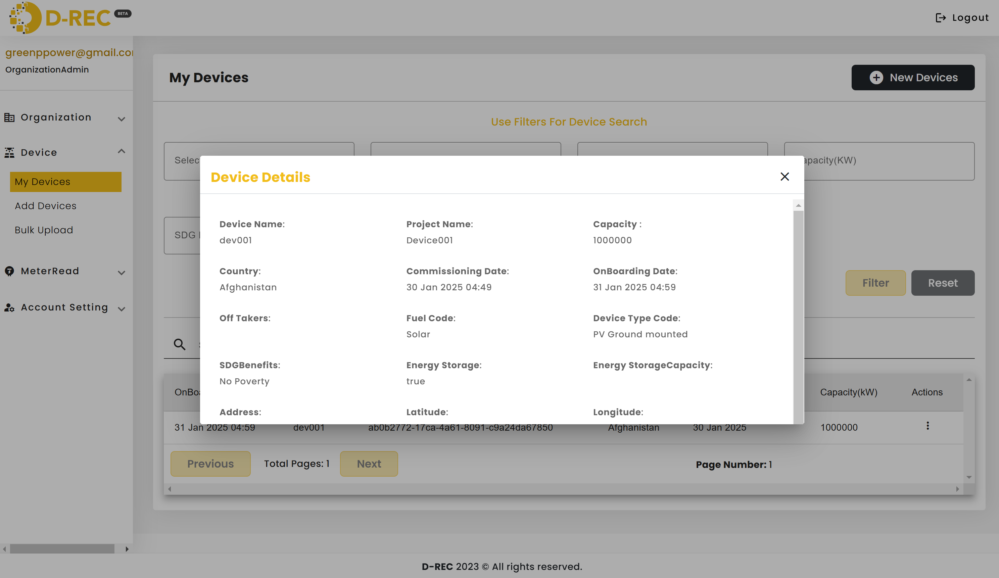
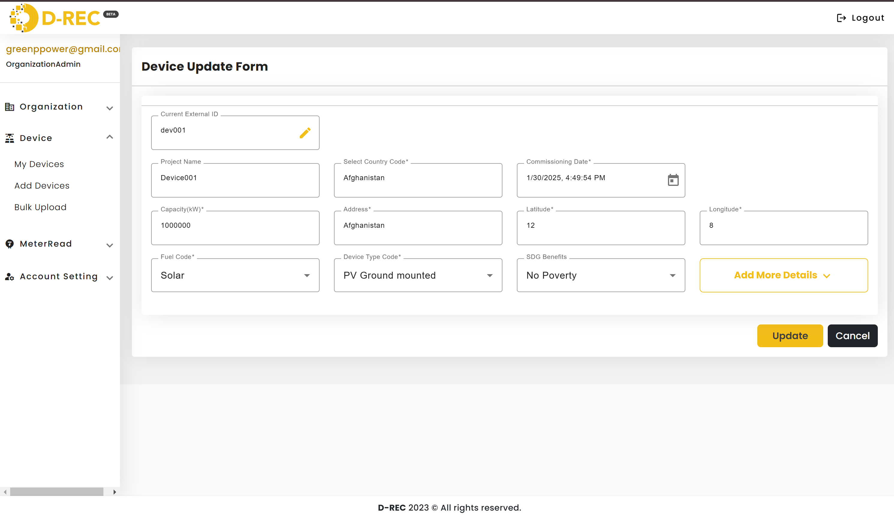
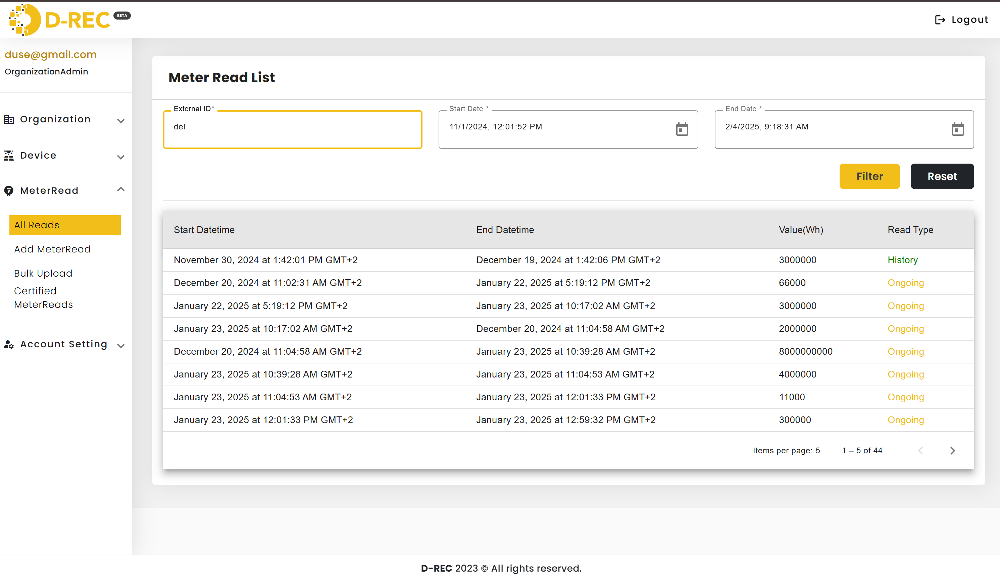
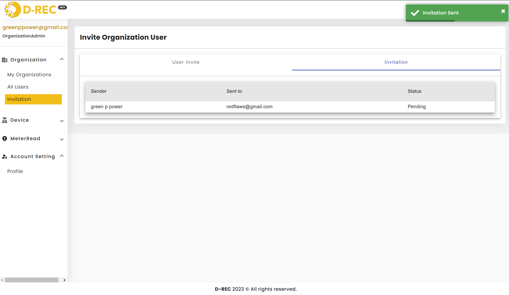

# Feature Walkthroughs

## Developer features

### Feature 1: Developer can view their organization

- From the first navlink called organization

### Feature 2: Developers Can Manage Users

Developers can view users within their organization and perform the following actions:

- Edit Users
- Delete Users

### Feature 3:Device Registration

- Devices can be registered in two ways:

  1. One device at a time
     

  2. More tha one device but not too many(from the add more device black button om the device registration page)
     

  3. Bulk upload (via CSV format)
     A developer uploads a CSV file containing devices.

  On successful registration of the devices in the CSV, the page appears as shown below.
  

  When checking the logs, users will see details about what happened, including whether errors occurred or not.
  

- A developer can register devices with the following details:

  - Name, Type, Country, Address, Location (GPS coordinates), Commission Date, Role, Fuel Code, and SDG Benefits.
  - Historical records are required for devices with a past commission date.

### Feature 4:Device viewing

From the device page, developers can manage devices using the "Actions" column (which holds three dots sign). It contains following actions:

- View Device Details
  

- Edit Device
  

- Delete Device (Confirmation popup appears before deletion)
  

### Feature 5:MeterRead registration

- Meter reads are associated with a specific organization on the platform.
- For a successfull addition of a meter read you need to add: device’s External ID, type of reading, unit of the meter, read values.(Depending on the type of meter read, the end datetime must be specified, except for History readings, where the
  start datetime and end datetime are required.)
  

### Feature 6:View MeterRead list

Developers can view meter reads(by providing the external ID) and filter them, which is especially useful when dealing with a large number of reads.

### Feature 7:MeterRead Bulk Upload

Developers can download a CSV template, fill in the devices information, and upload it to the platform.Once they want to upload many reads at time.

- When the file is successfully added, it is displayed on the page with a "Completed" status.
  

- If the status is failed, they can check the issue through the logs action, which redirects them to a page displaying the errors that occurred.

  

- To check their uploaded reads from the bulk upload, they can navigate to the "All Reads" link in the nav and provide the external IDs as usual.

  

### Feature 8:view certified MeterRead

Developers can filter and view only certified meter reads, especially if there are a large number of reads.

## Buyer features

### Feature 1: Add a Reservation

- Buyers can add a reservation by providing:
  - Reservation Name, Target Capacity, Start Date, and End Date.
- Devices displayed are available for reservation and only appear when not already reserved.
- Buyers can filter devices by country, type, capacity, SDG benefits, or commission date.
- Buyers can reserve the required energy, by selecting one or more devices to meet the desired capacity.

Before submitting the reservation, the buyer will be prompted with two questions in a popup:

- Continue reservation if some devices are unavailable
- Continue reservation if the target capacity is less than the estimated reachable capacity of devices within the selected period
- They will choose either yes or no for each of the questions.

### Feature 2: View Reservation

After submitting the reservation, the buyer will be redirected to the reservation page, where they can view its status.

### Feature 3: View Certificate

Once the reservation is submitted, certificates are generated for the devices whose reservations were accepted. The buyer can view their certificate from the certificate page.

## Shared Features for Developers and Buyers

### Feature 1:Invite Users to the Platform

#### DEVELOPER

Developers specify the role of the user they are inviting, which defines the user's permissions within the organization.

After submitting the invitation, developers are redirected to the Invitation Page, where they can view all sent invitations and their statuses (Accepted or Pending).

The invited user receives two emails: one for confirmation and another with login credentials.

#### BUYER

Buyers can invite users as either SubBuyers or regular users.

After successfully inviting a user, the buyer will be redirected to the invitations page, where they can monitor the invitation's status (e.g., whether the user has accepted it).
The invited user will receive an email with a confirmation link to accept the invitation and another one containing the login credantials to the platform.

### Feature 2: Update User Profile

- They can update their names and email

### Feature 3: Reset Password

From the account setting navigation link user can reset their password by adding a new password fulfilling these requirements

- Maximum 6 characters
- Upper and/or lower case
- One number
  
