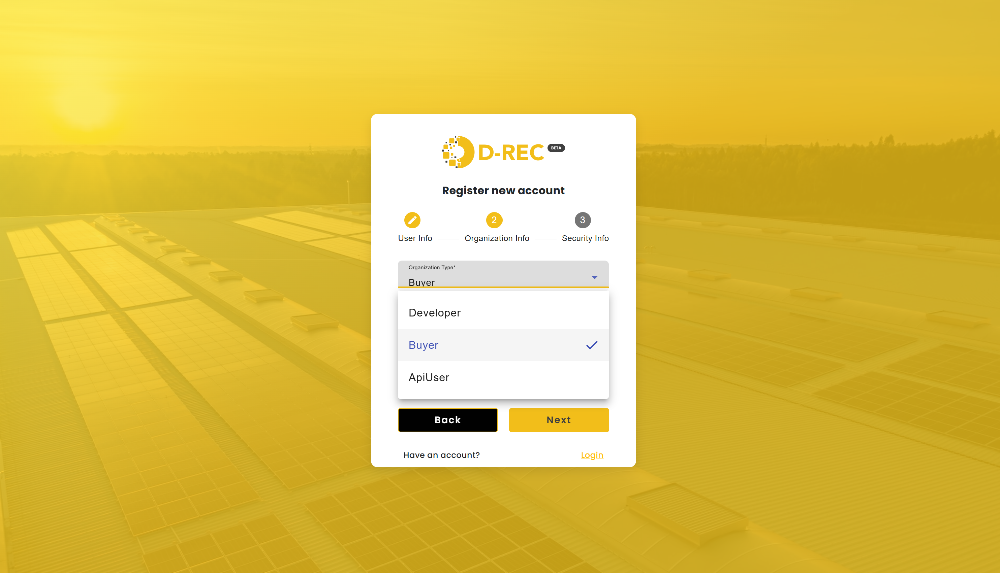

# Getting Started

User Guide (For Normal/Non-Technical Users/Non Api Users)

**Signing Up**

**_A buyer can be created in two ways:_**

**_1._ Via signup page**

Here, the buyer is prompted to provide:

- Personal information
- Organization details (where they must specify that they are a Buyer)
- Security information (by creating their password).

After completing the signup process, the buyer will automatically log into the platform.

**2. Admin can create a buyer via the Add Organization Page**

After a buyer being created in this way, the buyer will receive an email with a password that he/she can use to log in to the platform and a button that will redirect him/her to the platform's login page. From there, they can use their email and password to log in.

## Logging in

once a buyer already has an account they log in by providing the email and password on the landing page below If they have an issues with their password lets say they forgot it the can go reset their password through the forgot password link

When a buyer logs in, below is the UI they land on, showcasing the features and actions they can perform.

